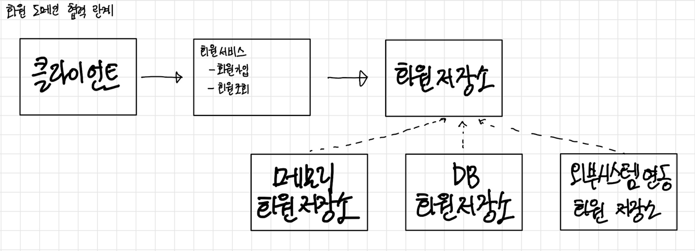
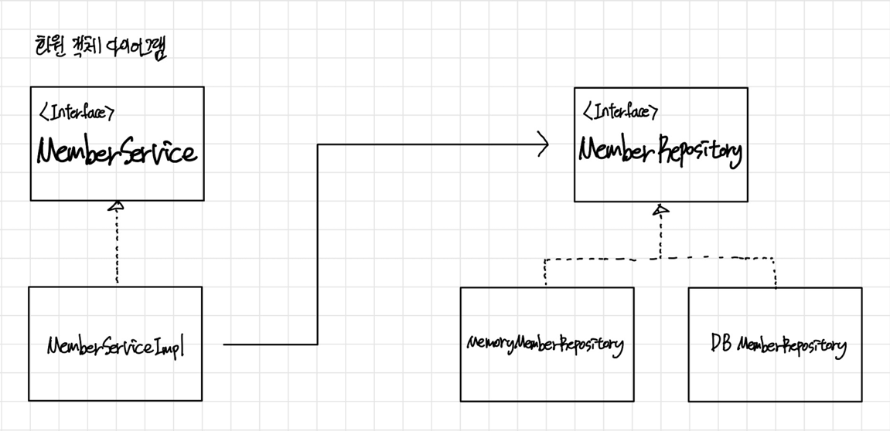

# Java-Spring-Basic
# 1. 객체 지향 설계와 스프링
## 스프링이란?
### 스프링 생태계
- 필수 : 스프링 프레임워크, 스프링 부트
- 선택 : 스프링 데이터(JPA), 스프링 세션, 스프링 시큐리티, 스프링 Rest Docs, 스프링 배치, 스프링 클라우드
- [스프링 공식 홈페이지](https://spring.io/)
### 스프링 프레임 워크
- 핵심 기술: 스프링 DI 컨테이너, AOP, 이벤트, 기타
- 웹 기술: 스프링 MVC, 스프링 WebFlux
- 데이터 접근 기술: 트랜잭션, JDBC, ORM 지원, XML 지원
- 기술 통합: 캐시, 이메일, 원격접근, 스케줄링
- 테스트: 스프링 기반 테스트 지원
- 언어: 코틀린, 그루비
- 최근에는 스프링 부트를 통해서 스프링 프레임워크의 기술들을 편리하게 사용

### 스프링부트
- 스프링을 편리하게 사용할 수 있도록 지원, 최근에는 기본으로 사용 단독으로 실행할 수 있는 스프링 애플리케이션을 쉽게 생성
- Tomcat 같은 웹 서버를 내장해서 별도의 웹 서버를 설치하지 않아도 됨
- 손쉬운 빌드 구성을 위한 starter 종속성 제공
- 스프링과 3rd parth(외부) 라이브러리 자동 구성
- 메트릭, 상태 확인, 외부 구성 같은 프로덕션 준비 기능 제공
- 관례에 의한 간결한 설정
- 스프링부트와 스프링 프레임 워크는 따로 사용하지 않는다. 같이 사용해야한다.

### 스프링 단어?
- 스프링이라는 단어는 문맥에 따라 다르게 사용된다.
    - 스프링 DI 컨테이너 기술
    - 스프링 프레임 워크
    - 스프링 부트, 스프링 프레임 워크 등을 모두 포함하는 단어

### 핵심개녕
- 스프링은 자바 언어 기반의 프레임워크
- 자바 언어의 가장 큰 특징 - 객체 지향 언어
- 스프링은 객체 지향 언어가 가진 강력한 특징을 살려내는 프레임 워크
- 스프링은 좋은 객체지향 애플리케이션을 개발할 수 있게 도와주는 프레임워크

## 좋은 객체 지향 프로그래밍이란?
### 객체 지향프로그래밍
- 객체 지향 프로그래밍은 컴퓨터 프로그램을 명령어의 목록으로 보는 시각에서 벗어나 여러 개의 독립된 단위, 즉 ***객체***들의 ***모임***으로 파악하고자 하는 것이다. 각각의 ***객체***는 ***메시지***를 주고받고, 데이터를 처리할 수 있다. ***(협력)***
- 객체 지향 프로그래밍은 프로그램을 ***유연***하고 ***변경***이 용이하게 만들기 때문에 대규모 소프트웨어 개발에 많이 사용된다.

### 유연하고, 변경이 용이?
- 레고 블럭 조립하듯이
- 키보드, 마우스 갈아 끼우듯이
- 컴퓨터 부품 갈아 끼우듯이
- 컴포넌트를 쉽고 유연하게 변경하면서 개발할 수 있는 방법

### 다형성 - 다형성의 실세계 비유
- 역할과 구현으로 세상을 구분 하자
- 운전자 - 자동차
    - *** 사진 ***
  > 자동차가 바뀌어도 운전자는 운전을 할 수 있다.

- 공연무대, 로미오와 줄리엣 공연
    - 사진
  > 로미오, 줄리엣 역할은 누구든 대체 가능하다. 연기자가 누구인지는 중요하지 않는다.

### 역할과 구현을 분리
- 역할과 구현으로 구분하면 세상이 단순해지고, 유연해지며 변경도 편리해진다.
- 장점
    - 클라이언트는 대상의 역할(인터페이스)만 알면 된다.
    - 클라이언트는 구현 대상의 내부 구조를 몰라도 된다.
    - 클라이언트는 구현 대상의 내부 구조가 변경되어도 영향을 받지 않는다. 클라이언트는 구현 대상 자체를 변경해도 영향을 받지 않는다.
### 자바 언어 - 역할과 구현을 분리
- 자바 언어의 다형성을 활용
    - 역할 = 인터페이스
    - 구현 = 인터페이스를 구현한 클래스, 구현 객체
- 객체를 설계할 때 ***역할***과 ***구현***을 명확히 분리
- 객체 설계시 역할(인터페이스)을 먼저 부여하고, 그 역할을 수행하는 구현 객체 만들기

### 객체의 협력이라는 관계부터 생각
- 혼자 있는 객체는 없다.
- 클라이언트: ***요청***, 서버: ***응답***
- 수 많은 객체 클라이언트와 객체 서버는 서로 협력 관계를 가진다.

### 자바 언어의 다형성
- 오버라이딩은 자바 기본 문법으로 오버라이딩 된 메서드가 실행
- 다형성으로 인터페이스를 구현한 객체를 실행 시점에 유연하게 변경 할 수 있다.
- 물론 클래스 상속 관계도 다형성, 오버 라이딩 적용가능
  *** 사진 ***

### 다형성의 본질
- 인터페이스를 구현한 객체 인스턴스를 실행 시점에 유연하게 변경할 수 있다.
- 다형성의 본질을 이해하려면 협력이라는 객체사이의 관계에서 시작해야함
- 클라이언트를 변경하지 않고, 서버의 구현 기능을 유연하게 변경할 수 있다.

### 정리 - 역할과 구현을 분리
- 실세계의 역할과 구현이라는 편리한 컨셉을 다형성을 통해 객체 세상으로 가져올 수 있음
- 유연하고, 변경이 용이
- 확장 가능한 설계
- 클라이언트에 영향을 주지 않는 변경 가능
- 인터페이스를 안정적으로 잘 설계하는 것이 중요

### 한계 - 역할과 구현을 분리
- 역할(인터페이스) 자체가 변하면, 클라이언트, 서버 모두에 큰 변경이 발생한다. 자동차를 비행기로 변경해야 한다면?
- 대본 자체가 변경된다면?
- USB 인터페이스가 변경된다면?
- 인터페이스를 안정적으로 잘 설계하는 것이 중요

### 스프링과 객체 지향
- 다형성이 가장 중요하다!
- 스프링은 다형성을 극대화해서 이용할 수 있게 도와준다.
- 구현을 편리하게 다룰 수 있도록 지원한다.
- 스프링을 사용하면 마치 레고 블럭 조립하듯이! 공연 무대의 배우를 선택하듯이! 구현을 편리하게 변경할 수 있다.


## 좋은 객체 지향 설계의 5가지 원칙(SOLID)
### SOLID
***클린코드로 유명한 로버트 마틴이 좋은 객체 지향 설계의 5가지 원칙을 정리***
- SRP: 단일 책임 원칙(single responsibility principle)
- OCP: 개방-폐쇄 원칙 (Open/closed principle)
- LSP: 리스코프 치환 원칙 (Liskov substitution principle)
- ISP: 인터페이스 분리 원칙 (Interface segregation principle)
- DIP: 의존관계 역전 원칙 (Dependency inversion principle)

### SRP 단일 책임 원칙
- 한 클래스는 하나의 책임만 가져야 한다.
- 하나의 책임이라는 것은 모호하다.
    - 클 수 있고, 작을 수 있다.
    - 문맥과 상황에 따라 다르다.
- 중요한 기준은 변경이다. 변경이 있을 때 파급 효과가 적으면 단일 책임 원칙을 잘 따른 것
- 예) UI 변경, 객체의 생성과 사용을 분리
> 책임을 적절하게 잘 조절해야한다

### OCP 개방-폐쇄 원칙
- 소프트웨어 요소는 확장에는 열려 있으나 변경에는 닫혀 있어야 한다
- 이런 거짓말 같은 말이? 확장을 하려면, 당연히 기존 코드를 변경?
- 다형성을 활용해보자
- 인터페이스를 구현한 새로운 클래스를 하나 만들어서 새로운 기능을 구현
- 지금까지 배운 역할과 구현의 분리를 생각해보자
  *** 사진 ***

#### 문제점
- MemberService 클라이언트가 구현 클래스를 직접 선택
    - MemberRepository m = new MemoryMemberRepository(); //기존 코드
    - MemberRepository m = new JdbcMemberRepository(); //변경 코드
- ***구현 객체를 변경하려면 클라이언트 코드를 변경해야 한다.***
- ***분명 다형성을 사용했지만 OCP 원칙을 지킬 수 없다.***
- 이 문제를 어떻게 해결해야 하나?
- 객체를 생성하고, 연관관계를 맺어주는 별도의 조립, 설정자가 필요하다.
> Spring이 있는 이유!!

### LSP 리스코프 치환 원칙
- 프로그램의 객체는 프로그램의 정확성을 깨뜨리지 않으면서 하위 타입의 인스턴스로 바꿀 수 있어야 한다
- 다형성에서 하위 클래스는 인터페이스 규약을 다 지켜야 한다는 것, 다형성을 지원하기 위 한 원칙, 인터페이스를 구현한 구현체는 믿고 사용하려면, 이 원칙이 필요하다.
- 단순히 컴파일에 성공하는 것을 넘어서는 이야기
- 예) 자동차 인터페이스의 엑셀은 앞으로 가라는 기능, 뒤로 가게 구현하면 LSP 위반, 느리 더라도 앞으로 가야함

### ISP 인터페이스 분리 원칙
- 특정 클라이언트를 위한 인터페이스 여러 개가 범용 인터페이스 하나보다 낫다
- 자동차 인터페이스 -> 운전 인터페이스, 정비 인터페이스로 분리
- 사용자 클라이언트 -> 운전자 클라이언트, 정비사 클라이언트로 분리
- 분리하면 정비 인터페이스 자체가 변해도 운전자 클라이언트에 영향을 주지 않음
- 인터페이스가 명확해지고, 대체 가능성이 높아진다.

### DIP 의존관계 역전 원칙
- 프로그래머는 “추상화에 의존해야지, 구체화에 의존하면 안된다.” 의존성 주입은 이 원칙 을 따르는 방법 중 하나다.
- 쉽게 이야기해서 구현 클래스에 의존하지 말고, 인터페이스에 의존하라는 뜻
- 앞에서 이야기한 ***역할(Role)에 의존하게 해야 한다는 것과 같다.*** 객체 세상도 클라이언트 가 인터페이스에 의존해야 유연하게 구현체를 변경할 수 있다! 구현체에 의존하게 되면 변경이 아주 어려워진다.
  > 시스템이 언제든지 갈아 낄 수 있게 해야한다.
    - ex) 운전자는 자동차 역할에 대해서 알아야하지 특정 자동차 브랜드을 구체적으로 알 필요는 없다.
    - ex) 배우는 현재 주어진 배역에 대해 알아야지, 배역 이외는 알 필요는 없다.

- 그런데 OCP에서 설명한 MemberService는 인터페이스에 의존하지만, 구현 클래스도 동시에 의존한다.
- MemberService 클라이언트가 구현 클래스를 직접 선택
  *** 사진***
    - MemberRepository m = new MemoryMemberRepository(); DIP 위반
  > MemberService는 MemberRepository만 알아도 된다. MemoryMemberRepository까지는 알 필요 없어

### 정의
- 객체 지향의 핵심은 다형성
- 다형성 만으로는 쉽게 부품을 갈아 끼우듯이 개발할 수 없다.
- 다형성 만으로는 구현 객체를 변경할 때 클라이언트 코드도 함께 변경된다. 다형성 만으로는 OCP, DIP를 지킬 수 없다.
- 뭔가 더 필요하다.

## 객체 지향 설계와 스프링
### 다시 스프링으로
***스프링 이야기에 왜 객체 지향 이야기가 나오는가?***
- DI(Dependency Injection): 의존관계, 의존성 주입
    - 스프링은 다음 기술로 다형성 + OCP, DIP를 가능하게 지원
    - DI 컨테이너 제공
- 클라이언트 코드의 변경 없이 기능 확장
- 쉽게 부품을 교체하듯이 개발

### 스프링이 없던 시절로...
- 옛날 어떤 개발자가 좋은 객체 지향 개발을 하려고 OCP, DIP 원칙을 지키면서 개발을 해 보니, 너무 할일이 많았다. 배보다 배꼽이 크다. 그래서 프레임워크로 만들어버림
- 순수하게 자바로 OCP, DIP 원칙들을 지키면서 개발을 해보면, 결국 스프링 프레임워크를 만들게 된다. (더 정확히는 DI 컨테이너)
- DI 개념은 말로 설명해도 이해가 잘 안된다. 코드로 짜봐야 필요성을 알게된다!
- 그러면 이제 스프링이 왜? 만들어졌는지 코드로 이해해보자

### 정리
> 예를 들어 데이터베이스를 사용할지 정하지 않은상황, 개발은 해야함, 인터페이스를 만들어 놓으면 미뤄도 괜찮음
- 모든 설계에 역할과 구현을 분리하자. 자동차, 공연의 예를 떠올려보자.
- 변경할 수 있도록 만드는 것이 좋은 객체 지향 설계다.
- 애플리케이션 설계도 공연을 설계 하듯이 배역만 만들어두고, 배우는 언제든지 유연하게 이상적으로는 모든 설계에 인터페이스를 부여하자

#### 실무 고민
- 하지만 인터페이스를 도입하면 추상화라는 비용이 발생한다.
> 코드를 한번 더 열어봐야한다.

- 기능을 확장할 가능성이 없다면, 구체 클래스를 직접 사용하고, 향후 꼭 필요할 때 리팩터링해서 인터페이스를 도입하는 것도 방법이다.

# 1. 스프링 핵심 원리 이해1 - 예제만들기 
## 비즈니스 요구사항과 설계
- 회원
  - 회원을 가입하고 조회할 수 있다.
  - 회원은 일반과 VIP 두 가지 등급이 있다.
  - 회원 데이터는 자체 DB를 구축할 수 있고, 외부 시스템과 연동할 수 있다. (미확정)

- 주문과 할인 정책
  - 회원은 상품을 주문할 수 있다.
  - 회원 등급에 따라 할인 정책을 적용할 수 있다.
  - 할인 정책은 모든 VIP는 1000원을 할인해주는 고정 금액 할인을 적용해달라. (나중에 변경 될 수 있다.)
  - 할인 정책은 변경 가능성이 높다. 회사의 기본 할인 정책을 아직 정하지 못했고, 오픈 직전까지 고민을 미루고 싶다. 최악의 경우 할인을 적용하지 않을 수 도 있다. (미확정)

요구사항을 보면 회원 데이터, 할인 정책 같은 부분은 지금 결정하기 어려운 부분이다. 그렇다고 이런 정책이 결정될 때 까지 개발을 무기한 기다릴 수 도 없다. 우리는 앞에서 배운 객체 지향 설계 방법이 있지 않은가!
인터페이스를 만들고 구현체를 언제든지 갈아끼울 수 있도록 설계하면 된다. 그럼 시작해보자.

- 참고: 프로젝트 환경설정을 편리하게 하려고 스프링 부트를 사용한 것이다. 지금은 스프링 없는 순수한
  자바로만 개발을 진행한다는 점을 꼭 기억하자! 스프링 관련은 한참 뒤에 등장한다.

## 회원 도메인 설계
- 회원 도메인 요구사항
  - 회원을 가입하고 조회할 수 있다.
  - 회원은 일반과 VIP 두 가지 등급이 있다.
  - 회원 데이터는 자체 DB를 구축할 수 있고, 외부 시스템과 연동할 수 있다. (미확정)

### 도매인 협력관계 
***사진***


### 회원 클래스 다이어그램
***사진***


### 회원 객체 다이어그램 
***사진***


> 실제 서버에 올라온다면 객체간의 참조가 어떻게 되는지
> 회원서비스: MemberServiceImpl

### 회원 도메인 개발 
#### 회원 엔티티 - 회원 등급 
```
package hello.core.member;

public enum Grade {
    BASIC,
    VIP
}
```

#### 회원 엔티티 - 회원 엔티티
```
package hello.core.member;

public class Member {
    private Long id;
    private String name;
    private Grade grade;

    public Member(Long id, String name, Grade grade) {
        this.id = id;
        this.name = name;
        this.grade = grade;
    }

    public Long getId() {
        return id;
    }

    public String getName() {
        return name;
    }

    public Grade getGrade() {
        return grade;
    }

    public void setId(Long id) {
        this.id = id;
    }

    public void setName(String name) {
        this.name = name;
    }

    public void setGrade(Grade grade) {
        this.grade = grade;
    }
}
```

#### 회원 저장소 - 회원 저장소 인터페이스
```
package hello.core.member;

public interface MemberRepository {
    void save(Member member);
    Member findById(Long memberId);
}
```

#### 회원 저장소 - 메모리 회원 저장소 구현체
데이터베이스가 아직 확정이 안되었다. 그래도 개발은 진행해야 하니 가장 단순한, 메모리 회원 저장소를
구현해서 우선 개발을 진행하자.
> 참고: HashMap 은 동시성 이슈가 발생할 수 있다. 이런 경우 ConcurrentHashMap 을 사용하자.

```
package hello.core.member;

import java.util.HashMap;
import java.util.Map;

public class MemoryMemberRepository implements MemberRepository{
    // 동시성 이슈가 있을 수 있어서 다른 맵을 사용해야한다 정도만 알아두자
    private static Map<Long, Member> store = new HashMap<>();

    @Override
    public void save(Member member) {
        store.put(member.getId(), member);
    }

    @Override
    public Member findById(Long memberId) {
        return store.get(memberId);
    }
}
```

#### 회원 서비스 - 회원 서비스 인터페이스
```
package hello.core.member;

public interface MemberService {
    void join(Member member);   // 회원가입
    Member findMember(Long memberId); // 회원조회
}
```

#### 회원 서비스 - 회원 서비스 구현체
```
package hello.core.member;

public class MemberServiceImpl implements MemberService{
    // 구현체가 하나만있으면 그냥 뒤에 impl을 붙인다.
    private final MemberRepository memberRepository = new MemoryMemberRepository();
    @Override
    public void join(Member member) {
        memberRepository.save(member);
    }

    @Override
    public Member findMember(Long memberId) {
        return memberRepository.findById(memberId);
    }
}
```

### 회원 도메인 실행과 테스트
#### 회원 도메인 - 회원 가입 main
```
package hello.core.member;

public class MemberApp {
    public static void main(String[] args) {
        MemberService memberService = new MemberServiceImpl();
        Member member = new Member(1L, "memberA", Grade.VIP);
        memberService.join(member);

        Member findMember = memberService.findMember(1L);
        System.out.println("new member "+member.getName());
        System.out.println("new member "+findMember.getName());
    }
}
```

#### 회원 도메인 - 회원 가입 테스트
```
package hello.core.member;

import org.assertj.core.api.Assertions;
import org.junit.jupiter.api.Test;
import static org.junit.jupiter.api.Assertions.*;

public class MemberServiceTest {
    MemberService memberService = new MemberServiceImpl();
    @Test
    void join() {
        // given
        Member member = new Member(1L, "member", Grade.VIP);
        // when
        memberService.join(member);
        Member findMember = memberService.findMember(1L);
        // then
        Assertions.assertThat(member).isEqualTo(findMember);
    }
}

```


> MemberServiceImpl에 문제가 있다. 인터페이스에 의족하지만 실제 할당하는 게 구현체를 할당 
> 추상화, 구체화에 둘다 의존 -> DIP 원칙을 준수하지 않음


## 주문과 할인 도메인 설계 
- 주문과 할인 정책
  - 회원은 상품을 주문할 수 있다.
  - 회원 등급에 따라 할인 정책을 적용할 수 있다.
  - 할인 정책은 모든 VIP는 1000원을 할인해주는 고정 금액 할인을 적용해달라. (나중에 변경 될 수 있다.)
  - 할인 정책은 변경 가능성이 높다. 회사의 기본 할인 정책을 아직 정하지 못했고, 오픈 직전까지 고민을 미루고 싶다. 최악의 경우 할인을 적용하지 않을 수 도 있다. (미확정)

### 주문 도메인 협력, 역할 책임 
***사진***
1. ***주문 생성***: 클라이언트는 주문 서비스에 주문 생성을 요청한다.
2. ***회원 조회***: 할인을 위해서는 회원 등급이 필요하다. 그래서 주문 서비스는 회원 저장소에서 회원을 조회한다.
3. ***할인 적용***: 주문 서비스는 회원 등급에 따른 할인 여부를 할인 정책에 위임한다. 
4. ***주문 결과 반환***: 주문 서비스는 할인 결과를 포함한 주문 결과를 반환한다.

> 정액은 항상 1000원할인, 정률은 2만원사면 얼마 얼마,,,

#### 주문도메인 객체 다이어그램1
> 협력관계를 그대로 재사용 할 수 있다. 주문 서비스 구현체를 바꾸지 않아도 된다.  

#### 주문도메인 객체 다이어그램1
> 
> 

### 주문과 할인 도메인 개발 
#### 할인 정책 인터페이스
```
package hello.core.discount;

import hello.core.member.Member;

public interface DiscountPolicy {
    // @return이 할인 대상금액
    int discount(Member member, int price);
}
```

#### 정액 할인 정책 구현체
```
package hello.core.discount;

import hello.core.member.Grade;
import hello.core.member.Member;

public class FixDiscountPolicy implements DiscountPolicy{
    private int discountFixAount =1000;
    @Override
    public int discount(Member member, int price) {
        if(member.getGrade() == Grade.VIP){
            return discountFixAount;
        }else {
            return 0;
        }
    }
}
```

#### 주문 엔티티
```
package hello.core.order;

public class Order {
    private Long memberId;
    private String itemName;
    private int itemPrice;
    private int discountPrice;

    public Order(Long memberId, String itemName, int itemPrice, int discountPrice) {
        this.memberId = memberId;
        this.itemName = itemName;
        this.itemPrice = itemPrice;
        this.discountPrice = discountPrice;
    }

    public int calculatePrice() {
        return itemPrice - discountPrice;
    }

    public Long getMemberId() {
        return memberId;
    }

    public void setMemberId(Long memberId) {
        this.memberId = memberId;
    }

    public String getItemName() {
        return itemName;
    }

    public void setItemName(String itemName) {
        this.itemName = itemName;
    }

    public int getItemPrice() {
        return itemPrice;
    }

    public void setItemPrice(int itemPrice) {
        this.itemPrice = itemPrice;
    }

    public int getDiscountPrice() {
        return discountPrice;
    }

    public void setDiscountPrice(int discountPrice) {
        this.discountPrice = discountPrice;
    }

    @Override
    public String toString() {
        return "Order{" +
                "memberId=" + memberId +
                ", itemName='" + itemName + '\'' +
                ", itemPrice=" + itemPrice +
                ", discountPrice=" + discountPrice +
                '}';
    }
}

```

#### 주문 서비스 인터페이스
```
package hello.core.order;

public interface OrderService {
    Order createOrder(Long memberId, String itemName, int itemPrice);
}

```

#### 주문 서비스 구현체
```
package hello.core.order;

import hello.core.discount.DiscountPolicy;
import hello.core.discount.FixDiscountPolicy;
import hello.core.discount.RateDiscountPolicy;
import hello.core.member.Member;
import hello.core.member.MemberRepository;
import hello.core.member.MemoryMemberRepository;

public class OrderServiceImpl implements OrderService{
    private final MemberRepository memberRepository = new MemoryMemberRepository();
    private final DiscountPolicy discountPolicy = new FixDiscountPolicy();

    @Override
    public Order createOrder(Long memberId, String itemName, int itemPrice) {
        Member member = memberRepository.findById(memberId);
        int discountPrice = discountPolicy.discount(member, itemPrice);
        return new Order(memberId, itemName, itemPrice, discountPrice);
        /*
        * 설계가 잘된이유
        * 오더서비스는 할인에 대해서 몰라도된다.
        * 할인은 디스카운트폴리시가 해결하고 값만 얄려준다
        * 할인에 대한 문제를 해결하는건 디스카운트폴리시에서 알아서한다.
        * */
    }
}

```

### 주문과 할인 도메인 실행과 테스트
#### 주문과 할인 정책 실행
```
package hello.core;

import hello.core.member.Grade;
import hello.core.member.Member;
import hello.core.member.MemberService;
import hello.core.member.MemberServiceImpl;
import hello.core.order.Order;
import hello.core.order.OrderService;
import hello.core.order.OrderServiceImpl;

public class OrderApp {
    public static void main(String[] args) {
        MemberService memberService = new MemberServiceImpl();
        OrderService orderService = new OrderServiceImpl();
        Long memberId = 1L;
        Member member = new Member(memberId, "memberA", Grade.VIP);
        memberService.join(member);
        Order order = orderService.createOrder(memberId, "item", 10000);
        System.out.println("order = "+ order);
    }
}

```

#### 주문과 할인 정책 테스트
```
package hello.core.member.order;
import hello.core.member.Grade;
import hello.core.member.Member;
import hello.core.member.MemberService;
import hello.core.member.MemberServiceImpl;
import hello.core.order.Order;
import hello.core.order.OrderService;
import hello.core.order.OrderServiceImpl;
import org.assertj.core.api.Assertions;
import org.junit.jupiter.api.Test;


public class OrderServiceTest {
    MemberService memberService = new MemberServiceImpl();
    OrderService orderService = new OrderServiceImpl();

    @Test
    void createOrder() {
        Long memberId = 1L;
        Member member = new Member(memberId, "memberA", Grade.VIP);
        memberService.join(member);
        Order order = orderService.createOrder(memberId, "itemA", 10000);
        Assertions.assertThat(order.getDiscountPrice()).isEqualTo(1000);
    }
}

```


# 3. 스프링 핵심 원리 이해2 - 객체 지향 원리 적용 
## 새로운 할인 정책 개발 
### 새로운 할인 정책을 확장해보자 
- 악덕 기획자: 서비스 오픈 직전에 할인 정책을 지금처럼 고정 금액 할인이 아니라 좀 더 합리적인 주문 금액당 할인하는 정률% 할인으로 변경하고 싶어요. 예를 들어서 기존 정책은 VIP가 10000원을 주문하든 20000원을 주문하든 항상 1000원을 할인했는데, 이번에 새로 나온 정책은 10%로 지정해두면 고객이 10000원 주문시 1000원을 할인해주고, 20000원 주문시에 2000원을 할인해주는 거에요!
- 순진 개발자: 제가 처음부터 고정 금액 할인은 아니라고 했잖아요.
- 악덕 기획자: 애자일 소프트웨어 개발 선언 몰라요? “계획을 따르기보다 변화에 대응하기를”
- 순진 개발자: ... (하지만 난 유연한 설계가 가능하도록 객체지향 설계 원칙을 준수했지 후후)

### RateDiscountPolicy 추가 

### RateDiscountPolicy 코드 

## 새로운 할인 정책 적용과 문제점
```
private final MemberRepository memberRepository = new MemoryMemberRepository();
//    private final DiscountPolicy discountPolicy = new FixDiscountPolicy();
private final DiscountPolicy discountPolicy = new RateDiscountPolicy();
```
> 실제 적용을 하려면 OrderServiceImpl로 들어가야함 

### 문제점 발견
- 우리는 역할과 구현을 충실하게 분리했다. OK
- 다형성도 활용하고, 인터페이스와 구현 객체를 분리했다. OK OCP, DIP 같은 객체지향 설계 원칙을 충실히 준수했다
그렇게 보이지만 사실은 아니다.
- DIP: 주문서비스 클라이언트( OrderServiceImpl )는 DiscountPolicy 인터페이스에 의존하면서 DIP를 지킨 것 같은데?
  - 클래스 의존관계를 분석해 보자. 추상(인터페이스) 뿐만 아니라 구체(구현) 클래스에도 의존하고 있다.
  추상(인터페이스) 의존: DiscountPolicy
  구체(구현) 클래스: FixDiscountPolicy , RateDiscountPolicy OCP: 변경하지 않고 확장할 수 있다고 했는데!
  지금 코드는 기능을 확장해서 변경하면, 클라이언트 코드에 영향을 준다! 따라서 OCP를 위반한다.

```
public class OrderServiceImpl implements OrderService{
  private final MemberRepository memberRepository = new MemoryMemberRepository();
  private DiscountPolicy discountPolicy;
          ... 
}
```
> 인터페이스에만 의존하게 하자! -> but, NullPointException 발생


## 관심사의 분리 
- 애플리케이션을 하나의 공연이라 생각해보자. 각각의 인터페이스를 배역(배우 역할)이라 생각하자. 그런데! 실제 배역 맞는 배우를 선택하는 것은 누가 하는가?
- 로미오와 줄리엣 공연을 하면 로미오 역할을 누가 할지 줄리엣 역할을 누가 할지는 배우들이 정하는게 아니다. 이전 코드는 마치 로미오 역할(인터페이스)을 하는 레오나르도 디카프리오(구현체, 배우)가 줄리엣 역할(인터페이스)을 하는 여자 주인공(구현체, 배우)을 직접 초빙하는 것과 같다. 디카프리오는 공연도 해야하고 동시에 여자 주인공도 공연에 직접 초빙해야 하는 다양한 책임을 가지고 있다.

***관심사를 분리하자***
- 배우는 본인의 역할인 배역을 수행하는 것에만 집중해야 한다.
- 디카프리오는 어떤 여자 주인공이 선택되더라도 똑같이 공연을 할 수 있어야 한다.
- 공연을 구성하고, 담당 배우를 섭외하고, 역할에 맞는 배우를 지정하는 책임을 담당하는 별도의 ***공연 기획자***가 나올시점이다.
- 공연 기획자를 만들고, 배우와 공연 기획자의 책임을 확실히 분리하자.

> 이전 코드는 로미오 역할을 하는 배우가 줄리엣 역할의 배우를 직접 초빙하는 것과 같다. 

### AppConfig 등장
- 애플리케이션의 전체 동작 방식을 구성(config)하기 위해, 구현 객체를 생성하고, 연결하는 책임을 가지는 별도의 설정 클래스를 만들자.

#### AppConfig 
```
public class AppConfig {
    public MemberService memberService() {
        return new MemberServiceImpl(new MemoryMemberRepository());
    }
    public OrderService orderService() {
        return new OrderServiceImpl(
                new MemoryMemberRepository(),
                new FixDiscountPolicy());
    }
}
```

#### 그림 - 클래스 다이어그램 

> AppConfig MemberServiceImpl, MemoryMemberRepository 를 생성한다.


## AppConfig 리팩터링 
```
package hello.core;

import hello.core.discount.DiscountPolicy;
import hello.core.discount.FixDiscountPolicy;
import hello.core.member.MemberRepository;
import hello.core.member.MemberService;
import hello.core.member.MemberServiceImpl;
import hello.core.member.MemoryMemberRepository;
import hello.core.order.OrderService;
import hello.core.order.OrderServiceImpl;

public class AppConfig {
    public MemberService memberService() {
        return new MemberServiceImpl(memberRepository());
    }
    public MemberRepository memberRepository() {
        return new MemoryMemberRepository();
    }
    public OrderService orderService() {
        return new OrderServiceImpl(
                memberRepository(),
                new FixDiscountPolicy());
    }
    public DiscountPolicy discountPolicy() {
        return new FixDiscountPolicy();
    }
}
```

## 새로운 구조와 할인 정책 적용
- 처음으로 돌아가서 정액 할인 정책을 정률% 할인 정책으로 변경해보자. 
- FixDiscountPolicy RateDiscountPolicy
- 어떤 부분만 변경하면 되겠는가?

AppConfig의 등장으로 애플리케이션이 크게 사용 영역과, 객체를 생성하고 구성(Configuration)하는 영역으로 분리되었다.

#### 그림 - 사용, 구성의 분리 

#### 할인 정책 변경 구성 코드
```
package hello.core;

import hello.core.discount.DiscountPolicy;
import hello.core.discount.FixDiscountPolicy;
import hello.core.discount.RateDiscountPolicy;
import hello.core.member.MemberRepository;
import hello.core.member.MemberService;
import hello.core.member.MemberServiceImpl;
import hello.core.member.MemoryMemberRepository;
import hello.core.order.OrderService;
import hello.core.order.OrderServiceImpl;

public class AppConfig {
    public MemberService memberService() {
        return new MemberServiceImpl(memberRepository());
    }
    public MemberRepository memberRepository() {
        return new MemoryMemberRepository();
    }
    public OrderService orderService() {
        return new OrderServiceImpl(
                memberRepository(),
                new FixDiscountPolicy());
    }
    public DiscountPolicy discountPolicy() {
//        return new FixDiscountPolicy();
        return new RateDiscountPolicy();
    }
}
```

## 전체 흐름 정리 
### 새로운 할인 정책 개발 
> 정액 할인 -> 정률 할인 정책 만들기 

### 새로운 할인 정책 적용과 문제점 
새로 개발한 정률 할인 정책을 적용하려고 하니 클라이언트 코드인 주문 서비스 구현체도 함께 변경해야함 -> OCP위반
주문 서비스 클라이언트가 인터페이스인 DiscountPolicy 뿐만 아니라, 구체 클래스인 FixDiscountPolicy 도 함께 의존 DIP 위반
> 주문서비스 구현체가 많은 역할을 하고 있었음, fix... 생성 등등

### 관심사를 분리 
- 애플리케이션을 하나의 공연으로 생각
- 기존에는 클라이언트가 의존하는 서버 구현 객체를 직접 생성하고, 실행함
- 비유를 하면 기존에는 남자 주인공 배우가 공연도 하고, 동시에 여자 주인공도 직접 초빙하는 다양한 책임을 가지고 있음
- 공연을 구성하고, 담당 배우를 섭외하고, 지정하는 책임을 담당하는 별도의 공연 기획자가 나올 시점
- 공연 기획자인 AppConfig가 등장
- AppConfig는 애플리케이션의 전체 동작 방식을 구성(config)하기 위해, 구현 객체를 생성하고, 연결하는 책임
- 이제부터 클라이언트 객체는 자신의 역할을 실행하는 것만 집중, 권한이 줄어듬(책임이 명확해짐)

### AppConfig 리팩터링 
구성 정보에서 역할과 구현을 명확하게 
분리 역할이 잘 드러남
중복 제거

### 새로운 구조와 할인 정책 적용 
- 정액 할인 정책 정률% 할인 정책으로 변경
- AppConfig의 등장으로 애플리케이션이 크게 사용 영역과, 객체를 생성하고 구성(Configuration)하는 영역으로 분리
- 할인 정책을 변경해도 AppConfig가 있는 구성 영역만 변경하면 됨, 사용 영역은 변경할 필요가 없음. 물론 클라이언트 코드인 주문 서비스 코드도 변경하지 않음

## 좋은 객체 지향 설계의 5가지 원칙의 적용 
***SRP, DIP, OCP***

### SRP 
***한 클래스는 하나의 책임만 가져야 한다.***
클라이언트 객체는 직접 구현 객체를 생성하고, 연결하고, 실행하는 다양한 책임을 가지고 있음 SRP 단일 책임 원칙을 따르면서 관심사를 분리함
구현 객체를 생성하고 연결하는 책임은 AppConfig가 담당
클라이언트 객체는 실행하는 책임만 담당

### DIP 
***프로그래머는 “추상화에 의존해야지, 구체화에 의존하면 안된다.” 의존성 주입은 이 원칙을 따르는 방법 중 하나다.***
새로운 할인 정책을 개발하고, 적용하려고 하니 클라이언트 코드도 함께 변경해야 했다. 왜냐하면 기존 클라이언트 코드( OrderServiceImpl )는 DIP를 지키며 DiscountPolicy 추상화 인터페이스에 의존하는 것 같았지만, FixDiscountPolicy 구체화 구현 클래스에도 함께 의존했다.
클라이언트 코드가 DiscountPolicy 추상화 인터페이스에만 의존하도록 코드를 변경했다.
하지만 클라이언트 코드는 인터페이스만으로는 아무것도 실행할 수 없다.
AppConfig가 FixDiscountPolicy 객체 인스턴스를 클라이언트 코드 대신 생성해서 클라이언트 코드에 의존관계를 주입했다. 이렇게해서 DIP 원칙을 따르면서 문제도 해결했다.

### OCP 
***소프트웨어 요소는 확장에는 열려 있으나 변경에는 닫혀 있어야 한다***
다형성 사용하고 클라이언트가 DIP를 지킴
애플리케이션을 사용 영역과 구성 영역으로 나눔
AppConfig가 의존관계를 FixDiscountPolicy RateDiscountPolicy 로 변경해서 클라이언트 코드에 주입하므로 클라이언트 코드는 변경하지 않아도 됨
소프트웨어 요소를 새롭게 확장해도 사용 영역의 변경은 닫혀 있다!