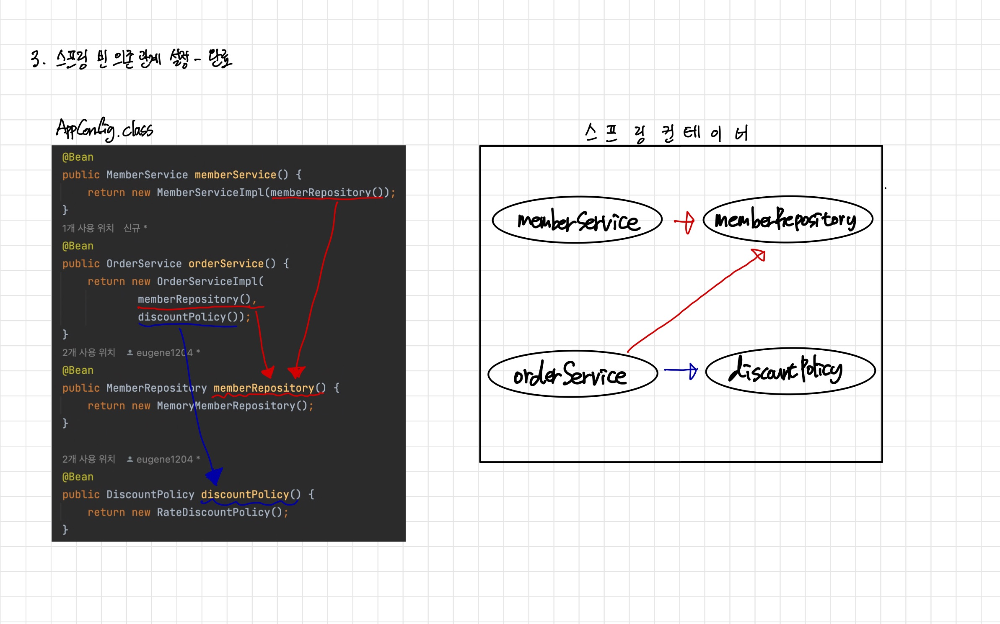

# Java-Spring-Basic
# 1. 객체 지향 설계와 스프링
## 스프링이란?
### 스프링 생태계
- 필수 : 스프링 프레임워크, 스프링 부트
- 선택 : 스프링 데이터(JPA), 스프링 세션, 스프링 시큐리티, 스프링 Rest Docs, 스프링 배치, 스프링 클라우드
- [스프링 공식 홈페이지](https://spring.io/)
### 스프링 프레임 워크
- 핵심 기술: 스프링 DI 컨테이너, AOP, 이벤트, 기타
- 웹 기술: 스프링 MVC, 스프링 WebFlux
- 데이터 접근 기술: 트랜잭션, JDBC, ORM 지원, XML 지원
- 기술 통합: 캐시, 이메일, 원격접근, 스케줄링
- 테스트: 스프링 기반 테스트 지원
- 언어: 코틀린, 그루비
- 최근에는 스프링 부트를 통해서 스프링 프레임워크의 기술들을 편리하게 사용

### 스프링부트
- 스프링을 편리하게 사용할 수 있도록 지원, 최근에는 기본으로 사용 단독으로 실행할 수 있는 스프링 애플리케이션을 쉽게 생성
- Tomcat 같은 웹 서버를 내장해서 별도의 웹 서버를 설치하지 않아도 됨
- 손쉬운 빌드 구성을 위한 starter 종속성 제공
- 스프링과 3rd parth(외부) 라이브러리 자동 구성
- 메트릭, 상태 확인, 외부 구성 같은 프로덕션 준비 기능 제공
- 관례에 의한 간결한 설정
- 스프링부트와 스프링 프레임 워크는 따로 사용하지 않는다. 같이 사용해야한다.

### 스프링 단어?
- 스프링이라는 단어는 문맥에 따라 다르게 사용된다.
    - 스프링 DI 컨테이너 기술
    - 스프링 프레임 워크
    - 스프링 부트, 스프링 프레임 워크 등을 모두 포함하는 단어

### 핵심개녕
- 스프링은 자바 언어 기반의 프레임워크
- 자바 언어의 가장 큰 특징 - 객체 지향 언어
- 스프링은 객체 지향 언어가 가진 강력한 특징을 살려내는 프레임 워크
- 스프링은 좋은 객체지향 애플리케이션을 개발할 수 있게 도와주는 프레임워크

## 좋은 객체 지향 프로그래밍이란?
### 객체 지향프로그래밍
- 객체 지향 프로그래밍은 컴퓨터 프로그램을 명령어의 목록으로 보는 시각에서 벗어나 여러 개의 독립된 단위, 즉 ***객체***들의 ***모임***으로 파악하고자 하는 것이다. 각각의 ***객체***는 ***메시지***를 주고받고, 데이터를 처리할 수 있다. ***(협력)***
- 객체 지향 프로그래밍은 프로그램을 ***유연***하고 ***변경***이 용이하게 만들기 때문에 대규모 소프트웨어 개발에 많이 사용된다.

### 유연하고, 변경이 용이?
- 레고 블럭 조립하듯이
- 키보드, 마우스 갈아 끼우듯이
- 컴퓨터 부품 갈아 끼우듯이
- 컴포넌트를 쉽고 유연하게 변경하면서 개발할 수 있는 방법

### 다형성 - 다형성의 실세계 비유
- 역할과 구현으로 세상을 구분 하자
- 운전자 - 자동차
    - *** 사진 ***
  > 자동차가 바뀌어도 운전자는 운전을 할 수 있다.

- 공연무대, 로미오와 줄리엣 공연
    - 사진
  > 로미오, 줄리엣 역할은 누구든 대체 가능하다. 연기자가 누구인지는 중요하지 않는다.

### 역할과 구현을 분리
- 역할과 구현으로 구분하면 세상이 단순해지고, 유연해지며 변경도 편리해진다.
- 장점
    - 클라이언트는 대상의 역할(인터페이스)만 알면 된다.
    - 클라이언트는 구현 대상의 내부 구조를 몰라도 된다.
    - 클라이언트는 구현 대상의 내부 구조가 변경되어도 영향을 받지 않는다. 클라이언트는 구현 대상 자체를 변경해도 영향을 받지 않는다.
### 자바 언어 - 역할과 구현을 분리
- 자바 언어의 다형성을 활용
    - 역할 = 인터페이스
    - 구현 = 인터페이스를 구현한 클래스, 구현 객체
- 객체를 설계할 때 ***역할***과 ***구현***을 명확히 분리
- 객체 설계시 역할(인터페이스)을 먼저 부여하고, 그 역할을 수행하는 구현 객체 만들기

### 객체의 협력이라는 관계부터 생각
- 혼자 있는 객체는 없다.
- 클라이언트: ***요청***, 서버: ***응답***
- 수 많은 객체 클라이언트와 객체 서버는 서로 협력 관계를 가진다.

### 자바 언어의 다형성
- 오버라이딩은 자바 기본 문법으로 오버라이딩 된 메서드가 실행
- 다형성으로 인터페이스를 구현한 객체를 실행 시점에 유연하게 변경 할 수 있다.
- 물론 클래스 상속 관계도 다형성, 오버 라이딩 적용가능
  *** 사진 ***

### 다형성의 본질
- 인터페이스를 구현한 객체 인스턴스를 실행 시점에 유연하게 변경할 수 있다.
- 다형성의 본질을 이해하려면 협력이라는 객체사이의 관계에서 시작해야함
- 클라이언트를 변경하지 않고, 서버의 구현 기능을 유연하게 변경할 수 있다.

### 정리 - 역할과 구현을 분리
- 실세계의 역할과 구현이라는 편리한 컨셉을 다형성을 통해 객체 세상으로 가져올 수 있음
- 유연하고, 변경이 용이
- 확장 가능한 설계
- 클라이언트에 영향을 주지 않는 변경 가능
- 인터페이스를 안정적으로 잘 설계하는 것이 중요

### 한계 - 역할과 구현을 분리
- 역할(인터페이스) 자체가 변하면, 클라이언트, 서버 모두에 큰 변경이 발생한다. 자동차를 비행기로 변경해야 한다면?
- 대본 자체가 변경된다면?
- USB 인터페이스가 변경된다면?
- 인터페이스를 안정적으로 잘 설계하는 것이 중요

### 스프링과 객체 지향
- 다형성이 가장 중요하다!
- 스프링은 다형성을 극대화해서 이용할 수 있게 도와준다.
- 구현을 편리하게 다룰 수 있도록 지원한다.
- 스프링을 사용하면 마치 레고 블럭 조립하듯이! 공연 무대의 배우를 선택하듯이! 구현을 편리하게 변경할 수 있다.


## 좋은 객체 지향 설계의 5가지 원칙(SOLID)
### SOLID
***클린코드로 유명한 로버트 마틴이 좋은 객체 지향 설계의 5가지 원칙을 정리***
- SRP: 단일 책임 원칙(single responsibility principle)
- OCP: 개방-폐쇄 원칙 (Open/closed principle)
- LSP: 리스코프 치환 원칙 (Liskov substitution principle)
- ISP: 인터페이스 분리 원칙 (Interface segregation principle)
- DIP: 의존관계 역전 원칙 (Dependency inversion principle)

### SRP 단일 책임 원칙
- 한 클래스는 하나의 책임만 가져야 한다.
- 하나의 책임이라는 것은 모호하다.
    - 클 수 있고, 작을 수 있다.
    - 문맥과 상황에 따라 다르다.
- 중요한 기준은 변경이다. 변경이 있을 때 파급 효과가 적으면 단일 책임 원칙을 잘 따른 것
- 예) UI 변경, 객체의 생성과 사용을 분리
> 책임을 적절하게 잘 조절해야한다

### OCP 개방-폐쇄 원칙
- 소프트웨어 요소는 확장에는 열려 있으나 변경에는 닫혀 있어야 한다
- 이런 거짓말 같은 말이? 확장을 하려면, 당연히 기존 코드를 변경?
- 다형성을 활용해보자
- 인터페이스를 구현한 새로운 클래스를 하나 만들어서 새로운 기능을 구현
- 지금까지 배운 역할과 구현의 분리를 생각해보자
  *** 사진 ***

#### 문제점
- MemberService 클라이언트가 구현 클래스를 직접 선택
    - MemberRepository m = new MemoryMemberRepository(); //기존 코드
    - MemberRepository m = new JdbcMemberRepository(); //변경 코드
- ***구현 객체를 변경하려면 클라이언트 코드를 변경해야 한다.***
- ***분명 다형성을 사용했지만 OCP 원칙을 지킬 수 없다.***
- 이 문제를 어떻게 해결해야 하나?
- 객체를 생성하고, 연관관계를 맺어주는 별도의 조립, 설정자가 필요하다.
> Spring이 있는 이유!!

### LSP 리스코프 치환 원칙
- 프로그램의 객체는 프로그램의 정확성을 깨뜨리지 않으면서 하위 타입의 인스턴스로 바꿀 수 있어야 한다
- 다형성에서 하위 클래스는 인터페이스 규약을 다 지켜야 한다는 것, 다형성을 지원하기 위 한 원칙, 인터페이스를 구현한 구현체는 믿고 사용하려면, 이 원칙이 필요하다.
- 단순히 컴파일에 성공하는 것을 넘어서는 이야기
- 예) 자동차 인터페이스의 엑셀은 앞으로 가라는 기능, 뒤로 가게 구현하면 LSP 위반, 느리 더라도 앞으로 가야함

### ISP 인터페이스 분리 원칙
- 특정 클라이언트를 위한 인터페이스 여러 개가 범용 인터페이스 하나보다 낫다
- 자동차 인터페이스 -> 운전 인터페이스, 정비 인터페이스로 분리
- 사용자 클라이언트 -> 운전자 클라이언트, 정비사 클라이언트로 분리
- 분리하면 정비 인터페이스 자체가 변해도 운전자 클라이언트에 영향을 주지 않음
- 인터페이스가 명확해지고, 대체 가능성이 높아진다.

### DIP 의존관계 역전 원칙
- 프로그래머는 “추상화에 의존해야지, 구체화에 의존하면 안된다.” 의존성 주입은 이 원칙 을 따르는 방법 중 하나다.
- 쉽게 이야기해서 구현 클래스에 의존하지 말고, 인터페이스에 의존하라는 뜻
- 앞에서 이야기한 ***역할(Role)에 의존하게 해야 한다는 것과 같다.*** 객체 세상도 클라이언트 가 인터페이스에 의존해야 유연하게 구현체를 변경할 수 있다! 구현체에 의존하게 되면 변경이 아주 어려워진다.
  > 시스템이 언제든지 갈아 낄 수 있게 해야한다.
    - ex) 운전자는 자동차 역할에 대해서 알아야하지 특정 자동차 브랜드을 구체적으로 알 필요는 없다.
    - ex) 배우는 현재 주어진 배역에 대해 알아야지, 배역 이외는 알 필요는 없다.

- 그런데 OCP에서 설명한 MemberService는 인터페이스에 의존하지만, 구현 클래스도 동시에 의존한다.
- MemberService 클라이언트가 구현 클래스를 직접 선택
  *** 사진***
    - MemberRepository m = new MemoryMemberRepository(); DIP 위반
  > MemberService는 MemberRepository만 알아도 된다. MemoryMemberRepository까지는 알 필요 없어

### 정의
- 객체 지향의 핵심은 다형성
- 다형성 만으로는 쉽게 부품을 갈아 끼우듯이 개발할 수 없다.
- 다형성 만으로는 구현 객체를 변경할 때 클라이언트 코드도 함께 변경된다. 다형성 만으로는 OCP, DIP를 지킬 수 없다.
- 뭔가 더 필요하다.

## 객체 지향 설계와 스프링
### 다시 스프링으로
***스프링 이야기에 왜 객체 지향 이야기가 나오는가?***
- DI(Dependency Injection): 의존관계, 의존성 주입
    - 스프링은 다음 기술로 다형성 + OCP, DIP를 가능하게 지원
    - DI 컨테이너 제공
- 클라이언트 코드의 변경 없이 기능 확장
- 쉽게 부품을 교체하듯이 개발

### 스프링이 없던 시절로...
- 옛날 어떤 개발자가 좋은 객체 지향 개발을 하려고 OCP, DIP 원칙을 지키면서 개발을 해 보니, 너무 할일이 많았다. 배보다 배꼽이 크다. 그래서 프레임워크로 만들어버림
- 순수하게 자바로 OCP, DIP 원칙들을 지키면서 개발을 해보면, 결국 스프링 프레임워크를 만들게 된다. (더 정확히는 DI 컨테이너)
- DI 개념은 말로 설명해도 이해가 잘 안된다. 코드로 짜봐야 필요성을 알게된다!
- 그러면 이제 스프링이 왜? 만들어졌는지 코드로 이해해보자

### 정리
> 예를 들어 데이터베이스를 사용할지 정하지 않은상황, 개발은 해야함, 인터페이스를 만들어 놓으면 미뤄도 괜찮음
- 모든 설계에 역할과 구현을 분리하자. 자동차, 공연의 예를 떠올려보자.
- 변경할 수 있도록 만드는 것이 좋은 객체 지향 설계다.
- 애플리케이션 설계도 공연을 설계 하듯이 배역만 만들어두고, 배우는 언제든지 유연하게 이상적으로는 모든 설계에 인터페이스를 부여하자

#### 실무 고민
- 하지만 인터페이스를 도입하면 추상화라는 비용이 발생한다.
> 코드를 한번 더 열어봐야한다.

- 기능을 확장할 가능성이 없다면, 구체 클래스를 직접 사용하고, 향후 꼭 필요할 때 리팩터링해서 인터페이스를 도입하는 것도 방법이다.

# 2. 스프링 핵심 원리 이해1 - 예제만들기 
## 비즈니스 요구사항과 설계
- 회원
  - 회원을 가입하고 조회할 수 있다.
  - 회원은 일반과 VIP 두 가지 등급이 있다.
  - 회원 데이터는 자체 DB를 구축할 수 있고, 외부 시스템과 연동할 수 있다. (미확정)

- 주문과 할인 정책
  - 회원은 상품을 주문할 수 있다.
  - 회원 등급에 따라 할인 정책을 적용할 수 있다.
  - 할인 정책은 모든 VIP는 1000원을 할인해주는 고정 금액 할인을 적용해달라. (나중에 변경 될 수 있다.)
  - 할인 정책은 변경 가능성이 높다. 회사의 기본 할인 정책을 아직 정하지 못했고, 오픈 직전까지 고민을 미루고 싶다. 최악의 경우 할인을 적용하지 않을 수 도 있다. (미확정)

요구사항을 보면 회원 데이터, 할인 정책 같은 부분은 지금 결정하기 어려운 부분이다. 그렇다고 이런 정책이 결정될 때 까지 개발을 무기한 기다릴 수 도 없다. 우리는 앞에서 배운 객체 지향 설계 방법이 있지 않은가!
인터페이스를 만들고 구현체를 언제든지 갈아끼울 수 있도록 설계하면 된다. 그럼 시작해보자.

- 참고: 프로젝트 환경설정을 편리하게 하려고 스프링 부트를 사용한 것이다. 지금은 스프링 없는 순수한
  자바로만 개발을 진행한다는 점을 꼭 기억하자! 스프링 관련은 한참 뒤에 등장한다.

## 회원 도메인 설계
- 회원 도메인 요구사항
  - 회원을 가입하고 조회할 수 있다.
  - 회원은 일반과 VIP 두 가지 등급이 있다.
  - 회원 데이터는 자체 DB를 구축할 수 있고, 외부 시스템과 연동할 수 있다. (미확정)

### 도매인 협력관계 
***사진***


### 회원 클래스 다이어그램
***사진***


### 회원 객체 다이어그램 
***사진***


> 실제 서버에 올라온다면 객체간의 참조가 어떻게 되는지
> 회원서비스: MemberServiceImpl

### 회원 도메인 개발 
#### 회원 엔티티 - 회원 등급 
```
package hello.core.member;

public enum Grade {
    BASIC,
    VIP
}
```

#### 회원 엔티티 - 회원 엔티티
```
package hello.core.member;

public class Member {
    private Long id;
    private String name;
    private Grade grade;

    public Member(Long id, String name, Grade grade) {
        this.id = id;
        this.name = name;
        this.grade = grade;
    }

    public Long getId() {
        return id;
    }

    public String getName() {
        return name;
    }

    public Grade getGrade() {
        return grade;
    }

    public void setId(Long id) {
        this.id = id;
    }

    public void setName(String name) {
        this.name = name;
    }

    public void setGrade(Grade grade) {
        this.grade = grade;
    }
}
```

#### 회원 저장소 - 회원 저장소 인터페이스
```
package hello.core.member;

public interface MemberRepository {
    void save(Member member);
    Member findById(Long memberId);
}
```

#### 회원 저장소 - 메모리 회원 저장소 구현체
데이터베이스가 아직 확정이 안되었다. 그래도 개발은 진행해야 하니 가장 단순한, 메모리 회원 저장소를
구현해서 우선 개발을 진행하자.
> 참고: HashMap 은 동시성 이슈가 발생할 수 있다. 이런 경우 ConcurrentHashMap 을 사용하자.

```
package hello.core.member;

import java.util.HashMap;
import java.util.Map;

public class MemoryMemberRepository implements MemberRepository{
    // 동시성 이슈가 있을 수 있어서 다른 맵을 사용해야한다 정도만 알아두자
    private static Map<Long, Member> store = new HashMap<>();

    @Override
    public void save(Member member) {
        store.put(member.getId(), member);
    }

    @Override
    public Member findById(Long memberId) {
        return store.get(memberId);
    }
}
```

#### 회원 서비스 - 회원 서비스 인터페이스
```
package hello.core.member;

public interface MemberService {
    void join(Member member);   // 회원가입
    Member findMember(Long memberId); // 회원조회
}
```

#### 회원 서비스 - 회원 서비스 구현체
```
package hello.core.member;

public class MemberServiceImpl implements MemberService{
    // 구현체가 하나만있으면 그냥 뒤에 impl을 붙인다.
    private final MemberRepository memberRepository = new MemoryMemberRepository();
    @Override
    public void join(Member member) {
        memberRepository.save(member);
    }

    @Override
    public Member findMember(Long memberId) {
        return memberRepository.findById(memberId);
    }
}
```

### 회원 도메인 실행과 테스트
#### 회원 도메인 - 회원 가입 main
```
package hello.core.member;

public class MemberApp {
    public static void main(String[] args) {
        MemberService memberService = new MemberServiceImpl();
        Member member = new Member(1L, "memberA", Grade.VIP);
        memberService.join(member);

        Member findMember = memberService.findMember(1L);
        System.out.println("new member "+member.getName());
        System.out.println("new member "+findMember.getName());
    }
}
```

#### 회원 도메인 - 회원 가입 테스트
```
package hello.core.member;

import org.assertj.core.api.Assertions;
import org.junit.jupiter.api.Test;
import static org.junit.jupiter.api.Assertions.*;

public class MemberServiceTest {
    MemberService memberService = new MemberServiceImpl();
    @Test
    void join() {
        // given
        Member member = new Member(1L, "member", Grade.VIP);
        // when
        memberService.join(member);
        Member findMember = memberService.findMember(1L);
        // then
        Assertions.assertThat(member).isEqualTo(findMember);
    }
}

```


> MemberServiceImpl에 문제가 있다. 인터페이스에 의족하지만 실제 할당하는 게 구현체를 할당 
> 추상화, 구체화에 둘다 의존 -> DIP 원칙을 준수하지 않음

#### 회원 도메인 설계의 문제점
- 이 코드의 설계상 문제점은 무엇일까요?
- 다른 저장소로 변경할 때 OCP 원칙을 잘 준수할까요?
- DIP를 잘 지키고 있을까요?
- 의존관계가 인터페이스 뿐만 아니라 구현까지 모두 의존하는 문제점이 있음
  - 주문까지 만들고나서 문제점과 해결 방안을 설명

## 주문과 할인 도메인 설계 
- 주문과 할인 정책
  - 회원은 상품을 주문할 수 있다.
  - 회원 등급에 따라 할인 정책을 적용할 수 있다.
  - 할인 정책은 모든 VIP는 1000원을 할인해주는 고정 금액 할인을 적용해달라. (나중에 변경 될 수 있다.)
  - 할인 정책은 변경 가능성이 높다. 회사의 기본 할인 정책을 아직 정하지 못했고, 오픈 직전까지 고민을 미루고 싶다. 최악의 경우 할인을 적용하지 않을 수 도 있다. (미확정)

### 주문 도메인 협력, 역할 책임
1. ***주문 생성***: 클라이언트는 주문 서비스에 주문 생성을 요청한다.
2. ***회원 조회***: 할인을 위해서는 회원 등급이 필요하다. 그래서 주문 서비스는 회원 저장소에서 회원을 조회한다.
3. ***할인 적용***: 주문 서비스는 회원 등급에 따른 할인 여부를 할인 정책에 위임한다. 
4. ***주문 결과 반환***: 주문 서비스는 할인 결과를 포함한 주문 결과를 반환한다.


### 주문 도메인 전체


> 정액은 항상 1000원할인, 정률은 2만원사면 얼마 얼마,,,

#### 주문도메인 객체 다이어그램


> 협력관계를 그대로 재사용 할 수 있다. 주문 서비스 구현체를 바꾸지 않아도 된다.  

#### 주문도메인 객체 다이어그램1,2
- 주문도메인 객체 다이어그램1 : 회원을 메모리에서 조회하고, 정액 할인 정책(고정 금액)을 지원해도 주문 서비스를 변경하지 않아도 된다. 역할들의 협력 관계를 그대로 재사용 할 수 있다.
- 주문도메인 객체 다이어그램2 : 회원을 메모리가 아닌 실제 DB에서 조회하고, 정률 할인 정책(주문 금액에 따라 % 할인)을 지원해도 주문 서비스를 변경하지 않아도 된다.
  협력 관계를 그대로 재사용 할 수 있다.


### 주문과 할인 도메인 개발 
#### 할인 정책 인터페이스
```
package hello.core.discount;

import hello.core.member.Member;

public interface DiscountPolicy {
    // @return이 할인 대상금액
    int discount(Member member, int price);
}
```

#### 정액 할인 정책 구현체
```
package hello.core.discount;

import hello.core.member.Grade;
import hello.core.member.Member;

public class FixDiscountPolicy implements DiscountPolicy{
    private int discountFixAount =1000;
    @Override
    public int discount(Member member, int price) {
        if(member.getGrade() == Grade.VIP){
            return discountFixAount;
        }else {
            return 0;
        }
    }
}
```

#### 주문 엔티티
```
package hello.core.order;

public class Order {
    private Long memberId;
    private String itemName;
    private int itemPrice;
    private int discountPrice;

    public Order(Long memberId, String itemName, int itemPrice, int discountPrice) {
        this.memberId = memberId;
        this.itemName = itemName;
        this.itemPrice = itemPrice;
        this.discountPrice = discountPrice;
    }

    public int calculatePrice() {
        return itemPrice - discountPrice;
    }

    public Long getMemberId() {
        return memberId;
    }

    public void setMemberId(Long memberId) {
        this.memberId = memberId;
    }

    public String getItemName() {
        return itemName;
    }

    public void setItemName(String itemName) {
        this.itemName = itemName;
    }

    public int getItemPrice() {
        return itemPrice;
    }

    public void setItemPrice(int itemPrice) {
        this.itemPrice = itemPrice;
    }

    public int getDiscountPrice() {
        return discountPrice;
    }

    public void setDiscountPrice(int discountPrice) {
        this.discountPrice = discountPrice;
    }

    @Override
    public String toString() {
        return "Order{" +
                "memberId=" + memberId +
                ", itemName='" + itemName + '\'' +
                ", itemPrice=" + itemPrice +
                ", discountPrice=" + discountPrice +
                '}';
    }
}

```

#### 주문 서비스 인터페이스
```
package hello.core.order;

public interface OrderService {
    Order createOrder(Long memberId, String itemName, int itemPrice);
}

```

#### 주문 서비스 구현체
- 주문 생성 요청이 오면, 회원 정보를 조회하고, 할인 정책을 적용한 다음 주문 객체를 생성해서 반환한다. 메모리 회원 리포지토리와, 고정 금액 할인 정책을 구현체로 생성한다.
```
package hello.core.order;

import hello.core.discount.DiscountPolicy;
import hello.core.discount.FixDiscountPolicy;
import hello.core.discount.RateDiscountPolicy;
import hello.core.member.Member;
import hello.core.member.MemberRepository;
import hello.core.member.MemoryMemberRepository;

public class OrderServiceImpl implements OrderService{
    private final MemberRepository memberRepository = new MemoryMemberRepository();
    private final DiscountPolicy discountPolicy = new FixDiscountPolicy();

    @Override
    public Order createOrder(Long memberId, String itemName, int itemPrice) {
        Member member = memberRepository.findById(memberId);
        int discountPrice = discountPolicy.discount(member, itemPrice);
        return new Order(memberId, itemName, itemPrice, discountPrice);
        /*
        * 설계가 잘된이유
        * 오더서비스는 할인에 대해서 몰라도된다.
        * 할인은 디스카운트폴리시가 해결하고 값만 얄려준다
        * 할인에 대한 문제를 해결하는건 디스카운트폴리시에서 알아서한다.
        * */
    }
}

```

### 주문과 할인 도메인 실행과 테스트
#### 주문과 할인 정책 실행
```
package hello.core;

import hello.core.member.Grade;
import hello.core.member.Member;
import hello.core.member.MemberService;
import hello.core.member.MemberServiceImpl;
import hello.core.order.Order;
import hello.core.order.OrderService;
import hello.core.order.OrderServiceImpl;

public class OrderApp {
    public static void main(String[] args) {
        MemberService memberService = new MemberServiceImpl();
        OrderService orderService = new OrderServiceImpl();
        Long memberId = 1L;
        Member member = new Member(memberId, "memberA", Grade.VIP);
        memberService.join(member);
        Order order = orderService.createOrder(memberId, "item", 10000);
        System.out.println("order = "+ order);
    }
}

```

#### 주문과 할인 정책 테스트
```
package hello.core.member.order;
import hello.core.member.Grade;
import hello.core.member.Member;
import hello.core.member.MemberService;
import hello.core.member.MemberServiceImpl;
import hello.core.order.Order;
import hello.core.order.OrderService;
import hello.core.order.OrderServiceImpl;
import org.assertj.core.api.Assertions;
import org.junit.jupiter.api.Test;


public class OrderServiceTest {
    MemberService memberService = new MemberServiceImpl();
    OrderService orderService = new OrderServiceImpl();

    @Test
    void createOrder() {
        Long memberId = 1L;
        Member member = new Member(memberId, "memberA", Grade.VIP);
        memberService.join(member);
        Order order = orderService.createOrder(memberId, "itemA", 10000);
        Assertions.assertThat(order.getDiscountPrice()).isEqualTo(1000);
    }
}

```


# 3. 스프링 핵심 원리 이해2 - 객체 지향 원리 적용 
## 새로운 할인 정책 개발 
### 새로운 할인 정책을 확장해보자 
- 악덕 기획자: 서비스 오픈 직전에 할인 정책을 지금처럼 고정 금액 할인이 아니라 좀 더 합리적인 주문 금액당 할인하는 정률% 할인으로 변경하고 싶어요. 예를 들어서 기존 정책은 VIP가 10000원을 주문하든 20000원을 주문하든 항상 1000원을 할인했는데, 이번에 새로 나온 정책은 10%로 지정해두면 고객이 10000원 주문시 1000원을 할인해주고, 20000원 주문시에 2000원을 할인해주는 거에요!
- 순진 개발자: 제가 처음부터 고정 금액 할인은 아니라고 했잖아요.
- 악덕 기획자: 애자일 소프트웨어 개발 선언 몰라요? “계획을 따르기보다 변화에 대응하기를”
- 순진 개발자: ... (하지만 난 유연한 설계가 가능하도록 객체지향 설계 원칙을 준수했지 후후)

- 새로운 정률할인 정책을 추가하자

### RateDiscountPolicy 추가 


### RateDiscountPolicy 코드
```
package hello.core.discount;

import hello.core.member.Grade;
import hello.core.member.Member;

public class RateDiscountPolicy implements DiscountPolicy{
    private int discountPercent = 10; // 10퍼센트 할인
    @Override
    public int discount(Member member, int price) {
        if(member.getGrade() == Grade.VIP){
            return price *discountPercent / 100 ;
        }else {
            return 0;
        }
    }
}
```
### 테스트 작성 
```
package hello.core.discount;

import hello.core.member.Grade;
import hello.core.member.Member;
import org.assertj.core.api.Assertions;
import org.junit.jupiter.api.DisplayName;
import org.junit.jupiter.api.Test;

import static org.assertj.core.api.Assertions.*;
import static org.junit.jupiter.api.Assertions.*;

class RateDiscountPolicyTest {
    RateDiscountPolicy discountPolicy = new RateDiscountPolicy();
    @Test
    @DisplayName("vip는 10퍼센트 할인이 적용되어야 한다.")
    void vip_o() {
        // given
        Member member = new Member(1L, "memberVIP", Grade.VIP);
        //when
        int discount = discountPolicy.discount(member, 10000);
        // then
        assertThat(discount).isEqualTo(1000);
    }

    @Test
    @DisplayName("VIP가 아니면 할인이 적용되지 않아야 한다. ")
    void vip_x() {
        //given
        Member member = new Member(2L, "memberBASIC", Grade.BASIC);
        // when
        int discount = discountPolicy.discount(member, 10000);
        assertThat(discount).isEqualTo(0);
    }
}
```

## 새로운 할인 정책 적용과 문제점
***할인 정책을 변경하려면 클라이언트인 ```OrderServiceImpl``` 코드를 고쳐야한다.***
```
private final MemberRepository memberRepository = new MemoryMemberRepository();
//    private final DiscountPolicy discountPolicy = new FixDiscountPolicy();
private final DiscountPolicy discountPolicy = new RateDiscountPolicy();
```
> 실제 적용을 하려면 OrderServiceImpl로 들어가야함 

### 문제점 발견
- 우리는 역할과 구현을 충실하게 분리했다. OK
- 다형성도 활용하고, 인터페이스와 구현 객체를 분리했다. OK OCP, DIP 같은 객체지향 설계 원칙을 충실히 준수했다 OK
그렇게 보이지만 사실은 아니다.
- DIP: 주문서비스 클라이언트( ```OrderServiceImpl``` )는 ```DiscountPolicy``` 인터페이스에 의존하면서 DIP를 지킨 것 같은데?
  - 클래스 의존관계를 분석해 보자. 추상(인터페이스) 뿐만 아니라 구체(구현) 클래스에도 의존하고 있다.
    - 추상(인터페이스) 의존: ```DiscountPolicy```
    - 구체(구현) 클래스: ```FixDiscountPolicy``` , ```RateDiscountPolicy``` 
- OCP: 변경하지 않고 확장할 수 있다고 했는데!
  - 지금 코드는 기능을 확장해서 변경하면, 클라이언트 코드에 영향을 준다! 따라서 OCP를 위반한다.

### 왜 클라이언트 코드를 변경해야 할까?
#### 기대했던 의존관계
- ```DiscountPolicy``` 인터페이스만 의존한다고 생각했다. 


#### 실제 의존관계
- 잘보면 클라이언트인 ```OrderServiceImpl```이 ```DiscountPlicy```인터페이스 뿐만 아니라 ```FixDiscountPolicy```인 구체 클래스도 함께 의존하고 있다. 실제코드를 보면 의존하고 있다 -> DIP 위반


#### 정책 변경 
- ```FixDiscountPolicy```를 ```RateDiscount```로 변경하려면 ```OrderServiceImpl```의 소스코드도 함께 변경해야 한다. -> OCP 위반


### 어떻게 문제를 해결할 수 있을까?
- 클라이언트 코드인 ```OrderServiceImpl```은 ```DiscountPlicy```의 인터페이스 뿐만 아니라 구체 클래스도 함께 의존한다.
- 그래서 구체 클래스를 변경할 때 클라이언트 코드도 함께 변경해야한다. 
- DIP 위반 -> 추상에만 의존하도록 변경(인터페이스에만 의존해야한다.)
- DIP를 위반하지 않도록 인터페이스에만 의존하도록 의존관계를 변경하면 된다. 

#### 인터페이스에만 의존하도록 설계를 변경하자


#### 인터페이스에만 의존하도록 코드변경
- 인터페이스에만 의존하도록 설계와 코드를 변경했다.
- 그런데 구현체가 없는데 어떻게 코드를 실행할 수 있을까?
- 실제 실행을 해보면 NPE(null pointer exception)가 발생한다.

```
public class OrderServiceImpl implements OrderService{
  private final MemberRepository memberRepository = new MemoryMemberRepository();
  private DiscountPolicy discountPolicy;
          ... 
}
```
#### 해결방안
이 문제를 해결하려면 누군가가 클라이언트인 ```OrderServiceImpl``` 에 ```DiscountPolicy``` 의 구현 객체를 대신 생성하고 주입해주어야 한다.


## 관심사의 분리 
- 애플리케이션을 하나의 공연이라 생각해보자. 각각의 인터페이스를 배역(배우 역할)이라 생각하자. 그런데! 실제 배역 맞는 배우를 선택하는 것은 누가 하는가?
- 로미오와 줄리엣 공연을 하면 로미오 역할을 누가 할지 줄리엣 역할을 누가 할지는 배우들이 정하는게 아니다. 이전 코드는 마치 로미오 역할(인터페이스)을 하는 레오나르도 디카프리오(구현체, 배우)가 줄리엣 역할(인터페이스)을 하는 여자 주인공(구현체, 배우)을 직접 초빙하는 것과 같다. 디카프리오는 공연도 해야하고 동시에 여자 주인공도 공연에 직접 초빙해야 하는 다양한 책임을 가지고 있다.

***관심사를 분리하자***
- 배우는 본인의 역할인 배역을 수행하는 것에만 집중해야 한다.
- 디카프리오는 어떤 여자 주인공이 선택되더라도 똑같이 공연을 할 수 있어야 한다.
- 공연을 구성하고, 담당 배우를 섭외하고, 역할에 맞는 배우를 지정하는 책임을 담당하는 별도의 ***공연 기획자***가 나올시점이다.
- 공연 기획자를 만들고, 배우와 공연 기획자의 책임을 확실히 분리하자.

> 이전 코드는 로미오 역할을 하는 배우가 줄리엣 역할의 배우를 직접 초빙하는 것과 같다. 

### AppConfig 등장
- 애플리케이션의 전체 동작 방식을 구성(config)하기 위해, 구현 객체를 생성하고, 연결하는 책임을 가지는 별도의 설정 클래스를 만들자.

#### AppConfig 
- AppConfig는 애플리케이션의 실제 동작에 필요한 구현 객체를 생성한다. 
  - ```MemberServiceImpl```
  - ```MemoryMemberServiceImpl```
  - ```OrderServiceImpl```
  - ```FixDiscountPolicy```
- AppConfig는 생성한 객체 인스턴스의 참조(레퍼런스)를 생성자를 통해서 주입(연결)헤준다.
  - ```MemberServiceImpl``` -> ```MemoryMemberRepository```
  - ```OrderServiceImpl``` -> ```MemoryMemberRepository``` , ```FixDiscountPolicy```
```
public class AppConfig {
    public MemberService memberService() {
        return new MemberServiceImpl(new MemoryMemberRepository());
    }
    public OrderService orderService() {
        return new OrderServiceImpl(
                new MemoryMemberRepository(),
                new FixDiscountPolicy());
    }
}
```

#### MemberServiceImpl - 생성자 주입
- 설계 변경으로 ```MemberServiceImpl```은 ```MemoryMemberRepository```를 의존하지 않는다!
- 단지 ```MemberRepository``` 인터페이스만 의존한다.
- ```MemberServiceImpl``` 입장에서 생성자를 통해서 어떤 구현 객체가 들어올지(주입될지)는 알 수 없다.
- ```MemberServiceImpl```의 생성자를 통해서 어떤 구현 객체를 주입할지는 오직 외부(```AppConfig```)에서 결정된다.
- ```MemberServiceImpl```은 이제부터 의존관계에 대한 고민은 외부에 맡기고 실행에만 집중하면 된다.
```
package hello.core.member;

public class MemberServiceImpl implements MemberService{
    // 구현체가 하나만있으면 그냥 뒤에 impl을 붙인다.
    private final MemberRepository memberRepository;
    public MemberServiceImpl(MemberRepository memberRepository) {
        this.memberRepository = memberRepository;
    }

    @Override
    public void join(Member member) {
        memberRepository.save(member);
    }

    @Override
    public Member findMember(Long memberId) {
        return memberRepository.findById(memberId);
    }
}
```

#### 그림 - 클래스 다이어그램 
- 객체의 생성과 연결은 AppConfig가 담당한다.
- DIP 완성 : MemberServiceImpl은 MemberRepository인 추상에만 의존하면된다. 이제 구체 클래스를 몰라도 된다. 
- 관심사의 분리 : 객체를 생성하고 연결하는 역할과 실행하는 역할이 명확히 분리되었다. 


> AppConfig는 MemberServiceImpl, MemoryMemberRepository 를 생성한다.

#### 그림 - 회원 객체 인스턴스 다이어그램 
- appConfig 객체는 MemoryMemberRepository 객체를 생성하고 그 참조값을 memberServiceImpl을 생성하면서 생성자로 전달한다. 
- 클라이언트인 memberServiceImpl 입장에서 보면 의존관계를 마치 외부에서 주입해주는 것 같다고 해서 DI(Dependency Injection) 우리말로 의존관계 주입 또는 의존성 주입이라고 한다.


#### OrderServiceImpl - 생성자 주입
- 설계 변경으로 ```OrderServiceImpl```은 ```FixDiscountPolicy```를 의존하지 않는다. 
- 단지 ```DiscountPolicy``` 인터페이스만 의존한다. 
- ```OrderServiceImpl``` 입장에서 생성자를 통해 어떤 구현 객체가 들어올지(주입될지)는 알 수 없다.
- ```OrderServiceImpl``` 생성자를 통해서 어떤 구현 객체을 주입할지는 오직 외부(AppConfig)에서 결정한다. 
- ```OrderServiceImpl```은 이제부터 실행에만 집중하면 된다 
- ```OrderServiceImpl``` 에는 ```MemoryMemberRepository``` , ```FixDiscountPolicy``` 객체의 의존관계가 주입된다.
```
package hello.core.order;

import hello.core.discount.DiscountPolicy;
import hello.core.discount.FixDiscountPolicy;
import hello.core.discount.RateDiscountPolicy;
import hello.core.member.Member;
import hello.core.member.MemberRepository;
import hello.core.member.MemoryMemberRepository;

public class OrderServiceImpl implements OrderService{
    private final MemberRepository memberRepository;
    private DiscountPolicy discountPolicy;
    public OrderServiceImpl(MemberRepository memberRepository, DiscountPolicy
            discountPolicy) {
        this.memberRepository = memberRepository;
        this.discountPolicy = discountPolicy;
    }

    @Override
    public Order createOrder(Long memberId, String itemName, int itemPrice) {
        Member member = memberRepository.findById(memberId);
        int discountPrice = discountPolicy.discount(member, itemPrice);
        return new Order(memberId, itemName, itemPrice, discountPrice);
        /*
        * 설계가 잘된이유
        * 오더서비스는 할인에 대해서 몰라도된다.
        * 할인은 디스카운트폴리시가 해결하고 값만 얄려준다
        * 할인에 대한 문제를 해결하는건 디스카운트폴리시에서 알아서한다.
        * */
    }
}
```

### AppConfig 실행 
#### 사용클래스 - MemberApp
```
package hello.core.member;

import hello.core.AppConfig;

public class MemberApp {
    public static void main(String[] args) {
        AppConfig appConfig = new AppConfig();
//        MemberService memberService = new MemberServiceImpl();
        MemberService memberService = appConfig.memberService();

        Member member = new Member(1L, "memberA", Grade.VIP);
        memberService.join(member);

        Member findMember = memberService.findMember(1L);
        System.out.println("new member "+member.getName());
        System.out.println("new member "+findMember.getName());
    }
}

```
#### 사용클래스 - OrderApp
```
package hello.core;

import hello.core.member.Grade;
import hello.core.member.Member;
import hello.core.member.MemberService;
import hello.core.member.MemberServiceImpl;
import hello.core.order.Order;
import hello.core.order.OrderService;
import hello.core.order.OrderServiceImpl;

public class OrderApp {
    public static void main(String[] args) {
        AppConfig appConfig = new AppConfig();

//        MemberService memberService = new MemberServiceImpl();
//        OrderService orderService = new OrderServiceImpl();

        MemberService memberService = appConfig.memberService();
        OrderService orderService = appConfig.orderService();
        Long memberId = 1L;
        Member member = new Member(memberId, "memberA", Grade.VIP);
        memberService.join(member);
        Order order = orderService.createOrder(memberId, "item", 10000);
        System.out.println("order = "+ order);
    }
}
```

#### 테스트 코드 오류 수정 
```
package hello.core.member;

import hello.core.AppConfig;
import org.assertj.core.api.Assertions;
import org.junit.jupiter.api.BeforeEach;
import org.junit.jupiter.api.Test;
import static org.junit.jupiter.api.Assertions.*;

public class MemberServiceTest {
    AppConfig appConfig = new AppConfig();
    MemberService memberService;

    @BeforeEach
    public void beforeEach() {
        AppConfig appConfig = new AppConfig();
        memberService = appConfig.memberService();
    }
    @Test
    void join() {
        // given
        Member member = new Member(1L, "member", Grade.VIP);
        // when
        memberService.join(member);
        Member findMember = memberService.findMember(1L);
        // then
        Assertions.assertThat(member).isEqualTo(findMember);
    }
}
```


```
package hello.core.member.order;
import hello.core.AppConfig;
import hello.core.member.Grade;
import hello.core.member.Member;
import hello.core.member.MemberService;
import hello.core.member.MemberServiceImpl;
import hello.core.order.Order;
import hello.core.order.OrderService;
import hello.core.order.OrderServiceImpl;
import org.assertj.core.api.Assertions;
import org.junit.jupiter.api.BeforeEach;
import org.junit.jupiter.api.Test;


public class OrderServiceTest {
    MemberService memberService;
    OrderService orderService;
    @BeforeEach
    public void beforeEach() {
        AppConfig appConfig = new AppConfig();
        memberService = appConfig.memberService();
        orderService = appConfig.orderService();
    }

    @Test
    void createOrder() {
        Long memberId = 1L;
        Member member = new Member(memberId, "memberA", Grade.VIP);
        memberService.join(member);
        Order order = orderService.createOrder(memberId, "itemA", 10000);
        Assertions.assertThat(order.getDiscountPrice()).isEqualTo(1000);
    }
}

```

## AppConfig 리팩터링 
### 기대하는 그림 


### 리팩터링 후 
- ```new MemoryMemberRepository()``` 이 부분이 중복 제거되었다. 이제 ```MemoryMemberRepository``` 를 다른 구현체로 변경할 때 한 부분만 변경하면 된다.
- ```AppConfig``` 를 보면 역할과 구현 클래스가 한눈에 들어온다. 애플리케이션 전체 구성이 어떻게 되어있는지 빠르게 파악할 수 있다.
```
package hello.core;

import hello.core.discount.DiscountPolicy;
import hello.core.discount.FixDiscountPolicy;
import hello.core.member.MemberRepository;
import hello.core.member.MemberService;
import hello.core.member.MemberServiceImpl;
import hello.core.member.MemoryMemberRepository;
import hello.core.order.OrderService;
import hello.core.order.OrderServiceImpl;

public class AppConfig {
    public MemberService memberService() {
        return new MemberServiceImpl(memberRepository());
    }
    public MemberRepository memberRepository() {
        return new MemoryMemberRepository();
    }
    public OrderService orderService() {
        return new OrderServiceImpl(
                memberRepository(),
                new FixDiscountPolicy());
    }
    public DiscountPolicy discountPolicy() {
        return new FixDiscountPolicy();
    }
}
```


## 새로운 구조와 할인 정책 적용
- 처음으로 돌아가서 정액 할인 정책을 정률% 할인 정책으로 변경해보자. 
- FixDiscountPolicy RateDiscountPolicy
- 어떤 부분만 변경하면 되겠는가?

AppConfig의 등장으로 애플리케이션이 크게 사용 영역과, 객체를 생성하고 구성(Configuration)하는 영역으로 분리되었다.

#### 그림 - 사용, 구성의 분리 
***```AppConfig```의 등장으로 애플리케이션이 크게 사용 영역과, 객체를 생성하고 구성(Configuration)하는 영역으로 분리되었다.***
> 정액 할인 -> 정률 할인 정책 만들기


#### 그림 - 할인 정책의 변경
- FixDiscountPolicy -> RateDiscountPolicy로 변경해도 구성 영역만 영향을 받고, 사용 영역은 전혀 영향을 받지 않는다.


#### 할인 정책 변경 구성 코드
```
package hello.core;

import hello.core.discount.DiscountPolicy;
import hello.core.discount.FixDiscountPolicy;
import hello.core.discount.RateDiscountPolicy;
import hello.core.member.MemberRepository;
import hello.core.member.MemberService;
import hello.core.member.MemberServiceImpl;
import hello.core.member.MemoryMemberRepository;
import hello.core.order.OrderService;
import hello.core.order.OrderServiceImpl;

public class AppConfig {
    public MemberService memberService() {
        return new MemberServiceImpl(memberRepository());
    }
    public MemberRepository memberRepository() {
        return new MemoryMemberRepository();
    }
    public OrderService orderService() {
        return new OrderServiceImpl(
                memberRepository(),
                new FixDiscountPolicy());
    }
    public DiscountPolicy discountPolicy() {
//        return new FixDiscountPolicy();
        return new RateDiscountPolicy();
    }
}
```

## 전체 흐름 정리
### 새로운 할인 정책 개발

### 새로운 할인 정책 적용과 문제점 
새로 개발한 정률 할인 정책을 적용하려고 하니 클라이언트 코드인 주문 서비스 구현체도 함께 변경해야함 -> OCP위반
주문 서비스 클라이언트가 인터페이스인 DiscountPolicy 뿐만 아니라, 구체 클래스인 FixDiscountPolicy 도 함께 의존 DIP 위반
> 주문서비스 구현체가 많은 역할을 하고 있었음, fix... 생성 등등

### 관심사를 분리 
- 애플리케이션을 하나의 공연으로 생각
- 기존에는 클라이언트가 의존하는 서버 구현 객체를 직접 생성하고, 실행함
- 비유를 하면 기존에는 남자 주인공 배우가 공연도 하고, 동시에 여자 주인공도 직접 초빙하는 다양한 책임을 가지고 있음
- 공연을 구성하고, 담당 배우를 섭외하고, 지정하는 책임을 담당하는 별도의 공연 기획자가 나올 시점
- 공연 기획자인 AppConfig가 등장
- AppConfig는 애플리케이션의 전체 동작 방식을 구성(config)하기 위해, 구현 객체를 생성하고, 연결하는 책임
- 이제부터 클라이언트 객체는 자신의 역할을 실행하는 것만 집중, 권한이 줄어듬(책임이 명확해짐)

### AppConfig 리팩터링 
- 구성 정보에서 역할과 구현을 명확하게 
- 분리 역할이 잘 드러남
- 중복 제거

### 새로운 구조와 할인 정책 적용 
- 정액 할인 정책 정률% 할인 정책으로 변경
- AppConfig의 등장으로 애플리케이션이 크게 사용 영역과, 객체를 생성하고 구성(Configuration)하는 영역으로 분리
- 할인 정책을 변경해도 AppConfig가 있는 구성 영역만 변경하면 됨, 사용 영역은 변경할 필요가 없음. 물론 클라이언트 코드인 주문 서비스 코드도 변경하지 않음

## 좋은 객체 지향 설계의 5가지 원칙의 적용 
***SRP, DIP, OCP***

### SRP 
***한 클래스는 하나의 책임만 가져야 한다.***
클라이언트 객체는 직접 구현 객체를 생성하고, 연결하고, 실행하는 다양한 책임을 가지고 있음 SRP 단일 책임 원칙을 따르면서 관심사를 분리함
구현 객체를 생성하고 연결하는 책임은 AppConfig가 담당
클라이언트 객체는 실행하는 책임만 담당

### DIP 
***프로그래머는 “추상화에 의존해야지, 구체화에 의존하면 안된다.” 의존성 주입은 이 원칙을 따르는 방법 중 하나다.***
새로운 할인 정책을 개발하고, 적용하려고 하니 클라이언트 코드도 함께 변경해야 했다. 왜냐하면 기존 클라이언트 코드( OrderServiceImpl )는 DIP를 지키며 DiscountPolicy 추상화 인터페이스에 의존하는 것 같았지만, FixDiscountPolicy 구체화 구현 클래스에도 함께 의존했다.
클라이언트 코드가 DiscountPolicy 추상화 인터페이스에만 의존하도록 코드를 변경했다.
하지만 클라이언트 코드는 인터페이스만으로는 아무것도 실행할 수 없다.
AppConfig가 FixDiscountPolicy 객체 인스턴스를 클라이언트 코드 대신 생성해서 클라이언트 코드에 의존관계를 주입했다. 이렇게해서 DIP 원칙을 따르면서 문제도 해결했다.

### OCP 
***소프트웨어 요소는 확장에는 열려 있으나 변경에는 닫혀 있어야 한다***
다형성 사용하고 클라이언트가 DIP를 지킴
애플리케이션을 사용 영역과 구성 영역으로 나눔
AppConfig가 의존관계를 FixDiscountPolicy RateDiscountPolicy 로 변경해서 클라이언트 코드에 주입하므로 클라이언트 코드는 변경하지 않아도 됨
소프트웨어 요소를 새롭게 확장해도 사용 영역의 변경은 닫혀 있다!

## IoC, DI, 그리고 컨테이너 
### 제어의 역전 IoC(Inversion of Control)
- 기존 프로그램은 클라이언트 구현 객체가 스스로 필요한 서버 구현 객체를 생성하고, 연결하고, 실행했다. 한마디로 구현 객체가 프로그램의 제어 흐름을 스스로 조종했다. 개발자 입장에서는 자연스러운 흐름이다. 
- 반면에 AppConfig가 등장한 이후에 구현 객체는 자신의 로직을 실행하는 역할만 담당한다. 프로그램의 제어 흐름은 이제 AppConfig가 가져간다. 예를 들어서 OrderServiceImpl 은 필요한 인터페이스들을 호출하지만 어떤 구현 객체들이 실행될지 모른다.
- 프로그램에 대한 제어 흐름에 대한 권한은 모두 ```AppConfig```가 가지고 있다. 심지어 ```OrderServiceImpl``` 도 ```AppConfig```가 생성한다. 그리고 ```AppConfig```는 ```OrderServiceImpl``` 이 아닌 ```OrderService``` 인터페이스의 다른 구현 객체를 생성하고 실행할 수 도 있다. 그런 사실도 모른체 ```OrderServiceImpl``` 은 묵묵히 자신의 로직을 실행할 뿐이다.
- 이렇듯 프로그램의 제어 흐름을 직접 제어하는 것이 아니라 외부에서 관리하는 것을 제어의 역전(IoC)이라 한다.
> 내가 호출하지 않고 프레임워크가 내코드를 대신 호출 하는것 -> 제어권이 뒤바뀐다.

### 프레임워크 vs 라이브러리
- 프레임워크가 내가 작성한 코드를 제어하고, 대신 실행하면 그것은 프레임워크가 맞다. (JUnit)
- 반면에 내가 작성한 코드가 직접 제어의 흐름을 담당한다면 그것은 프레임워크가 아니라 라이브러리다.

> 프레임워크와 라이브러리를 구분할때 제어의역전이 중요하다.
> ex) 테스트코드를 작성할때 join()메서드 작성할 때, 실행 및 제어는 JUnit가 한다. 나는 필요한 로직을 작성했을 뿐임 -> 프레임워크
> ex) 자바 객체를 XML 혹은 JSON으로 바꾼다 -> 라이브러리

### 의존관계 주입 DI(Dependency Injection)
- ```OrderServiceImpl``` 은 ```DiscountPolicy``` 인터페이스에 의존한다. 실제 어떤 구현 객체가 사용될지는 모른다.
- 의존관계는 정적인 클래스 의존 관계와, 실행 시점에 결정되는 동적인 객체(인스턴스) 의존 관계 둘을 분리해서 생각해야 한다.
#### 정적인 클래스 의존관계
- 클래스가 사용하는 ```import``` 코드만 보고 의존관계를 쉽게 판단할 수 있다. 정적인 의존관계는 애플리케이션을 실행하지 않아도 분석할 수 있다. 클래스 다이어그램을 보자
```OrderServiceImpl``` 은 ```MemberRepository``` , ```DiscountPolicy``` 에 의존한다는 것을 알 수 있다.
```
import hello.core.discount.DiscountPolicy;
import hello.core.discount.FixDiscountPolicy;
import hello.core.discount.RateDiscountPolicy;
import hello.core.member.Member;
import hello.core.member.MemberRepository;
import hello.core.member.MemoryMemberRepository;

public class OrderServiceImpl implements OrderService{
    private final MemberRepository memberRepository;
    private DiscountPolicy discountPolicy;
    .....
    }
```
그런데 이러한 클래스 의존관계 만으로는 실제 어떤 객체가 ```OrderServiceImpl``` 에 주입 될지 알 수 없다.
> DiscountPolicy에 fix..가 올지 Rate 가 올지는 알수 없어 


#### 클래스 다이어그램 
- 동적인 객체 인스턴스 의존 관계
애플리케이션 실행 시점에 실제 생성된 객체 인스턴스의 참조가 연결된 의존 관계다.

#### 객체 다이어그램
- 애플리케이션 실행 시점(런타임)에 외부에서 실제 구현 객체를 생성하고 클라이언트에 전달해서 클라이언트와 서버의 실제 의존관계가 연결 되는 것을 ***의존관계 주입***이라 한다.
- 객체 인스턴스를 생성하고, 그 참조값을 전달해서 연결된다. -> 동적
- 의존관계 주입을 사용하면 클라이언트 코드를 변경하지 않고, 클라이언트가 호출하는 대상의 타입 인스턴스를 변경할 수 있다.
- 의존관계 주입을 사용하면 정적인 클래스 의존관계를 변경하지 않고, 동적인 객체 인스턴스 의존관계를 쉽게 변경할 수 있다. -> 클래스 다이어그램은 달라지지 않는다.

### IoC 컨테이너, DI 컨테이너
- ```AppConfig``` 처럼 객체를 생성하고 관리하면서 의존관계를 연결해 주는 것을 
- IoC 컨테이너 또는 ***DI 컨테이너***라 한다.
- 의존관계 주입에 초점을 맞추어 최근에는 주로 DI 컨테이너라 한다.
- 또는 어샘블러, 오브젝트 팩토리 등으로 불리기도 한다.

> IoC는 범용적이다.. 주로 DI 컨테이너라고 한다.

## 스프링으로 전환하기 
지금까지 순수한 자바 코드만으로 DI를 적용했다. 이제 스프링을 사용해보자.
### AppConfig 스프링 기반으로 변경
```
package hello.core;

import hello.core.discount.DiscountPolicy;
import hello.core.discount.FixDiscountPolicy;
import hello.core.discount.RateDiscountPolicy;
import hello.core.member.MemberRepository;
import hello.core.member.MemberService;
import hello.core.member.MemberServiceImpl;
import hello.core.member.MemoryMemberRepository;
import hello.core.order.OrderService;
import hello.core.order.OrderServiceImpl;
import org.springframework.context.annotation.Bean;
import org.springframework.context.annotation.Configuration;

@Configuration
public class AppConfig {
    @Bean
    public MemberService memberService() {
        return new MemberServiceImpl(memberRepository());
    }
    @Bean
    public MemberRepository memberRepository() {
        return new MemoryMemberRepository();
    }
    @Bean
    public OrderService orderService() {
        return new OrderServiceImpl(
                memberRepository(),
                new FixDiscountPolicy());
    }
    @Bean
    public DiscountPolicy discountPolicy() {
//        return new FixDiscountPolicy();
        return new RateDiscountPolicy();
    }
}
```
> @Bean : 
> @Configuration :

### MemberApp에 스프링 컨테이너 적용 
```
package hello.core.member;

import hello.core.AppConfig;
import org.springframework.context.ApplicationContext;
import org.springframework.context.annotation.AnnotationConfigApplicationContext;
public class MemberApp {
    public static void main(String[] args) {
//        AppConfig appConfig = new AppConfig();
//        MemberService memberService = new MemberServiceImpl();
//        MemberService memberService = appConfig.memberService();

        ApplicationContext applicationContext = new AnnotationConfigApplicationContext(AppConfig.class);
        MemberService memberService = applicationContext.getBean("memberService", MemberService.class);

        Member member = new Member(1L, "memberA", Grade.VIP);
        memberService.join(member);

        Member findMember = memberService.findMember(1L);
        System.out.println("new member "+member.getName());
        System.out.println("new member "+findMember.getName());
    }
}
```

### OrderApp에 스프링 컨테이너 적용
```
package hello.core;

import hello.core.member.Grade;
import hello.core.member.Member;
import hello.core.member.MemberService;
import hello.core.member.MemberServiceImpl;
import hello.core.order.Order;
import hello.core.order.OrderService;
import hello.core.order.OrderServiceImpl;
import org.springframework.context.ApplicationContext;
import org.springframework.context.annotation.AnnotationConfigApplicationContext;

public class OrderApp {
    public static void main(String[] args) {
        AppConfig appConfig = new AppConfig();

//        MemberService memberService = new MemberServiceImpl();
//        OrderService orderService = new OrderServiceImpl();

//        MemberService memberService = appConfig.memberService();
//        OrderService orderService = appConfig.orderService();
        ApplicationContext applicationContext = new AnnotationConfigApplicationContext(AppConfig.class);
        MemberService memberService = applicationContext.getBean("memberService", MemberService.class);
        OrderService orderService = applicationContext.getBean("orderService", OrderService.class);

        Long memberId = 1L;
        Member member = new Member(memberId, "memberA", Grade.VIP);
        memberService.join(member);
        Order order = orderService.createOrder(memberId, "item", 10000);
        System.out.println("order = "+ order);
    }
}
```

#### 스프링 컨테이너 
- ```ApplicationContext``` 를 스프링 컨테이너라 한다.
- 기존에는 개발자가 ```AppConfig``` 를 사용해서 직접 객체를 생성하고 DI를 했지만, 이제부터는 스프링 컨테이너를 통해서 사용한다.
- 스프링 컨테이너는 ```@Configuration``` 이 붙은 ```AppConfig``` 를 설정(구성) 정보로 사용한다. 여기서 ```@Bean``` 이라 적힌 메서드를 모두 호출해서 반환된 객체를 스프링 컨테이너에 등록한다. 이렇게 스프링 컨테이너에 등록된 객체를 스프링 빈이라 한다.
- 스프링 빈은 ```@Bean``` 이 붙은 메서드의 명을 스프링 빈의 이름으로 사용한다. ( ```memberService``` , ```orderService``` )
- 이전에는 개발자가 필요한 객체를 ```AppConfig``` 를 사용해서 직접 조회했지만, 이제부터는 스프링 컨테이너를 통해서 필요한 스프링 빈(객체)를 찾아야 한다. 스프링 빈은 ```applicationContext.getBean()``` 메서드를 사용해서 찾을 수 있다.
- 기존에는 개발자가 직접 자바코드로 모든 것을 했다면 이제부터는 스프링 컨테이너에 객체를 스프링 빈으로 등록하고, 스프링 컨테이너에서 스프링 빈을 찾아서 사용하도록 변경되었다.

# 4. 스프링 컨테이너와 스프링 빈 
## 스프링 컨테이너 생성 
### 컨테이너 생성되는 과정을 알아보자 
- ```ApplicationContext``` 를 스프링 컨테이너라 한다.
- ```ApplicationContext``` 는 인터페이스이다.
- 스프링 컨테이너는 XML을 기반으로 만들 수 있고, 애노테이션 기반의 자바 설정 클래스로 만들 수 있다. 직전에 ```AppConfig``` 를 사용했던 방식이 애노테이션 기반의 자바 설정 클래스로 스프링 컨테이너를 만든
  것이다.
- 자바 설정 클래스를 기반으로 스프링 컨테이너( ```ApplicationContext``` )를 만들어보자.
  - ```new AnnotationConfigApplicationContext(AppConfig.class);``` 
  - 이 클래스는 ```ApplicationContext``` 인터페이스의 구현체이다.
```
ApplicationContext applicationContext = new AnnotationConfigApplicationContext(AppConfig.class);
```
### 스프링 컨테이너의 생성 과정 
#### 1. 스프링 컨테이너 생성 
- ```new AnnotationConfigApplicationContext(AppConfig.class)```
- 스프링 컨테이너를 생성할 때는 구성 정보를 지정해주어야 한다. 
- 여기서는 ```AppConfig.class``` 를 구성 정보로 지정했다.링


#### 2. 스프링 빈 등록 
- 스프링 컨테이너는 파라미터로 넘어온 설정 클래스 정보를 사용해서 스프링 빈을 등록한다.
- 빈 이름
  - 빈 이름은 메서드 이름을 사용한다. 빈 이름을 직접 부여할 수 도 있다.
  - ```@Bean(name="memberService2")```
  - 단, 빈 이름은 항상 다른 이름을 부여해야 한다. 같은 이름을 부여하면, 다른 빈이 무시되거나, 기존 빈을 덮어버리거나 설정에 따라 오류가 발생한다.


#### 3. 스프링 빈 의존관계 설정 - 준비 

#### 4. 스프링 빈 의존관계 설정 - 완료 
- 스프링 컨테이너는 설정 정보를 참고해서 의존관계를 주입(DI)한다.
- 단순히 자바 코드를 호출하는 것 같지만, 차이가 있다. 이 차이는 뒤에 싱글톤 컨테이너에서 설명한다.


#### 참고 
- 스프링은 빈을 생성하고, 의존관계를 주입하는 단계가 나누어져 있다. 그런데 이렇게 자바 코드로 스프링 빈을 등록하면 생성자를 호출하면서 의존관계 주입도 한번에 처리된다. 여기서는 이해를 돕기 위해 개념적으로 나누어 설명했다. 자세한 내용은 의존관계 자동 주입에서 다시 설명하겠다.

#### 정리
- 스프링 컨테이너를 생성하고, 설정(구성) 정보를 참고해서 스프링 빈도 등록하고, 의존관계도 설정했다. 이제 스프링 컨테이너에서 데이터를 조회해보자.

## 컨테이너에 등록된 모든 빈 조회
- 모든 빈 출력하기
  - 실행하면 스프링에 등록된 모든 빈 정보를 출력할 수 있다.
  - ```ac.getBeanDefinitionNames()``` : 스프링에 등록된 모든 빈 이름을 조회한다.
  - ```ac.getBean()``` : 빈 이름으로 빈 객체(인스턴스)를 조회한다. 
- 애플리케이션 빈 출력하기
  - 스프링이 내부에서 사용하는 빈은 제외하고, 내가 등록한 빈만 출력해보자. 
  - 스프링이 내부에서 사용하는 빈은 getRole() 로 구분할 수 있다.
    - ```ROLE_APPLICATION``` : 일반적으로 사용자가 정의한 빈 
    - ```ROLE_INFRASTRUCTURE``` : 스프링이 내부에서 사용하는 빈

```
package hello.core.beanfind;

import hello.core.AppConfig;
import org.junit.jupiter.api.DisplayName;
import org.junit.jupiter.api.Test;
import org.springframework.beans.factory.config.BeanDefinition;
import org.springframework.context.annotation.AnnotationConfigApplicationContext;
import org.springframework.context.annotation.Bean;

import static org.assertj.core.api.Assertions.assertThat;
public class ApplicationContextInfoTest {
    AnnotationConfigApplicationContext ac = new AnnotationConfigApplicationContext(AppConfig.class);

    @Test
    @DisplayName("모든 빈 출력하기")
    void findAllBean() {
        String[] beanDefinitionNames = ac.getBeanDefinitionNames();
        for (String beanDefinitionName : beanDefinitionNames) {
            Object bean = ac.getBean(beanDefinitionName);
            System.out.println("name=" + beanDefinitionName + " object=" +
                    bean);
        }

    }

    @Test
    @DisplayName("애플리케이션 빈 출력하기")
    void findApplicationBean() {
        String[] beanDefinitionNames = ac.getBeanDefinitionNames();
        for (String beanDefinitionName : beanDefinitionNames) {
            // bean에 대한 메타데이터 정보
            BeanDefinition beanDefinition = ac.getBeanDefinition(beanDefinitionName);
            // Role ROLE_APPLICATION : 직접 등록한 애플리케이션 빈
            // Role ROLE_INFRASTRUCTURE : 스프링이 내부에서 사용하는 빈
            if(beanDefinition.getRole() == BeanDefinition.ROLE_APPLICATION) {
                Object bean = ac.getBean(beanDefinitionName);
                System.out.println("name=" + beanDefinitionName + " object=" + bean);
            }
        }

    }
}

```

## 스프링 빈 조회 - 기본
### 스프링 컨테이너에서 스프링 빈을 찾는 가장 기본적인 조회 방법
- ac.getBean(빈이름, 타입) 
- ac.getBean(타입)
```
package hello.core.beanfind;


import hello.core.AppConfig;
import hello.core.member.MemberService;
import hello.core.member.MemberServiceImpl;
import org.junit.jupiter.api.Assertions;
import org.junit.jupiter.api.DisplayName;
import org.junit.jupiter.api.Test;
import org.springframework.beans.factory.NoSuchBeanDefinitionException;
import
        org.springframework.context.annotation.AnnotationConfigApplicationContext;
import static org.assertj.core.api.Assertions.*;

public class ApplicationContextBasicFindTest {
    AnnotationConfigApplicationContext ac = new AnnotationConfigApplicationContext(AppConfig.class);

    @Test
    @DisplayName("빈 이름으로 조회")
    void findBeanName(){
        MemberService memberService = ac.getBean("memberService", MemberService.class);
        assertThat(memberService).isInstanceOf(MemberServiceImpl.class);
    }

    @Test
    @DisplayName("이름 없이 타입으로마 조회")
    void findBeanByType(){
        MemberService memberService = ac.getBean(MemberService.class);
        assertThat(memberService).isInstanceOf(MemberServiceImpl.class);
    }

    @Test
    @DisplayName("구체 타입으로 조회")
    void findBeanByName2() {
        // 인스턴스 타입을 보고 결정하기 때문에 구체화로 적어도 괜찮음
        // 하지만, 구체타입은 별로.. 구현에 의존한거라서
        MemberServiceImpl memberService = ac.getBean("memberService",
                MemberServiceImpl.class);
        assertThat(memberService).isInstanceOf(MemberServiceImpl.class);
    }

    @Test
    @DisplayName("빈 이름으로 조회X") void findBeanByNameX() {
        //ac.getBean("xxxxx", MemberService.class);
        Assertions.assertThrows(NoSuchBeanDefinitionException.class, () ->
                ac.getBean("xxxxx", MemberService.class));
    }

}
```

## 스프링 빈 조회 - 동일한 타입이 둘 이상 
- 타입으로 조회시 같은 타입의 스프링 빈이 둘 이상이면 오류가 발생한다. 이때는 빈 이름을 지정하자. 
- ```ac.getBeansOfType()``` 을 사용하면 해당 타입의 모든 빈을 조회할 수 있다.
```
package hello.core.beanfind;
import hello.core.member.MemberRepository;
import hello.core.member.MemoryMemberRepository;
import org.junit.jupiter.api.DisplayName;
import org.junit.jupiter.api.Test;
import org.springframework.beans.factory.NoUniqueBeanDefinitionException;
import org.springframework.context.annotation.AnnotationConfigApplicationContext;
import org.springframework.context.annotation.Bean;
import org.springframework.context.annotation.Configuration;
import java.util.Map;
import static org.assertj.core.api.Assertions.assertThat;
import static org.junit.jupiter.api.Assertions.assertThrows;
public class ApplicationContextSameBeanFindTest {
    AnnotationConfigApplicationContext ac = new
            AnnotationConfigApplicationContext(SameBeanConfig.class);

    @Test
    @DisplayName("타입으로 조회시 같은 타입이 둘 이상 있으면, 중복 오류가 발생한다")
    void findBeanByTypeDuplicate() {
        //MemberRepository bean = ac.getBean(MemberRepository.class);
        assertThrows(NoUniqueBeanDefinitionException.class, () ->
                ac.getBean(MemberRepository.class));
    }

    @Test
    @DisplayName("타입으로 조회시 같은 타입이 둘 이상 있으면, 빈 이름을 지정하면 된다") void findBeanByName() {
        MemberRepository memberRepository = ac.getBean("memberRepository1",
                MemberRepository.class);
        assertThat(memberRepository).isInstanceOf(MemberRepository.class);
    }

    @Test
    @DisplayName("특정 타입을 모두 조회하기")
    void findAllBeanByType() {
        Map<String, MemberRepository> beansOfType = ac.getBeansOfType(MemberRepository.class);
        for (String key : beansOfType.keySet()) {
            System.out.println("key = " + key + " value = " + beansOfType.get(key));
        }
        System.out.println("beansOfType = " + beansOfType);
        assertThat(beansOfType.size()).isEqualTo(2);
    }

    @Configuration
    static class SameBeanConfig {
        // static을 사용한다는 것은 그냥 이 자바파일 안에서만 사용하겠다는 의미
        @Bean
        public MemberRepository memberRepository1() {
            return new MemoryMemberRepository();
        }

        @Bean
        public MemberRepository memberRepository2() {
            return new MemoryMemberRepository();
        }
    }

}
```

## 스프링 빈 조회 - 상속관계
- 부모 타입으로 조회하면, 자식 타입도 함께 조회한다.
- 그래서 모든 자바 객체의 최고 부모인 Object 타입으로 조회하면, 모든 스프링 빈을 조회한다.


```
package hello.core.beanfind;

import hello.core.discount.DiscountPolicy;
import hello.core.discount.FixDiscountPolicy;
import hello.core.discount.RateDiscountPolicy;
import hello.core.member.MemberService;
import hello.core.member.MemberServiceImpl;
import org.junit.jupiter.api.DisplayName;
import org.junit.jupiter.api.Test;
import org.junit.jupiter.api.function.Executable;
import org.springframework.beans.factory.NoUniqueBeanDefinitionException;
import
        org.springframework.context.annotation.AnnotationConfigApplicationContext;
import org.springframework.context.annotation.Bean;
import org.springframework.context.annotation.Configuration;
import java.util.Map;
import static org.assertj.core.api.Assertions.assertThat;
import static org.junit.jupiter.api.Assertions.assertThrows;


import static org.junit.Assert.assertThrows;

public class ApplicationContextExtendsFindTest {
    AnnotationConfigApplicationContext ac = new AnnotationConfigApplicationContext(TestConfig.class);
    @Test
    @DisplayName("부모타입으로 조회시 자식이 둘이상있으면, 중복 오류가 발생")
    void findBeanByParentTypeDuplicate() {
//        DiscountPolicy bean = ac.getBean(DiscountPolicy.class);
        assertThrows(NoUniqueBeanDefinitionException.class, (Executable) () ->
                ac.getBean(DiscountPolicy.class));
    }
    @DisplayName("부모타입으로 조회시 자식이 둘이상있으면, 빈이름 지정")
    void findBeanByParentTypeBeanName() {
        DiscountPolicy rateDiscountPolicy = ac.getBean("rateDiscountPolicy", DiscountPolicy.class);
        assertThat(rateDiscountPolicy).isInstanceOf(RateDiscountPolicy.class);
    }
    @Test
    @DisplayName("특정 하위 타입으로 조회")
    void findBeanBySubType() {
        RateDiscountPolicy bean = ac.getBean(RateDiscountPolicy.class);
        assertThat(bean).isInstanceOf(RateDiscountPolicy.class);
    }
    @Test
    @DisplayName("부모 타입으로 모두 조회")
    void findAllBeanByParentType() {
        Map<String, DiscountPolicy> beansOfType =
                ac.getBeansOfType(DiscountPolicy.class);
        assertThat(beansOfType.size()).isEqualTo(2);
        for (String key : beansOfType.keySet()) {
            System.out.println("key = " + key + " value=" +
                    beansOfType.get(key));
        } }

    @Test
    @DisplayName("부모 타입으로 모두 조회하기 - Object")
    void findAllBeanByObjectType() {
        Map<String, Object> beansOfType = ac.getBeansOfType(Object.class);
        for (String key : beansOfType.keySet()) {
            System.out.println("key = " + key + " value=" +
                    beansOfType.get(key));
        } }

    @Configuration
    static class TestConfig {
        // 왜 디스카운트로하냐? 개발할때, 구현.. 역확을 쪼개자
        @Bean
        public DiscountPolicy rateDisCountPolicy() {
            return new RateDiscountPolicy();
        }
        @Bean
        public DiscountPolicy fixDisCountPolicy() {
            return new FixDiscountPolicy();
        }
    }
}
```
## BeanFactory와 ApplicationContext
> BeanFactory는 최상위를 상속받은 ApplicationContext
> ApplicationContext는 빈팩토리에 부가기능을 추가함 


### BeanFactory
- 스프링 컨테이너의 최상위 인터페이스다.
- 스프링 빈을 관리하고 조회하는 역할을 담당한다.
- getBean() 을 제공한다.
지금까지 우리가 사용했던 대부분의 기능은 BeanFactory가 제공하는 기능이다.
### ApplicationContext
- BeanFactory 기능을 모두 상속받아서 제공한다.
- 빈을 관리하고 검색하는 기능을 BeanFactory가 제공해주는데, 그러면 둘의 차이가 뭘까? 애플리케이션을 개발할 때는 빈을 관리하고 조회하는 기능은 물론이고, 수 많은 부가기능이 필요하다.


### ApplicatonContext가 제공하는 부가기능
- MesssageSource, 메시지소스를 활용한 국제화 기능
  - 예를 들어서 한국에서 들어오면 한국어로, 영어권에서 들어오면 영어로 출력 
- 환경변수
  - 로컬, 개발, 운영등을 구분해서 처리 
- 애플리케이션 이벤트
  - 이벤트를 발행하고 구독하는 모델을 편리하게 지원
- 편리한 리소스 조회
  - 파일, 클래스패스, 외부 등에서 리소스를 편리하게 조회

### 정리
ApplicationContext는 BeanFactory의 기능을 상속받는다.
ApplicationContext는 빈 관리기능 + 편리한 부가 기능을 제공한다.
BeanFactory를 직접 사용할 일은 거의 없다. 부가기능이 포함된 ApplicationContext를 사용한다. BeanFactory나 ApplicationContext를 스프링 컨테이너라 한다.

## 다양한 설정 형식 지원 - 자바 코드, XML
- 스프링 컨테이너는 다양한 형식의 설정 정보를 받아드릴 수 있게 유연하게 설계되어 있다.
  - 자바 코드, XML, Groovy 등등


### 애노테이션 기반 자바 코드 설정 사용
- 지금까지 했던 것이다.
- new AnnotationConfigApplicationContext(AppConfig.class) AnnotationConfigApplicationContext 클래스를 사용하면서 자바 코드로된 설정 정보를 넘기면 된다.

### XML 설정 사용
- 최근에는 스프링 부트를 많이 사용하면서 XML기반의 설정은 잘 사용하지 않는다. 아직 많은 레거시
- 프로젝트 들이 XML로 되어 있고, 또 XML을 사용하면 컴파일 없이 빈 설정 정보를 변경할 수 있는 장점도 있으므로 한번쯤 배워두는 것도 괜찮다.
- GenericXmlApplicationContext 를 사용하면서 xml 설정 파일을 넘기면 된다.
> XML을 설정정보로 사용하는 것이다. 
#### XmlAppConfig 사용 자바 코드
```
package hello.core.XML;

import hello.core.member.MemberService;
import org.junit.jupiter.api.Test;
import org.springframework.context.ApplicationContext;
import org.springframework.context.support.GenericXmlApplicationContext;
import static org.assertj.core.api.Assertions.*;
public class XmlAppContext {
    @Test
    void xmlAppContext() {
        ApplicationContext ac = new GenericXmlApplicationContext("appConfig.xml");
        MemberService memberService = ac.getBean("memberService", MemberService.class);
        assertThat(memberService).isInstanceOf(MemberService.class);
    }
}
```
#### xml 기반의 스프링 빈 설정 정보 
- src/main/resources/appConfig.xml
- xml 기반의 appConfig.xml 스프링 설정 정보와 자바 코드로 된 AppConfig.java 설정 정보를 비교해보면 거의 비슷하다는 것을 알 수 있다.
- xml 기반으로 설정하는 것은 최근에 잘 사용하지 않으므로 이정도로 마무리 하고, 필요하면 스프링 공식 레퍼런스 문서를 확인하자.
```
<?xml version="1.0" encoding="UTF-8"?>
<beans xmlns="http://www.springframework.org/schema/beans"
       xmlns:xsi="http://www.w3.org/2001/XMLSchema-instance"
       xsi:schemaLocation="http://www.springframework.org/schema/beans http://www.springframework.org/schema/beans/spring-beans.xsd">
    <bean id="memberService" class="hello.core.member.MemberServiceImpl">
        <constructor-arg name="memberRepository" ref="memberRepository" />
    </bean>
    <!--  memberRepository를 등록해준다  -->
    <!--  appConfig에서 작성한 bean들이랑 똑같음  -->
    <bean id="memberRepository"
          class="hello.core.member.MemoryMemberRepository" />
    <bean id="orderService" class="hello.core.order.OrderServiceImpl">
        <constructor-arg name="memberRepository" ref="memberRepository" />
        <constructor-arg name="discountPolicy" ref="discountPolicy" />
    </bean>
    <bean id="discountPolicy" class="hello.core.discount.RateDiscountPolicy" />
</beans>
```

## 스프링 빈 설정 메타 정보 - BeanDefinition 
- 스프링은 어떻게 이런 다양한 설정 형식을 지원하는 것일까? 그 중심에는 BeanDefinition 이라는 추상화가 있다.
- 쉽게 이야기해서 역할과 구현을 개념적으로 나눈 것이다!
  - XML을 읽어서 BeanDefinition을 만들면 된다.
  - 자바 코드를 읽어서 BeanDefinition을 만들면 된다.
  - 스프링 컨테이너는 자바 코드인지, XML인지 몰라도 된다. 오직 BeanDefinition만 알면 된다.
- BeanDefinition 을 빈 설정 메타정보라 한다.
  - @Bean , <bean> 당 각각 하나씩 메타 정보가 생성된다.
- 스프링 컨테이너는 이 메타정보를 기반으로 스프링 빈을 생성한다.
> 스프링컨테이너는 BeanDefinition(추상화된 인터페이스)에만 의존한다


### 깊이 알아보자 

- AnnotationConfigApplicationContext 는 AnnotatedBeanDefinitionReader 를 사용해서 AppConfig.class 를 읽고 BeanDefinition 을 생성한다.
- GenericXmlApplicationContext 는 XmlBeanDefinitionReader 를 사용해서 appConfig.xml 설정 정보를 읽고 BeanDefinition 을 생성한다.
- 새로운 형식의 설정 정보가 추가되면, XxxBeanDefinitionReader를 만들어서 BeanDefinition 을 생성하면 된다.


### BeanDefinition 살펴보기
#### BeanDefinition 정보
- BeanClassName: 생성할 빈의 클래스 명(자바 설정 처럼 팩토리 역할의 빈을 사용하면 없음) 
- factoryBeanName: 팩토리 역할의 빈을 사용할 경우 이름, 예) appConfig 
- factoryMethodName: 빈을 생성할 팩토리 메서드 지정, 예) memberService
- Scope: 싱글톤(기본값)
- lazyInit: 스프링 컨테이너를 생성할 때 빈을 생성하는 것이 아니라, 실제 빈을 사용할 때 까지 최대한 생성을 지연처리 하는지 여부
- InitMethodName: 빈을 생성하고, 의존관계를 적용한 뒤에 호출되는 초기화 메서드 명 
- DestroyMethodName: 빈의 생명주기가 끝나서 제거하기 직전에 호출되는 메서드 명 
- Constructor arguments, Properties: 의존관계 주입에서 사용한다. (자바 설정 처럼 팩토리 역할의 빈을 사용하면 없음)
```
package hello.core.beandefinition;
import hello.core.AppConfig;
import org.junit.jupiter.api.DisplayName;
import org.junit.jupiter.api.Test;
import org.springframework.beans.MutablePropertyValues;
import org.springframework.beans.factory.config.BeanDefinition;
import org.springframework.beans.factory.config.ConstructorArgumentValues;
import org.springframework.context.annotation.AnnotationConfigApplicationContext;
import org.springframework.context.support.GenericXmlApplicationContext;
public class BeanDefinitionTest {
    AnnotationConfigApplicationContext ac = new AnnotationConfigApplicationContext(AppConfig.class);

    @Test
    @DisplayName("빈 설정 메타정보확인");

    void findApplicationBean() {
        String[] beanDefinitionNames = ac.getBeanDefinitionNames();
        for (String beanDefinitionName : beanDefinitionNames) {
            BeanDefinition beanDefinition = ac.getBeanDefinition(beanDefinitionName);
            if (beanDefinition.getRole() == BeanDefinition.ROLE_APPLICATION) {
                System.out.println("beanDefinitionName" + beanDefinitionName + " beanDefinition = " + beanDefinition);
            }
        }
    }
}
```
### 정리
- BeanDefinition을 직접 생성해서 스프링 컨테이너에 등록할 수 도 있다. 하지만 실무에서 BeanDefinition을 직접 정의하거나 사용할 일은 거의 없다. 어려우면 그냥 넘어가면 된다^^!
- BeanDefinition에 대해서는 너무 깊이있게 이해하기 보다는, 스프링이 다양한 형태의 설정 정보를 BeanDefinition으로 추상화해서 사용하는 것 정도만 이해하면 된다.
- 가끔 스프링 코드나 스프링 관련 오픈 소스의 코드를 볼 때, BeanDefinition 이라는 것이 보일 때가 있다. 이때 이러한 메커니즘을 떠올리면 된다.

# 싱글톤 컨테이너 
## 웹어플리케이션과 싱글톤 
### 웹 애플리케이션과 싱글톤
- 스프링은 태생이 기업용 온라인 서비스 기술을 지원하기 위해 탄생했다.
- 대부분의 스프링 애플리케이션은 웹 애플리케이션이다. 물론 웹이 아닌 애플리케이션 개발도 얼마든지 개발할 수 있다.
- 웹 애플리케이션은 보통 여러 고객이 동시에 요청을 한다.

> 요청마다 객체를 생성해야하면 너무 많이 호출되어야함.. 이게 문제! 


### 스프링 없는 순수한 DI 컨테이너 테스트
- 우리가 만들었던 스프링 없는 순수한 DI 컨테이너인 AppConfig는 요청을 할 때 마다 객체를 새로 생성한다.
- 고객 트래픽이 초당 100이 나오면 초당 100개 객체가 생성되고 소멸된다! 메모리 낭비가 심하다. 
- 해결방안은 해당 객체가 딱 1개만 생성되고, 공유하도록 설계하면 된다. 싱글톤 패턴
```
package hello.core.singleton;

import hello.core.AppConfig;
import hello.core.member.MemberService;
import org.junit.jupiter.api.DisplayName;
import org.junit.jupiter.api.Test;
import static org.assertj.core.api.Assertions.*;
public class SingletonServiceTest {
    @Test
    @DisplayName("스프링 없는 순수한 컨테이너")
    void pureContainer() {
        AppConfig appConfig = new AppConfig();
        // 1. 조회 : 호출할때마다 객체를 생성
        MemberService memberService1 = appConfig.memberService();
        //2. 조회: 호출할 때 마다 객체를 생성
        MemberService memberService2 = appConfig.memberService();
        //참조값이 다른 것을 확인
        System.out.println("memberService1 = " + memberService1); System.out.println("memberService2 = " + memberService2);
        //memberService1 != memberService2
        assertThat(memberService1).isNotSameAs(memberService2);
    }
}
```
## 싱글톤 패턴
- 클래스의 인스턴스가 딱 1개만 생성되는 것을 보장하는 디자인 패턴이다. 
- 그래서 객체 인스턴스를 2개 이상 생성하지 못하도록 막아야 한다.
  - private 생성자를 사용해서 외부에서 임의로 new 키워드를 사용하지 못하도록 막아야 한다.

### 싱글톤 패턴을 적용한 예제 코드를 보자. main이 아닌 test 위치에 생성하자.
- 1. static 영역에 객체 instance를 미리 하나 생성해서 올려둔다.
- 2. 이 객체 인스턴스가 필요하면 오직 getInstance() 메서드를 통해서만 조회할 수 있다. 이 메서드를 호출하면 항상 같은 인스턴스를 반환한다.
- 3. 딱 1개의 객체 인스턴스만 존재해야 하므로, 생성자를 private으로 막아서 혹시라도 외부에서 new 키워드로 객체 인스턴스가 생성되는 것을 막는다.
```
package hello.core.singleton;

public class SingletonService {
    //1. static 영역에 객체를 딱 1개만 생성해둔다.
    private static final SingletonService instance = new SingletonService();
    //2. public으로 열어서 객체 인스터스가 필요하면 이 static 메서드를 통해서만 조회하도록 허용한다.
    // 자바가 뜰때 내부적으로 실행해서 instance에 참조한다.
    public static SingletonService getInstance(){
        return instance;
    }
    //3. 생성자를 private으로 선언해서 외부에서 new 키워드를 사용한 객체 생성을 못하게 막는다.
    private SingletonService () {

    }

    public void logic() {
        System.out.println("싱들톤 객체 로직 호출");
    }
    // 싱글톤 객체를 실행할 수 있는 건 여기에서만!!!
}

```
### 싱글톤 패턴을 사용하는 테스트 코드를 보자.
- private으로 new 키워드를 막아두었다.
- 호출할 때 마다 같은 객체 인스턴스를 반환하는 것을 확인할 수 있다.
- 참고: 싱글톤 패턴을 구현하는 방법은 여러가지가 있다. 여기서는 객체를 미리 생성해두는 가장 단순하고 안전한 방법을 선택했다.
- 싱글톤 패턴을 적용하면 고객의 요청이 올 때 마다 객체를 생성하는 것이 아니라, 이미 만들어진 객체를 공유해서 효율적으로 사용할 수 있다. 하지만 싱글톤 패턴은 다음과 같은 수 많은 문제점들을 가지고 있다.
```
package hello.core.singleton;

import hello.core.AppConfig;
import hello.core.member.MemberService;
import org.junit.jupiter.api.DisplayName;
import org.junit.jupiter.api.Test;
import static org.assertj.core.api.Assertions.*;
public class SingletonServiceTest {
    ...
    @Test
    @DisplayName("싱글톤 패턴을 적용한 객체 사용")
    void singletonServiceTest() {
        //1. 조회: 호출할 때 마다 같은 객체를 반환
        SingletonService singletonService1 = SingletonService.getInstance();
        SingletonService singletonService2 = SingletonService.getInstance();
        //참조값이 같은 것을 확인
        System.out.println("singletonService1 = " + singletonService1); System.out.println("singletonService2 = " + singletonService2);

        // singletonService1 == singletonService2
        // isSameAs : 참조 비교
        // isEquals : 자바에서 equals
        assertThat(singletonService1).isSameAs(singletonService2);
        singletonService1.logic();
    }
}
```
> 이떄까지 만든거를 싱글톤으로 고쳐야하나? 
> 스프링 컨테이너를 사용하면 객체를 기본적으로 싱글톤으로 관리해준다.
> 싱글톤 패턴이 적용되면 있는 객체를 재활용함 -> 성능이 좋아짐 

### 싱글톤 패턴 문제점 
- 싱글톤 패턴을 구현하는 코드 자체가 많이 들어간다.
- 의존관계상 클라이언트가 구체 클래스에 의존한다. DIP를 위반한다. 
- 클라이언트가 구체 클래스에 의존해서 OCP 원칙을 위반할 가능성이 높다.
- 테스트하기 어렵다.
- 내부 속성을 변경하거나 초기화 하기 어렵다. 
- private 생성자로 자식 클래스를 만들기 어렵다. 
- 결론적으로 유연성이 떨어진다.
  안티패턴으로 불리기도 한다.

## 싱글톤 컨테이너 
- 스프링 컨테이너는 싱글톤 패턴의 문제점을 해결하면서, 객체 인스턴스를 싱글톤(1개만 생성)으로 관리한다.
- 지금까지 우리가 학습한 스프링 빈이 바로 싱글톤으로 관리되는 빈이다.

### 싱글톤 컨테이너
- 스프링 컨테이너는 싱글턴 패턴을 적용하지 않아도, 객체 인스턴스를 싱글톤으로 관리한다.
  - 이전에 설명한 컨테이너 생성 과정을 자세히 보자. 컨테이너는 객체를 하나만 생성해서 관리한다.
- 스프링 컨테이너는 싱글톤 컨테이너 역할을 한다. 이렇게 싱글톤 객체를 생성하고 관리하는 기능을 싱글톤 레지스트리라 한다.
- 스프링 컨테이너의 이런 기능 덕분에 싱글턴 패턴의 모든 단점을 해결하면서 객체를 싱글톤으로 유지할 수 있다.
  - 싱글톤 패턴을 위한 지저분한 코드가 들어가지 않아도 된다.
  - DIP, OCP, 테스트, private 생성자로 부터 자유롭게 싱글톤을 사용할 수 있다.

### 스프링 컨테이너를 사용하는 테스트코드 
```
package hello.core.singleton;

import hello.core.AppConfig;
import hello.core.member.MemberService;
import org.junit.jupiter.api.DisplayName;
import org.junit.jupiter.api.Test;
import org.springframework.context.ApplicationContext;
import org.springframework.context.annotation.AnnotationConfigApplicationContext;

import static org.assertj.core.api.Assertions.*;
public class SingletonServiceTest {
    ...
    @Test
    @DisplayName("스프링 컨테이너와 싱글톤")
    void springContainer(){
        ApplicationContext ac = new AnnotationConfigApplicationContext(AppConfig.class);
        // 1. 조회 : 호출할때마다 객체를 생성
        MemberService memberService1 = ac.getBean("memberService", MemberService.class);
        //2. 조회: 호출할 때 마다 객체를 생성
        MemberService memberService2 = ac.getBean("memberService", MemberService.class);
        //참조값이 다른 것을 확인
        System.out.println("memberService1 = " + memberService1);
        System.out.println("memberService2 = " + memberService2);
        //memberService1 != memberService2
        assertThat(memberService1).isSameAs(memberService2);
    }
}
```

### 싱글톤 컨테이너 적용 후 
- 스프링 컨테이너 덕분에 고객의 요청이 올 때 마다 객체를 생성하는 것이 아니라, 이미 만들어진 객체를 공유해서 효율적으로 재사용할 수 있다.
- 참고: 스프링의 기본 빈 등록 방식은 싱글톤이지만, 싱글톤 방식만 지원하는 것은 아니다. 요청할 때 마다 새로운 객체를 생성해서 반환하는 기능도 제공한다. 
- 자세한 내용은 뒤에 빈 스코프에서 설명하겠다.


## 싱글톤 방식의 주의점
- 싱글톤 패턴이든, 스프링 같은 싱글톤 컨테이너를 사용하든, 객체 인스턴스를 하나만 생성해서 공유하는 싱글톤 방식은 여러 클라이언트가 하나의 같은 객체 인스턴스를 공유하기 때문에 싱글톤 객체는 상태를 유지(stateful)하게 설계하면 안된다.
- 무상태(stateless)로 설계해야 한다!
  - 특정 클라이언트에 의존적인 필드가 있으면 안된다.
  - 특정 클라이언트가 값을 변경할 수 있는 필드가 있으면 안된다!
  - 가급적 읽기만 가능해야 한다.
  - 필드 대신에 자바에서 공유되지 않는, 지역변수, 파라미터, ThreadLocal 등을 사용해야 한다.
- 스프링 빈의 필드에 공유 값을 설정하면 정말 큰 장애가 발생할 수 있다!!!

### 상태를 유지할 경우 발생하는 문제점 예시
```
package hello.core.singleton;

public class StatefulService {
    private int price; // 상태를 유지하는 필드
    public void order(String name, int price){
        System.out.println("name ="+name+" price ="+price);
        this.price = price;
    }
    public int getPrice() {
        return price;
    }
}
```
### 상태를 유지할 경우 발생하는 문제점 예시
- 최대한 단순히 설명하기 위해, 실제 쓰레드는 사용하지 않았다.
- ThreadA가 사용자A 코드를 호출하고 ThreadB가 사용자B 코드를 호출한다 가정하자.
- StatefulService 의 price 필드는 공유되는 필드인데, 특정 클라이언트가 값을 변경한다.
- 사용자A의 주문금액은 10000원이 되어야 하는데, 20000원이라는 결과가 나왔다.
- 실무에서 이런 경우를 종종 보는데, 이로인해 정말 해결하기 어려운 큰 문제들이 터진다.(몇년에 한번씩 꼭 만난다.)
- 진짜 공유필드는 조심해야 한다! 스프링 빈은 항상 무상태(stateless)로 설계하자.
```
package hello.core.singleton;

import org.assertj.core.api.Assertions;
import org.junit.jupiter.api.Test;
import org.springframework.context.ApplicationContext;
import org.springframework.context.annotation.AnnotationConfigApplicationContext;
import org.springframework.context.annotation.Bean;

import static org.junit.jupiter.api.Assertions.*;

class StatefulServiceTest {
    @Test
    void statefulServiceSingleton() {
        ApplicationContext ac = new
                AnnotationConfigApplicationContext(TestConfig.class);
        StatefulService statefulService1 = ac.getBean("statefulService",
                StatefulService.class);
        StatefulService statefulService2 = ac.getBean("statefulService",
                StatefulService.class);
        //ThreadA: A사용자 10000원 주문
        statefulService1.order("userA", 10000);
        //ThreadB: B사용자 20000원 주문
        statefulService2.order("userB", 20000);
        //ThreadA: 사용자A 주문 금액 조회
        int price = statefulService1.getPrice();
        //ThreadA: 사용자A는 10000원을 기대했지만, 기대와 다르게 20000원 출력
        System.out.println("price = " + price);
        Assertions.assertThat(statefulService1.getPrice()).isEqualTo(20000);
    }
    static class TestConfig{
        @Bean
        public StatefulService statefulService() {return new StatefulService();}
    }

}
```

## @Configuration과 싱글톤
- memberService 빈을 만드는 코드를 보면 memberRepository() 를 호출한다. 
  - 이 메서드를 호출하면 new MemoryMemberRepository() 를 호출한다. 
- orderService 빈을 만드는 코드도 동일하게 memberRepository() 를 호출한다. 이 메서드를 호출하면 new MemoryMemberRepository() 를 호출한다.
- 결과적으로 각각 다른 2개의 MemoryMemberRepository 가 생성되면서 싱글톤이 깨지는 것 처럼 보인다. 스프링 컨테이너는 이 문제를 어떻게 해결할까?
```
package hello.core;

import hello.core.discount.DiscountPolicy;
import hello.core.discount.FixDiscountPolicy;
import hello.core.discount.RateDiscountPolicy;
import hello.core.member.MemberRepository;
import hello.core.member.MemberService;
import hello.core.member.MemberServiceImpl;
import hello.core.member.MemoryMemberRepository;
import hello.core.order.OrderService;
import hello.core.order.OrderServiceImpl;
import org.springframework.context.annotation.Bean;
import org.springframework.context.annotation.Configuration;

@Configuration
public class AppConfig {
    // @Bean memberService -> new MemoryMemberRepository()
    // @Bean orderService -> new MemoryMemberRepository()

    @Bean
    public MemberService memberService() {
        return new MemberServiceImpl(memberRepository());
    }
    @Bean
    public MemberRepository memberRepository() {
        return new MemoryMemberRepository();
    }
    @Bean
    public OrderService orderService() {
        return new OrderServiceImpl(
                memberRepository(),
                new FixDiscountPolicy());
    }
    @Bean
    public DiscountPolicy discountPolicy() {
//        return new FixDiscountPolicy();
        return new RateDiscountPolicy();
    }
}

```
### 검증 용도의 코드 추가
- 테스트를 위해 MemberRepository를 조회할 수 있는 기능을 추가한다. 기능 검증을 위해 잠깐 사용하는 것이니 인터페이스에 조회기능까지 추가하지는 말자.
```
package hello.core.member;

public class MemberServiceImpl implements MemberService{
    // 구현체가 하나만있으면 그냥 뒤에 impl을 붙인다.
    private final MemberRepository memberRepository;
    ...
    // 테스트 전용
    public MemberRepository getMemberRepository() {
        return memberRepository;
    }
}
```

```
package hello.core.order;

import hello.core.discount.DiscountPolicy;
import hello.core.discount.FixDiscountPolicy;
import hello.core.discount.RateDiscountPolicy;
import hello.core.member.Member;
import hello.core.member.MemberRepository;
import hello.core.member.MemoryMemberRepository;

public class OrderServiceImpl implements OrderService{
    private final MemberRepository memberRepository;
    ...
    // 테스트용도
    public MemberRepository getMemberRepository() {
        return memberRepository;
    }
}
```

### 테스트 
- 확인해보면 memberRepository 인스턴스는 모두 같은 인스턴스가 공유되어 사용된다. 
- AppConfig의 자바 코드를 보면 분명히 각각 2번 new MemoryMemberRepository 호출해서 다른 인스턴스가 생성되어야 하는데?
- 어떻게 된 일일까? 혹시 두 번 호출이 안되는 것일까? 실험을 통해 알아보자.
```
package hello.core.singleton;

import hello.core.AppConfig;
import hello.core.member.MemberRepository;
import hello.core.member.MemberService;
import hello.core.member.MemberServiceImpl;
import hello.core.order.OrderServiceImpl;
import org.junit.jupiter.api.Test;
import org.springframework.context.ApplicationContext;
import org.springframework.context.annotation.AnnotationConfigApplicationContext;

import static org.assertj.core.api.Assertions.assertThat;

public class ConfigurationSingletonTest {
    @Test
    void configurationTest() {
        ApplicationContext ac = new AnnotationConfigApplicationContext(AppConfig.class);
        MemberServiceImpl memberService = ac.getBean("memberService", MemberServiceImpl.class);
        OrderServiceImpl orderService = ac.getBean("orderService", OrderServiceImpl.class);
        MemberRepository memberRepository = ac.getBean("memberRepository",
                MemberRepository.class);
        System.out.println("memberService -> memberRepository = " +
                memberService.getMemberRepository());
        System.out.println("orderService -> memberRepository  = " +
                orderService.getMemberRepository());
        System.out.println("memberRepository = " + memberRepository);
        assertThat(memberService.getMemberRepository()).isSameAs(memberRepository);
        assertThat(orderService.getMemberRepository()).isSameAs(memberRepository);

    }
}
```

### AppConfig에 호출 로그 남김
- 스프링 컨테이너가 각각 @Bean을 호출해서 스프링 빈을 생성한다. 그래서 memberRepository() 는 다음과 같이 총 3번이 호출되어야 하는 것 아닐까?
- 1. 스프링 컨테이너가 스프링 빈에 등록하기 위해 @Bean이 붙어있는 memberRepository() 호출 
- 2. memberService() 로직에서 memberRepository() 호출
- 3. orderService() 로직에서 memberRepository() 호출
```
package hello.core;

import hello.core.discount.DiscountPolicy;
import hello.core.discount.FixDiscountPolicy;
import hello.core.discount.RateDiscountPolicy;
import hello.core.member.MemberRepository;
import hello.core.member.MemberService;
import hello.core.member.MemberServiceImpl;
import hello.core.member.MemoryMemberRepository;
import hello.core.order.OrderService;
import hello.core.order.OrderServiceImpl;
import org.springframework.context.annotation.Bean;
import org.springframework.context.annotation.Configuration;

@Configuration
public class AppConfig {
    // @Bean memberService -> new MemoryMemberRepository()
    // @Bean orderService -> new MemoryMemberRepository()

    @Bean
    public MemberService memberService() {
        System.out.println("call AppConfig.memberService");
        return new MemberServiceImpl(memberRepository());
    }
    @Bean
    public MemberRepository memberRepository() {
        System.out.println("call AppConfig.memberRepository");
        return new MemoryMemberRepository();
    }
    @Bean
    public OrderService orderService() {
        System.out.println("call AppConfig.orderService");
        return new OrderServiceImpl(
                memberRepository(),
                new FixDiscountPolicy());
    }
    @Bean
    public DiscountPolicy discountPolicy() {
//        return new FixDiscountPolicy();
        return new RateDiscountPolicy();
    }
}
```
- 그런데 출력 결과는 모두 1번만 호출된다.
```
call AppConfig.memberService
call AppConfig.memberRepository
call AppConfig.orderService
```

## @Configuration과 바이트코드 조작의 마법
스프링 컨테이너는 싱글톤 레지스트리다. 따라서 스프링 빈이 싱글톤이 되도록 보장해주어야 한다. 그런데 스프링이 자바 코드까지 어떻게 하기는 어렵다. 저 자바 코드를 보면 분명 3번 호출되어야 하는 것이 맞다. 그래서 스프링은 클래스의 바이트코드를 조작하는 라이브러리를 사용한다.
모든 비밀은 ```@Configuration``` 을 적용한 ```AppConfig``` 에 있다.

```
package hello.core.singleton;

import hello.core.AppConfig;
import hello.core.member.MemberRepository;
import hello.core.member.MemberService;
import hello.core.member.MemberServiceImpl;
import hello.core.order.OrderServiceImpl;
import org.junit.jupiter.api.Test;
import org.springframework.context.ApplicationContext;
import org.springframework.context.annotation.AnnotationConfigApplicationContext;

import static org.assertj.core.api.Assertions.assertThat;

public class ConfigurationSingletonTest {
    ...
    @Test
    void configurationDeep() {
        ApplicationContext ac = new
                AnnotationConfigApplicationContext(AppConfig.class);
        //AppConfig도 스프링 빈으로 등록된다.
        AppConfig bean = ac.getBean(AppConfig.class);
        System.out.println("bean = " + bean.getClass());
        //출력: bean = class hello.core.AppConfig$$EnhancerBySpringCGLIB$$1a336290
    }

}

```
- 사실 ```AnnotationConfigApplicationContext``` 에 파라미터로 넘긴 값은 스프링 빈으로 등록된다. 그래서 AppConfig 도 스프링 빈이 된다.
- AppConfig 스프링 빈을 조회해서 클래스 정보를 출력해보자.
```
bean = class hello.core.AppConfig$$EnhancerBySpringCGLIB$$1a336290
```
- 순수한 클래스라면 다음과 같이 출력되어야 한다.
```
class hello.core.AppConfig
```
그런데 예상과는 다르게 클래스 명에 xxxCGLIB가 붙으면서 상당히 복잡해진 것을 볼 수 있다. 이것은 내가 만든 클래스가 아니라 스프링이 CGLIB라는 바이트코드 조작 라이브러리를 사용해서 ```AppConfig``` 클래스를 상속받은 임의의 다른 클래스를 만들고, 그 다른 클래스를 스프링 빈으로 등록한 것이다!

### 그림 
- 그 임의의 다른 클래스가 바로 싱글톤이 보장되도록 해준다. 아마도 다음과 같이 바이트 코드를 조작해서 작성되어 있을 것이다.(실제로는 CGLIB의 내부 기술을 사용하는데 매우 복잡하다.)


### AppConfig@CGLIB 예상 코드
- ```@Bean```이 붙은 메서드마다 이미 스프링 빈이 존재하면 존재하는 빈을 반환하고, 스프링 빈이 없으면 생성해서 스프링 빈으로 등록하고 반환하는 코드가 동적으로 만들어진다.
- 덕분에 싱글톤이 보장되는 것이다.
- 참고 ```AppConfig@CGLIB```는 ```AppConfig```의 자식 타입이므로, ```AppConfig``` 타입으로 조회 할 수 있다.

```
@Bean
  public MemberRepository memberRepository() {
      if (memoryMemberRepository가 이미 스프링 컨테이너에 등록되어 있으면?) { 
              return 스프링 컨테이너에서 찾아서 반환;
      } else { //스프링 컨테이너에 없으면 기존 로직을 호출해서 MemoryMemberRepository를 생성하고 스프링 컨테이너에 등록 
              return 반환
} }
```

### @Configuration 을 적용하지 않고, @Bean 만 적용하면 어떻게 될까?
- ```@Configuration``` 을 붙이면 바이트코드를 조작하는 CGLIB 기술을 사용해서 싱글톤을 보장하지만, 만약 ```@Bean```만 적용하면 어떻게 될까?
```
//@Configuration 삭제 
public class AppConfig {
}
```
- 이제 똑같이 실행해보자.
```
bean = class hello.core.AppConfig
```
- 이 출력 결과를 통해서 AppConfig가 CGLIB 기술 없이 순수한 AppConfig로 스프링 빈에 등록된 것을 확인할 수 있다.

```
    call AppConfig.memberService
    call AppConfig.memberRepository
    call AppConfig.orderService
    call AppConfig.memberRepository
    call AppConfig.memberRepository
```
- 이 출력 결과를 통해서 ```MemberRepository```가 총 3번 호출된 것을 알 수 있다. 1번은 ```@Bean```에 의해 스프링 컨테이너에 등록하기 위해서이고, 2번은 각각 memberRepository() 를 호출하면서 발생한 코드다.

### 인스턴스가 같은지 테스트 결과
- 당연히 인스턴스가 같은지 테스트 하는 코드도 실패하고, 각각 다 다른 ```MemoryMemberRepository``` 인스턴스를 가지고 있다.
- 확인이 끝났으면 ```@Configuration```이 동작하도록 다시 돌려놓자.
```
memberService -> memberRepository =
hello.core.member.MemoryMemberRepository@6239aba6
orderService -> memberRepository  = hello.core.member.MemoryMemberRepository@3e6104fc
memberRepository = hello.core.member.MemoryMemberRepository@12359a82
```


### 정리
- ```@Bean```만 사용해도 스프링 빈으로 등록되지만, 싱글톤을 보장하지 않는다.
  - ```memberRepository()``` 처럼 의존관계 주입이 필요해서 메서드를 직접 호출할 때 싱글톤을 보장하지 않는다.
  - DI 주입이 안되게 된다. 마치 ```private MemberRepository memberRepository = new new MemoryMemberRepository();``` 와 같다.

- 크게 고민할 것이 없다. 스프링 설정 정보는 항상 ```@Configuration``` 을 사용하자.

# 6.컴포넌트 스캔
## 컴포넌트 스캔과 의존관계 자동 주입 시작하기
- 지금까지 스프링 빈을 등록할 때는 자바 코드의 @Bean이나 XML의 <bean> 등을 통해서 설정 정보에 직접 등록할 스프링 빈을 나열했다.
  예제에서는 몇개가 안되었지만, 이렇게 등록해야 할 스프링 빈이 수십, 수백개가 되면 일일이 등록하기도 귀찮고, 설정 정보도 커지고, 누락하는 문제도 발생한다. 역시 개발자는 반복을 싫어한다.(무엇보다 귀찮다 ᅲᅲ)
- 그래서 스프링은 설정 정보가 없어도 자동으로 스프링 빈을 등록하는 컴포넌트 스캔이라는 기능을 제공한다.
- 또 의존관계도 자동으로 주입하는 @Autowired 라는 기능도 제공한다.
  코드로 컴포넌트 스캔과 의존관계 자동 주입을 알아보자.
  먼저 기존 AppConfig.java는 과거 코드와 테스트를 유지하기 위해 남겨두고, 새로운
  AutoAppConfig.java를 만들자.

### AutoAppConfig
```
package hello.core;

import org.springframework.context.annotation.ComponentScan;
import org.springframework.context.annotation.Configuration;
import org.springframework.context.annotation.FilterType;

@Configuration
// 클래스를 찾아서 자동으로 스프링빈으로 등록한다.
@ComponentScan(
        excludeFilters = @ComponentScan.Filter(type = FilterType.ANNOTATION, classes = Configuration.class)
)
public class AutoAppConfig {
}

```
- 컴포넌트 스캔을 사용하려면 먼저 @ComponentScan 을 설정 정보에 붙여주면 된다. 
- 기존의 AppConfig와는 다르게 @Bean으로 등록한 클래스가 하나도 없다!
- 참고: 컴포넌트 스캔을 사용하면 @Configuration 이 붙은 설정 정보도 자동으로 등록되기 때문에, AppConfig, TestConfig 등 앞서 만들어두었던 설정 정보도 함께 등록되고, 실행되어 버린다. 그래서 excludeFilters 를 이용해서 설정정보는 컴포넌트 스캔 대상에서 제외했다. 보통 설정 정보를 컴포넌트 스캔 대상에서 제외하지는 않지만, 기존 예제 코드를 최대한 남기고 유지하기 위해서 이 방법을 선택했다.

컴포넌트 스캔은 이름 그대로 @Component 애노테이션이 붙은 클래스를 스캔해서 스프링 빈으로 등록한다. @Component 를 붙여주자.
- 참고: @Configuration 이 컴포넌트 스캔의 대상이 된 이유도 @Configuration 소스코드를 열어보면 @Component 애노테이션이 붙어있기 때문이다.
이제 각 클래스가 컴포넌트 스캔의 대상이 되도록 @Component 애노테이션을 붙여주자.

### MemoryMemberRepository @Component 추가
```
package hello.core.member;

import org.springframework.stereotype.Component;
import java.util.HashMap;
import java.util.Map;

@Component
public class MemoryMemberRepository implements MemberRepository{
    ...
}

```

### RateDiscountPolicy @Component 추가
```
package hello.core.member;
import org.springframework.stereotype.Component;
import java.util.HashMap;
import java.util.Map;

@Component
public class RateDiscountPolicy implements DiscountPolicy{
    ...
}
```

### MemberServiceImpl @Component, @Autowired 추가
- 이전에 AppConfig에서는 @Bean 으로 직접 설정 정보를 작성했고, 의존관계도 직접 명시했다. 이제는 이런 설정 정보 자체가 없기 때문에, 의존관계 주입도 이 클래스 안에서 해결해야 한다.
- @Autowired 는 의존관계를 자동으로 주입해준다. 자세한 룰은 조금 뒤에 설명하겠다.
```
package hello.core.member;

import org.springframework.beans.factory.annotation.Autowired;
import org.springframework.stereotype.Component;

@Component
public class MemberServiceImpl implements MemberService{
    private final MemberRepository memberRepository;
    
    @Autowired // ex) ac.getBean(MemberRepository.class)
    public MemberServiceImpl(MemberRepository memberRepository) {
        this.memberRepository = memberRepository;
    }
    ...
}

```

### OrderServiceImpl @Component, @Autowired 추가
- @Autowired 를 사용하면 생성자에서 여러 의존관계도 한번에 주입받을 수 있다.
```
package hello.core.order;

import hello.core.discount.DiscountPolicy;
import hello.core.discount.FixDiscountPolicy;
import hello.core.discount.RateDiscountPolicy;
import hello.core.member.Member;
import hello.core.member.MemberRepository;
import hello.core.member.MemoryMemberRepository;
import org.springframework.beans.factory.annotation.Autowired;
import org.springframework.stereotype.Component;

@Component
public class OrderServiceImpl implements OrderService{
    private final MemberRepository memberRepository;
    private DiscountPolicy discountPolicy;
    @Autowired
    public OrderServiceImpl(MemberRepository memberRepository, DiscountPolicy
            discountPolicy) {
        this.memberRepository = memberRepository;
        this.discountPolicy = discountPolicy;
    }
    ...
}
```

### AutoAppConfigTest.java
```
package hello.core.scan;

import hello.core.AutoAppConfig;
import hello.core.member.MemberService;
import org.junit.jupiter.api.Test;
import org.springframework.context.annotation.AnnotationConfigApplicationContext;
import static org.assertj.core.api.Assertions.*;
public class AutoAppConfigTest {
    @Test
    void basicScan() {
        AnnotationConfigApplicationContext ac = new AnnotationConfigApplicationContext(AutoAppConfig.class);

        MemberService memberService = ac.getBean(MemberService.class);
        assertThat(memberService).isInstanceOf(MemberService.class);
    }
}
```

### 컴포넌트 스캔과 자동 의존관계 주입이 어떻게 동작하는지? 
#### 1. @ComponentScan
- @ComponentScan 은 @Component 가 붙은 모든 클래스를 스프링 빈으로 등록한다. 
- 이때 스프링 빈의 기본 이름은 클래스명을 사용하되 맨 앞글자만 소문자를 사용한다. 
  - 빈 이름 기본 전략: MemberServiceImpl 클래스 memberServiceImpl
  - 빈 이름 직접 지정: 만약 스프링 빈의 이름을 직접 지정하고 싶으면 @Component("memberService2") 이런식으로 이름을 부여하면 된다.


#### 2. @Autowired 의존관계 자동 주입
- 생성자에 @Autowired 를 지정하면, 스프링 컨테이너가 자동으로 해당 스프링 빈을 찾아서 주입한다. 
- 이때 기본 조회 전략은 타입이 같은 빈을 찾아서 주입한다.
  - getBean(MemberRepository.class) 와 동일하다고 이해하면 된다. 
  - 더 자세한 내용은 뒤에서 설명한다.


- 생성자에 파라미터가 많아도 다 찾아서 자동으로 주입한다.

## 탐색 위치와 기본 스캔 대상
### 탐색할 패키지의 시작 위치 지정
모든 자바 클래스를 다 컴포넌트 스캔하면 시간이 오래 걸린다. 그래서 꼭 필요한 위치부터 탐색하도록 시작 위치를 지정할 수 있다.
- ```basePackages``` : 탐색할 패키지의 시작 위치를 지정한다. 이 패키지를 포함해서 하위 패키지를 모두 탐색한다.
  - ```basePackages = {"hello.core", "hello.service"}``` 이렇게 여러 시작 위치를 지정할 수도 있다.
- ```basePackageClasses``` : 지정한 클래스의 패키지를 탐색 시작 위치로 지정한다.
- 만약 지정하지 않으면 ```@ComponentScan``` 이 붙은 설정 정보 클래스의 패키지가 시작 위치가 된다.

```
package hello.core;

import org.springframework.context.annotation.ComponentScan;
import org.springframework.context.annotation.Configuration;
import org.springframework.context.annotation.FilterType;

@Configuration
@ComponentScan(
        basePackages = "hello.core.member",
        basePackageClasses = AutoAppConfig.class,
        excludeFilters = @ComponentScan.Filter(type = FilterType.ANNOTATION, classes = Configuration.class)
)
public class AutoAppConfig {
}

```
### 권장하는 방법
개인적으로 즐겨 사용하는 방법은 패키지 위치를 지정하지 않고, 설정 정보 클래스의 위치를 프로젝트 최상단에 두는 것이다. 최근 스프링 부트도 이 방법을 기본으로 제공한다.
- 예를 들어서 프로젝트가 다음과 같이 구조가 되어 있으면
  - ```com.hello```
  - ```com.hello.service```
  - ```com.hello.repository```


```com.hello``` 프로젝트 시작 루트, 여기에 ```AppConfig``` 같은 메인 설정 정보를 두고, ```@ComponentScan``` 애노테이션을 붙이고, basePackages 지정은 생략한다.

이렇게 하면 ```com.hello``` 를 포함한 하위는 모두 자동으로 컴포넌트 스캔의 대상이 된다. 그리고 프로젝트 메인 설정 정보는 프로젝트를 대표하는 정보이기 때문에 프로젝트 시작 루트 위치에 두는 것이 좋다 생각한다.
참고로 스프링 부트를 사용하면 스프링 부트의 대표 시작 정보인 ```@SpringBootApplication``` 를 이 프로젝트 시작 루트 위치에 두는 것이 관례이다. (그리고 이 설정안에 바로 ```@ComponentScan``` 이 들어있다!)

> 스프링 부트를 쓰면 CoreApplication 여기서 부터 ComponentScan을 실행함
 

### 컴포넌트 스캔 기본 대상
- 컴포넌트 스캔은 ```@Component``` 뿐만 아니라 다음과 내용도 추가로 대상에 포함한다. 
  - ```@Component``` : 컴포넌트 스캔에서 사용
  - ```@Controlller``` : 스프링 MVC 컨트롤러에서 사용
  - ```@Service``` : 스프링 비즈니스 로직에서 사용
  - ```@Repository``` : 스프링 데이터 접근 계층에서 사용 
  - ```@Configuration``` : 스프링 설정 정보에서 사용
  
- 해당 클래스의 소스 코드를 보면 @Component 를 포함하고 있는 것을 알 수 있다.
- 참고: 사실 애노테이션에는 상속관계라는 것이 없다. 그래서 이렇게 애노테이션이 특정 애노테이션을 들고 있는 것을 인식할 수 있는 것은 자바 언어가 지원하는 기능은 아니고, 스프링이 지원하는 기능이다.
   
- 컴포넌트 스캔의 용도 뿐만 아니라 다음 애노테이션(메타정보)이 있으면 스프링은 부가 기능을 수행한다. 
  - ```@Controller``` : 스프링 MVC 컨트롤러로 인식
  - ```@Repository``` : 스프링 데이터 접근 계층으로 인식하고, 데이터 계층의 예외를 스프링 예외로 변환해준다. 
  - ```@Configuration``` : 앞서 보았듯이 스프링 설정 정보로 인식하고, 스프링 빈이 싱글톤을 유지하도록 추가 처리를 한다.
  - ```@Service``` : 사실 ```@Service``` 는 특별한 처리를 하지 않는다. 대신 개발자들이 핵심 비즈니스 로직이 여기에 있겠구나 라고 비즈니스 계층을 인식하는데 도움이 된다.
- 참고: ```useDefaultFilters``` 옵션은 기본으로 켜져있는데, 이 옵션을 끄면 기본 스캔 대상들이 제외된다. 그냥 이런 옵션이 있구나 정도 알고 넘어가자.
```
```

## 필터
- includeFilters : 컴포넌트 스캔 대상을 추가로 지정한다. 
- excludeFilters : 컴포넌트 스캔에서 제외할 대상을 지정한다.

### 컴포넌트 스캔대상 
```
package hello.core.filter;
import java.lang.annotation.*;

@Target(ElementType.TYPE) // type이면 클래스레벨에 붙는다.
@Retention(RetentionPolicy.RUNTIME)
@Documented
public @interface MyIncludeComponent {
}
```

### 컴포넌트 스캔 대상에서 제외할 애노테이션
```
package hello.core.filter;

import java.lang.annotation.*;

@Target(ElementType.TYPE)
@Retention(RetentionPolicy.RUNTIME)
@Documented
public @interface MyExcludeComponent {
}
```

### 컴포넌트 스캔 대상에 추가할 클래스
- @MyIncludeComponent 적용
```
package hello.core.filter;

@MyIncludeComponent
public class BeanA {
}
```
### 컴포넌트 스캔 대상에서 제외할 클래스
- @MyExcludeComponent 적용
```
package hello.core.filter;

@MyExcludeComponent
public class BeanB {
}
```

### 설정 정보와 전체 테스트 코드
```
package hello.core.filter;

import org.junit.jupiter.api.Assertions;
import org.junit.jupiter.api.Test;
import org.springframework.beans.factory.NoSuchBeanDefinitionException;
import org.springframework.context.ApplicationContext;
import
        org.springframework.context.annotation.AnnotationConfigApplicationContext;
import org.springframework.context.annotation.ComponentScan;
import org.springframework.context.annotation.Configuration;
import org.springframework.context.annotation.FilterType;
import static org.assertj.core.api.Assertions.assertThat;
import static org.springframework.context.annotation.ComponentScan.Filter;
public class ComponentFilterAppConfigTest {
    @Test
    void filterScan() {
        ApplicationContext ac = new
                AnnotationConfigApplicationContext(ComponentFilterAppConfig.class);
        BeanA beanA = ac.getBean("beanA", BeanA.class);
        assertThat(beanA).isNotNull();
        Assertions.assertThrows(
                NoSuchBeanDefinitionException.class,
                () -> ac.getBean("beanB", BeanB.class));
    }

    @Configuration
    @ComponentScan(
            includeFilters = @Filter(type = FilterType.ANNOTATION, classes =
                    MyIncludeComponent.class),
            excludeFilters = @Filter(type = FilterType.ANNOTATION, classes =
                    MyExcludeComponent.class)
    )
    static class ComponentFilterAppConfig {
    }
}
```
- includeFilters 에 MyIncludeComponent 애노테이션을 추가해서 BeanA가 스프링 빈에 등록된다.
- excludeFilters 에 MyExcludeComponent 애노테이션을 추가해서 BeanB는 스프링 빈에 등록되지 않는다.
```
 @ComponentScan(
    includeFilters = @Filter(type = FilterType.ANNOTATION, classes =
  MyIncludeComponent.class),
    excludeFilters = @Filter(type = FilterType.ANNOTATION, classes =
  MyExcludeComponent.class)
  )
```

### FilterType 옵션
- ANNOTATION: 기본값, 애노테이션을 인식해서 동작한다. 
  - ex) org.example.SomeAnnotation
- ASSIGNABLE_TYPE: 지정한 타입과 자식 타입을 인식해서 동작한다. 
  - ex) org.example.SomeClass
- ASPECTJ: AspectJ 패턴 사용
  - ex) org.example..*Service+
- REGEX: 정규 표현식
  - ex) org\.example\.Default.*
- CUSTOM: TypeFilter 이라는 인터페이스를 구현해서 처리 
  - ex) org.example.MyTypeFilter

#### 예를 들어서 BeanA도 빼고 싶으면 다음과 같이 추가하면 된다.
- 참고: @Component 면 충분하기 때문에, includeFilters 를 사용할 일은 거의 없다. excludeFilters 는 여러가지 이유로 간혹 사용할 때가 있지만 많지는 않다.
특히 최근 스프링 부트는 컴포넌트 스캔을 기본으로 제공하는데, 개인적으로는 옵션을 변경하면서 사용하기 보다는 스프링의 기본 설정에 최대한 맞추어 사용하는 것을 권장하고, 선호하는 편이다.
```
```

## 중복 등록과 충돌
- 1. 자동빈등록 vs 자동빈등록
- 2. 수동빈등록 vs 자동빈등록

### 자동빈등록 vs 자동빈등록
- 컴포넌트 스캔에 의해 자동으로 스프링 빈이 등록되는데, 그 이름이 같은 경우 스프링은 오류를 발생시킨다.
  - ```ConflictingBeanDefinitionException``` 예외 발생
***이 경우 수동 빈 등록이 우선권을 가진다.***
```
@Component("service")
public class MemberServiceImpl implements MemberService{
```

```
@Configuration("service")
@ComponentScan(
        basePackages = "hello.core.member",
        basePackageClasses = AutoAppConfig.class,
        excludeFilters = @ComponentScan.Filter(type = FilterType.ANNOTATION, classes = Configuration.class)
)
public class AutoAppConfig {
}
```

### 수동 빈 등록 vs 자동 빈 등록
```
// 자동 빈 등록
@Component
public class MemoryMemberRepository implements MemberRepository {}
```

```
// 수동 빈 등록 
@Configuration()
// 클래스를 찾아서 자동으로 스프링빈으로 등록한다.
@ComponentScan(
        basePackages = "hello.core.member",
        basePackageClasses = AutoAppConfig.class,
        excludeFilters = @ComponentScan.Filter(type = FilterType.ANNOTATION, classes = Configuration.class)
)
public class AutoAppConfig {
    @Bean(name ="memoryMemberRepository")
    MemoryMemberRepository memoryMemberRepository() {
        return new MemoryMemberRepository();
    }
}
```

#### 수동 빈 등록시 남는 로그
물론 개발자가 의도적으로 이런 결과를 기대했다면, 자동 보다는 수동이 우선권을 가지는 것이 좋다. 하지만 현실은 개발자가 의도적으로 설정해서 이런 결과가 만들어지기 보다는 여러 설정들이 꼬여서 이런 결과가 만들어지는 경우가 대부분이다!
그러면 정말 잡기 어려운 버그가 만들어진다. 항상 잡기 어려운 버그는 애매한 버그다.
그래서 최근 스프링 부트에서는 수동 빈 등록과 자동 빈 등록이 충돌나면 오류가 발생하도록 기본 값을 바꾸었다.
```
  Overriding bean definition for bean 'memoryMemberRepository' with a different
  definition: replacing

```

#### 수동 빈 등록, 자동 빈 등록 오류시 스프링 부트 에러
- 스프링 부트인 ```CoreApplication``` 을 실행해보면 오류를 볼 수 있다.
```
Consider renaming one of the beans or enabling overriding by setting
spring.main.allow-bean-definition-overriding=true
```
# 7. 의존관계 자동 주입
## 다양한 의존관계 주입 방법
### 의존관계 주입은 크게 4가지 방법이 있다. 
### 생성자 주입
- 이름 그대로 생성자를 통해서 의존 관계를 주입 받는 방법이다. 
- 지금까지 우리가 진행했던 방법이 바로 생성자 주입이다.
- 특징
  - 생성자 호출시점에 딱 1번만 호출되는 것이 보장된다. 
  - ***불변, 필수 의존관계에 사용***
  - > 불변 : 처음 시작할때 의존관계가 주입된다. 생성되면 바꿀 수 없다. 
  - > 필수 : private final => 무조건 값이 있어야한다

***중요! 생성자가 딱 1개만 있으면 ```@Autowired```를 생략해도 자동 주입 된다. 물론 스프링 빈에만 해당한다.***
```
@Component
  public class OrderServiceImpl implements OrderService {
      private final MemberRepository memberRepository;
      private final DiscountPolicy discountPolicy;
      
      @Autowired
      public OrderServiceImpl(MemberRepository memberRepository, DiscountPolicy discountPolicy) {
          this.memberRepository = memberRepository;
          this.discountPolicy = discountPolicy;
      }
}
```

### 수정자 주입(setter 주입)
- setter라 불리는 필드의 값을 변경하는 수정자 메서드를 통해서 의존관계를 주입하는 방법이다. 
- 특징
  - 선택, 변경 가능성이 있는 의존관계에 사용
  - 자바빈 프로퍼티 규약의 수정자 메서드 방식을 사용하는 방법이다.

> OrderServiceImpl 스프링컨테이너에 등록한다. 
> 스프링 컨테이너는 스프링빈을 등록, 연관관계를 자동으로 주입한다.(@Autowired)

```
@Component
  public class OrderServiceImpl implements OrderService {
        private MemberRepository memberRepository;
        private DiscountPolicy discountPolicy;
        @Autowired
        public void setMemberRepository(MemberRepository memberRepository) {
            this.memberRepository = memberRepository;
          }
        @Autowired
        public void setDiscountPolicy(DiscountPolicy discountPolicy) {
            this.discountPolicy = discountPolicy;
        }
}

```
- 참고: ```@Autowired``` 의 기본 동작은 주입할 대상이 없으면 오류가 발생한다. 주입할 대상이 없어도 동작하게 하려면 ```@Autowired(required = false)``` 로 지정하면 된다.

#### 자바빈 프로퍼티 규약 예시
- 참고: 자바빈 프로퍼티, 자바에서는 과거부터 필드의 값을 직접 변경하지 않고, setXxx, getXxx 라는 메서드를 통해서 값을 읽거나 수정하는 규칙을 만들었는데, 그것이 자바빈 프로퍼티 규약이다. 더 자세한 내용이 궁금하면 자바빈 프로퍼티로 검색해보자.
```
class Data {
      private int age;
      public void setAge(int age) {
        this.age = age;
      }
      public int getAge() {
        return age;
} }
```

### 필드 주입
- 이름 그대로 필드에 바로 주입하는 방법이다.
- 특징
  - 코드가 간결해서 많은 개발자들을 유혹하지만 외부에서 변경이 불가능해서 테스트 하기 힘들다는 치명적인 단점이 있다.
  - DI 프레임워크가 없으면 아무것도 할 수 없다.
  - 사용하지 말자!
    - 애플리케이션의 실제 코드와 관계 없는 테스트 코드
    - 스프링 설정을 목적으로 하는 ```@Configuration``` 같은 곳에서만 특별한 용도로 사용
- 참고: 순수한 자바 테스트 코드에는 당연히 ```@Autowired```가 동작하지 않는다. ```@SpringBootTest``` 처럼 스프링 컨테이너를 테스트에 통합한 경우에만 가능하다.

> 외부에서 값을 넣어 줄수가 없게된다. 왜냐하면 객체 생성에 있어 문제가 발생함 
> getter, setter로 생성해서 반환해야하는 문제가 발생함...

```
@Component
    public class OrderServiceImpl implements OrderService {
        @Autowired
        private MemberRepository memberRepository;
        @Autowired
        private DiscountPolicy discountPolicy;
}
```
- 참고: 다음 코드와 같이 ```@Bean``` 에서 파라미터에 의존관계는 자동 주입된다. 수동 등록시 자동 등록된 빈의 의존관계가 필요할 때 문제를 해결할 수 있다.

### 일반 메서드 주입
- 일반 메서드를 통해서 주입 받을 수 있다. 
- 특징
  - 한번에 여러 필드를 주입 받을 수 있다.
  - 일반적으로 잘 사용하지 않는다.
- 참고: 어쩌면 당연한 이야기이지만 의존관계 자동 주입은 스프링 컨테이너가 관리하는 스프링 빈이어야 동작한다. 스프링 빈이 아닌 ```Member``` 같은 클래스에서 ```@Autowired``` 코드를 적용해도 아무 기능도 동작하지 않는다.
```
@Component
    public class OrderServiceImpl implements OrderService {
        private MemberRepository memberRepository;
        private DiscountPolicy discountPolicy;
@Autowired
        public void init(MemberRepository memberRepository, DiscountPolicy
    discountPolicy) {
            this.memberRepository = memberRepository;
            this.discountPolicy = discountPolicy;
        }
}
```

## 옵션 처리
주입할 스프링 빈이 없어도 동작해야 할 때가 있다.
그런데 @Autowired 만 사용하면 required 옵션의 기본값이 true 로 되어 있어서 자동 주입 대상이 없으면 오류가 발생한다.
자동 주입 대상을 옵션으로 처리하는 방법은 다음과 같다.
- @Autowired(required=false) : 자동 주입할 대상이 없으면 수정자 메서드 자체가 호출 안됨 
- org.springframework.lang.@Nullable : 자동 주입할 대상이 없으면 null이 입력된다. -> 호출은 된다.
- Optional<> : 자동 주입할 대상이 없으면 Optional.empty 가 입력된다. 
```
package hello.core.autowired;

import hello.core.member.Member;
import org.junit.jupiter.api.Test;
import org.springframework.beans.factory.annotation.Autowired;
import org.springframework.context.ApplicationContext;
import org.springframework.context.annotation.AnnotationConfigApplicationContext;
import org.springframework.lang.Nullable;

import java.util.Optional;

public class AutowiredTest {
    @Test
    void AutowiredTestOption() {
        ApplicationContext ac = new AnnotationConfigApplicationContext(TestBean.class);

    }
    static class TestBean{
        @Autowired(required = false)
        public void setNoBean1(Member member1){
            System.out.println("setNoBean1 = " + member1); // 호출되지 않 // 
        }

        @Autowired
        public void setNoBean2(@Nullable Member member1){
            System.out.println("setNoBean2 = " + member1); // setNoBean2 = null
        }
        @Autowired(required = false)
        public void setNoBean3(Optional<Member> member1){
            System.out.println("setNoBean3 = " + member1); // setNoBean3 = Optional.empty
        }
    }
}
```
- Member는 스프링 빈이 아니다.
- setNoBean1() 은 @Autowired(required=false) 이므로 호출 자체가 안된다.
### 출력 결과 
```
    setNoBean2 = null
    setNoBean3 = Optional.empty
```
- 참고: @Nullable, Optional은 스프링 전반에 걸쳐서 지원된다. 예를 들어서 생성자 자동 주입에서 특정 필드에만 사용해도 된다.

## 생성자 주입을 선택해라!
과거에는 수정자 주입과 필드 주입을 많이 사용했지만, 최근에는 스프링을 포함한 DI 프레임워크 대부분이
생성자 주입을 권장한다. 그 이유는 다음과 같다.
> 공연을 시작하기 전에! 미리 배역을 결정해두자

### 불변
- 대부분의 의존관계 주입은 한번 일어나면 애플리케이션 종료시점까지 의존관계를 변경할 일이 없다. 오히려 대부분의 의존관계는 애플리케이션 종료 전까지 변하면 안된다.(불변해야 한다.)
- 수정자 주입을 사용하면, setXxx 메서드를 public으로 열어두어야 한다.
- 누군가 실수로 변경할 수 도 있고, 변경하면 안되는 메서드를 열어두는 것은 좋은 설계 방법이 아니다. 
- 생성자 주입은 객체를 생성할 때 딱 1번만 호출되므로 이후에 호출되는 일이 없다. 따라서 불변하게 설계할 수 있다.
### 누락
- 프레임워크 없이 순수한 자바 코드를 단위 테스트 하는 경우에 다음과 같이 수정자 의존관계인 경우
```
public class OrderServiceImpl implements OrderService {
      private MemberRepository memberRepository;
      private DiscountPolicy discountPolicy;
      @Autowired
      public void setMemberRepository(MemberRepository memberRepository) {
          this.memberRepository = memberRepository;
      }
      @Autowired
      public void setDiscountPolicy(DiscountPolicy discountPolicy) {
          this.discountPolicy = discountPolicy;
      }
//...
}
```
- @Autowired 가 프레임워크 안에서 동작할 때는 의존관계가 없으면 오류가 발생하지만, 지금은 프레임워크
  없이 순수한 자바 코드로만 단위 테스트를 수행하고 있다.
```
```
그런데 막상 실행 결과는 NPE(Null Point Exception)이 발생하는데, memberRepository, discountPolicy 모두 의존관계 주입이 누락되었기 때문이다.
생성자 주입을 사용하면 다음처럼 주입 데이터를 누락 했을 때 컴파일 오류가 발생한다. 그리고 IDE에서 바로 어떤 값을 필수로 주입해야 하는지 알 수 있다.
```
@Test
  void createOrder() {
      OrderServiceImpl orderService = new OrderServiceImpl();
      orderService.createOrder(1L, "itemA", 10000);
      
      }
```
### final 키워드
생성자 주입을 사용하면 필드에 final 키워드를 사용할 수 있다. 그래서 생성자에서 혹시라도 값이 설정되지 않는 오류를 컴파일 시점에 막아준다. 다음 코드를 보자.
- 잘 보면 필수 필드인 discountPolicy 에 값을 설정해야 하는데, 이 부분이 누락되었다. 자바는 컴파일 시점에 다음 오류를 발생시킨다.
- java: variable discountPolicy might not have been initialized
- 기억하자! 컴파일 오류는 세상에서 가장 빠르고, 좋은 오류다!
> 생성자에서만 값을 넣어줄수 있다. 다른곳에서 갑을 넣어주려면 오류가 발생한다. 
> 만약, 생성자에서 final 값을 넣어주지 않으면 오류가 발생함! -> 컴파일러가 알려줌! 

```
@Component
  public class OrderServiceImpl implements OrderService {
      private final MemberRepository memberRepository;
      private final DiscountPolicy discountPolicy;
@Autowired
      public OrderServiceImpl(MemberRepository memberRepository, DiscountPolicy
  discountPolicy) {
          this.memberRepository = memberRepository;
      }
//...
}
```
- 참고: 수정자 주입을 포함한 나머지 주입 방식은 모두 생성자 이후에 호출되므로, 필드에 final 키워드를 사용할 수 없다. 오직 생성자 주입 방식만 final 키워드를 사용할 수 있다.

### 정리
- 생성자 주입 방식을 선택하는 이유는 여러가지가 있지만, 프레임워크에 의존하지 않고, 순수한 자바 언어의 특징을 잘 살리는 방법이기도 하다.
- 기본으로 생성자 주입을 사용하고, 필수 값이 아닌 경우에는 수정자 주입 방식을 옵션으로 부여하면 된다. 생성자 주입과 수정자 주입을 동시에 사용할 수 있다.
- 항상 생성자 주입을 선택해라! 그리고 가끔 옵션이 필요하면 수정자 주입을 선택해라. 필드 주입은 사용하지 않는게 좋다.

## 롬복과 최신 트랜드
막상 개발을 해보면, 대부분이 다 불변이고, 그래서 다음과 같이 필드에 final 키워드를 사용하게 된다. 그런데 생성자도 만들어야 하고, 주입 받은 값을 대입하는 코드도 만들어야 하고...
필드 주입처럼 좀 편리하게 사용하는 방법은 없을까?
역시 개발자는 귀찮은 것은 못 참는다!
다음 기본 코드를 최적화해보자.

### 기본코드 
```
@Component
    public class OrderServiceImpl implements OrderService {
        private final MemberRepository memberRepository;
        private final DiscountPolicy discountPolicy;
        @Autowired
        public OrderServiceImpl(MemberRepository memberRepository, DiscountPolicy
    discountPolicy) {
            this.memberRepository = memberRepository;
            this.discountPolicy = discountPolicy;
        }
}
```
- 생성자가 딱 1개만 있으면 @Autowired 를 생략할 수 있다.
```
@Component
    public class OrderServiceImpl implements OrderService {
        private final MemberRepository memberRepository;
        private final DiscountPolicy discountPolicy;

        public OrderServiceImpl(MemberRepository memberRepository, DiscountPolicy
    discountPolicy) {
            this.memberRepository = memberRepository;
            this.discountPolicy = discountPolicy;
        }
}
```
> 롬복은 getter, setter 직접 만들어준다. -> 편하게 사용할 수 있음!!!

- 이제 롬복을 적용해보자. 롬복 라이브러리 적용 방법은 아래에 적어두었다.
- 롬복 라이브러리가 제공하는 @RequiredArgsConstructor 기능을 사용하면 final이 붙은 필드를 모아서 생성자를 자동으로 만들어준다. (다음 코드에는 보이지 않지만 실제 호출 가능하다.)
- 최종 결과는 다음과 같다! 정말 간결하지 않은가!

### 최종 결과 코드 
```
@Component
@RequiredArgsConstructor
public class OrderServiceImpl implements OrderService{
    private final MemberRepository memberRepository;
//    private MemberRepository memberRepository;
    private final DiscountPolicy discountPolicy;

//    @Autowired
//    public OrderServiceImpl(MemberRepository memberRepository, DiscountPolicy
//            discountPolicy) {
//        this.memberRepository = memberRepository;
//        this.discountPolicy = discountPolicy;
//    }
..
}
```
- 이 최종결과 코드와 이전의 코드는 완전히 동일하다. 롬복이 자바의 애노테이션 프로세서라는 기능을 이용해서 컴파일 시점에 생성자 코드를 자동으로 생성해준다. 실제 class 를 열어보면 다음 코드가 추가되어 있는 것을 확인할 수 있다.

```
```
### 정리
최근에는 생성자를 딱 1개 두고, @Autowired 를 생략하는 방법을 주로 사용한다. 여기에 Lombok 라이브러리의 @RequiredArgsConstructor 함께 사용하면 기능은 다 제공하면서, 코드는 깔끔하게 사용할 수 있다.

### 롬복 라이브러리 적용 방법
build.gradle 에 라이브러리 및 환경 추가
1. Preferences(윈도우 File Settings) plugin
2. Preferences Annotation Processors 검색
3. 임의의 테스트 클래스를 만들고 @Getter, @Setter 확인
```
configurations {
      compileOnly {
          extendsFrom annotationProcessor
} }
dependencies {
    implementation 'org.springframework.boot:spring-boot-starter'
//lombok 라이브러리 추가 시작
compileOnly 'org.projectlombok:lombok' annotationProcessor 'org.projectlombok:lombok'
testCompileOnly 'org.projectlombok:lombok' testAnnotationProcessor 'org.projectlombok:lombok' //lombok 라이브러리 추가 끝
}
...
```  

## 조회빈이2개이상-문제
@Autowired 는 타입(Type)으로 조회한다.
```  
  @Autowired
  private DiscountPolicy discountPolicy
```  
타입으로 조회하기 때문에, 마치 다음 코드와 유사하게 동작한다. (실제로는 더 많은 기능을 제공한다.) ac.getBean(DiscountPolicy.class)
스프링 빈 조회에서 학습했듯이 타입으로 조회하면 선택된 빈이 2개 이상일 때 문제가 발생한다. DiscountPolicy 의 하위 타입인 FixDiscountPolicy , RateDiscountPolicy 둘다 스프링 빈으로 선언해보자.

```  
  @Component
  public class FixDiscountPolicy implements DiscountPolicy {}
```
```  
  @Component
  public class RateDiscountPolicy implements DiscountPolicy {}

```
그리고 이렇게 의존관계 자동 주입을 실행하면
```  
  @Autowired
  private DiscountPolicy discountPolicy
```

NoUniqueBeanDefinitionException 오류가 발생한다.
```  
  NoUniqueBeanDefinitionException: No qualifying bean of type
  'hello.core.discount.DiscountPolicy' available: expected single matching bean
  but found 2: fixDiscountPolicy,rateDiscountPolicy
```
오류메시지가 친절하게도 하나의 빈을 기대했는데 fixDiscountPolicy , rateDiscountPolicy 2개가 발견되었다고 알려준다.
이때 하위 타입으로 지정할 수 도 있지만, 하위 타입으로 지정하는 것은 DIP를 위배하고 유연성이 떨어진다. 그리고 이름만 다르고, 완전히 똑같은 타입의 스프링 빈이 2개 있을 때 해결이 안된다.
스프링 빈을 수동 등록해서 문제를 해결해도 되지만, 의존 관계 자동 주입에서 해결하는 여러 방법이 있다.

## @Autowired 필드 명, @Qualifier, @Primary 

해결 방법을 하나씩 알아보자.
- 조회 대상 빈이 2개 이상일 때 해결 방법
  - @Autowired 필드 명 매칭
  - @Qualifier -> @Qualifier끼리 매칭 -> 빈 이름 매칭 
  - @Primary 사용

### @Autowired 필드 명 매칭
@Autowired 는 타입 매칭을 시도하고, 이때 여러 빈이 있으면 필드 이름, 파라미터 이름으로 빈 이름을 추가
매칭한다.

### 기존 코드
```
@Autowired 
private DiscountPolicy discountPolicy
```

### 필드 명을 빈 이름으로 변경
- 필드 명이 rateDiscountPolicy 이므로 정상 주입된다.
- 필드 명 매칭은 먼저 타입 매칭을 시도 하고 그 결과에 여러 빈이 있을 때 추가로 동작하는 기능이다.
```
@Autowired 
private DiscountPolicy rateDiscountPolicy
```
#### @Autowired 매칭 정리
1. 타입 매칭
2. 타입 매칭의 결과가 2개 이상일 때 필드 명, 파라미터 명으로 빈 이름 매칭

### @Qualifier 사용
@Qualifier 는 추가 구분자를 붙여주는 방법이다. 주입시 추가적인 방법을 제공하는 것이지 빈 이름을 변경하는 것은 아니다.

#### 빈 등록시 @Qualifier 붙여 준다.
> 구분할 수 있는 옵션을 추가하는 것이다. 

```
 @Component
  @Qualifier("mainDiscountPolicy")
  public class RateDiscountPolicy implements DiscountPolicy {}
```

```
 @Component
  @Qualifier("fixDiscountPolicy")
  public class FixDiscountPolicy implements DiscountPolicy {}

```
- 주입시에 @Qualifier를 붙여주고 등록한 이름을 적어준다.

#### 생성자 자동 주입 예시
```
@Autowired
  public OrderServiceImpl(MemberRepository memberRepository,
                          @Qualifier("mainDiscountPolicy") DiscountPolicy
  discountPolicy) {
      this.memberRepository = memberRepository;
      this.discountPolicy = discountPolicy;
}

```
#### 수정자 자동 주입 예시
- @Qualifier 로 주입할 때 @Qualifier("mainDiscountPolicy") 를 못찾으면 어떻게 될까? 그러면 mainDiscountPolicy라는 이름의 스프링 빈을 추가로 찾는다. 
- 하지만 경험상 @Qualifier는 @Qualifier 를 찾는 용도로만 사용하는게 명확하고 좋다.
```
@Autowired
  public DiscountPolicy setDiscountPolicy(@Qualifier("mainDiscountPolicy")
  DiscountPolicy discountPolicy) {
      this.discountPolicy = discountPolicy;
  }
```
다음과 같이 직접 빈 등록시에도 @Qualifier를 동일하게 사용할 수 있다.
```
  @Bean
  @Qualifier("mainDiscountPolicy")
  public DiscountPolicy discountPolicy() {
    return new ...
  }
```

#### @Qualifier 정리
1. @Qualifier끼리 매칭
2. 빈 이름 매칭
3. NoSuchBeanDefinitionException 예외 발생

### @Primary 사용
@Primary 는 우선순위를 정하는 방법이다. @Autowired 시에 여러 빈이 매칭되면 @Primary 가 우선권을 가진다.
rateDiscountPolicy 가 ***우선권을 가지도록 하자.***
```
  @Component
  @Primary
  public class RateDiscountPolicy implements DiscountPolicy {}
  @Component
  public class FixDiscountPolicy implements DiscountPolicy {}
```

> 메인데이터베이스와 보조데이터베이스가 있다. 메인이 90프로 이상 사용될때 @Primary 를 사용한다. 
> 보조에는 @Qualifier 를 사용한다.

#### 사용코드 
```
@Autowired
public OrderServiceImpl(MemberRepository memberRepository,
                          DiscountPolicy discountPolicy) {
      this.memberRepository = memberRepository;
      this.discountPolicy = discountPolicy;
      }
//수정자
@Autowired
public DiscountPolicy setDiscountPolicy(DiscountPolicy discountPolicy) {
      this.discountPolicy = discountPolicy;
  }

```

코드를 실행해보면 문제 없이 @Primary 가 잘 동작하는 것을 확인할 수 있다.
여기까지 보면 @Primary 와 @Qualifier 중에 어떤 것을 사용하면 좋을지 고민이 될 것이다.
@Qualifier 의 단점은 주입 받을 때 다음과 같이 모든 코드에 @Qualifier 를 붙여주어야 한다는 점이다.

```
@Autowired
  public OrderServiceImpl(MemberRepository memberRepository,
                          @Qualifier("mainDiscountPolicy") DiscountPolicy
  discountPolicy) {
      this.memberRepository = memberRepository;
      this.discountPolicy = discountPolicy;
}

```
반면에 @Primary 를 사용하면 이렇게 @Qualifier 를 붙일 필요가 없다.


### @Primary, @Qualifier 활용
코드에서 자주 사용하는 메인 데이터베이스의 커넥션을 획득하는 스프링 빈이 있고, 코드에서 특별한 기능으로 가끔 사용하는 서브 데이터베이스의 커넥션을 획득하는 스프링 빈이 있다고 생각해보자. 메인 데이터베이스의 커넥션을 획득하는 스프링 빈은 @Primary 를 적용해서 조회하는 곳에서 @Qualifier 지정 없이 편리하게 조회하고, 서브 데이터베이스 커넥션 빈을 획득할 때는 @Qualifier 를 지정해서 명시적으로 획득 하는 방식으로 사용하면 코드를 깔끔하게 유지할 수 있다. 물론 이때 메인 데이터베이스의 스프링 빈을 등록할 때 @Qualifier 를 지정해주는 것은 상관없다.
### 우선순위
@Primary 는 기본값 처럼 동작하는 것이고, @Qualifier 는 매우 상세하게 동작한다. 
이런 경우 어떤 것이 우선권을 가져갈까? 스프링은 자동보다는 수동이, 넒은 범위의 선택권 보다는 좁은 범위의 선택권이 우선 순위가 높다. 
따라서 여기서도 @Qualifier 가 우선권이 높다.

## 애노테이션 직접 만들기

@Qualifier("mainDiscountPolicy") 이렇게 문자를 적으면 컴파일시 타입 체크가 안된다. 
다음과 같은 애노테이션을 만들어서 문제를 해결할 수 있다.
```
 package hello.core.annotataion;
  import org.springframework.beans.factory.annotation.Qualifier;
  import java.lang.annotation.*;
  @Target({ElementType.FIELD, ElementType.METHOD, ElementType.PARAMETER,
  ElementType.TYPE, ElementType.ANNOTATION_TYPE})
  @Retention(RetentionPolicy.RUNTIME)
  @Documented
  @Qualifier("mainDiscountPolicy")
  public @interface MainDiscountPolicy {
  }
```

```
 @Component
  @MainDiscountPolicy
  public class RateDiscountPolicy implements DiscountPolicy {}
```

```
//생성자 자동 주입
@Autowired
public OrderServiceImpl(MemberRepository memberRepository,
                          @MainDiscountPolicy DiscountPolicy discountPolicy) {
      this.memberRepository = memberRepository;
      this.discountPolicy = discountPolicy;
  }
  
```

```
//수정자 자동 주입
@Autowired
  public DiscountPolicy setDiscountPolicy(@MainDiscountPolicy DiscountPolicy
  discountPolicy) {
      this.discountPolicy = discountPolicy;
  }
```


애노테이션에는 상속이라는 개념이 없다. 이렇게 여러 애노테이션을 모아서 사용하는 기능은 스프링이 지원해주는 기능이다. 
@Qulifier 뿐만 아니라 다른 애노테이션들도 함께 조합해서 사용할 수 있다. 단적으로 @Autowired도 재정의 할 수 있다. 물론 스프링이 제공하는 기능을 뚜렷한 목적 없이 무분별하게 재정의 하는 것은 유지보수에 더 혼란만 가중할 수 있다.


## 조회한 빈이 모두 필요할 때, List, Map 
의도적으로 정말 해당 타입의 스프링 빈이 다 필요한 경우도 있다.
예를 들어서 할인 서비스를 제공하는데, 클라이언트가 할인의 종류(rate, fix)를 선택할 수 있다고 가정해보자. 스프링을 사용하면 소위 말하는 전략 패턴을 매우 간단하게 구현할 수 있다.
코드로 바로 설명하겠다.
```
package hello.core.autowired;

import hello.core.AutoAppConfig;
import hello.core.discount.DiscountPolicy;
import hello.core.member.Grade;
import hello.core.member.Member;
import org.junit.jupiter.api.Test;
import org.springframework.context.ApplicationContext;
import org.springframework.context.annotation.AnnotationConfigApplicationContext;
import static org.assertj.core.api.Assertions.assertThat;
import java.util.List;
import java.util.Map;

public class AllBeanTest {
    @Test
    void findAllBean() {
        ApplicationContext ac = new
                AnnotationConfigApplicationContext(AutoAppConfig.class, DiscountService.class);
        DiscountService discountService = ac.getBean(DiscountService.class);
        Member member = new Member(1L, "userA", Grade.VIP);
        int discountPrice = discountService.discount(member, 10000,
                "fixDiscountPolicy");
        assertThat(discountService).isInstanceOf(DiscountService.class);
        assertThat(discountPrice).isEqualTo(1000);
    }
    static class DiscountService {
        private final Map<String, DiscountPolicy> policyMap;
        private final List<DiscountPolicy> policies;
        public DiscountService(Map<String, DiscountPolicy> policyMap,
                               List<DiscountPolicy> policies) {
            this.policyMap = policyMap;
            this.policies = policies;
            System.out.println("policyMap = " + policyMap);
            System.out.println("policies = " + policies);
        }
        public int discount(Member member, int price, String discountCode) {
            DiscountPolicy discountPolicy = policyMap.get(discountCode);
            System.out.println("discountCode = " + discountCode);
            System.out.println("discountPolicy = " + discountPolicy);
            return discountPolicy.discount(member, price);
        } }
}
```
> 진짜 편리하게 사용할 수 있음! 잘 기억하는게 좋을거같음 

### 로직 분석
DiscountService는 Map으로 모든 DiscountPolicy 를 주입받는다. 이때 fixDiscountPolicy , rateDiscountPolicy 가 주입된다.
discount () 메서드는 discountCode로 "fixDiscountPolicy"가 넘어오면 map에서 fixDiscountPolicy 스프링 빈을 찾아서 실행한다. 물론 “rateDiscountPolicy”가 넘어오면 rateDiscountPolicy 스프링 빈을 찾아서 실행한다.
### 주입 분석
Map<String, DiscountPolicy> : map의 키에 스프링 빈의 이름을 넣어주고, 그 값으로 DiscountPolicy 타입으로 조회한 모든 스프링 빈을 담아준다.
List<DiscountPolicy> : DiscountPolicy 타입으로 조회한 모든 스프링 빈을 담아준다. 만약 해당하는 타입의 스프링 빈이 없으면, 빈 컬렉션이나 Map을 주입한다.

참고 - 스프링 컨테이너를 생성하면서 스프링 빈 등록하기
스프링 컨테이너는 생성자에 클래스 정보를 받는다. 여기에 클래스 정보를 넘기면 해당 클래스가 스프링 빈으로 자동 등록된다.
new AnnotationConfigApplicationContext(AutoAppConfig.class,DiscountService.class);

이 코드는 2가지로 나누어 이해할 수 있다.
- new AnnotationConfigApplicationContext() 를 통해 스프링 컨테이너를 생성한다. 
- AutoAppConfig.class , DiscountService.class 를 파라미터로 넘기면서 해당 클래스를 자동으로
스프링 빈으로 등록한다.
정리하면 스프링 컨테이너를 생성하면서, 해당 컨테이너에 동시에 AutoAppConfig , DiscountService 를 스프링 빈으로 자동 등록한다.

## 자동, 수동의 올바른 실무 운영 기준
### 편리한 자동 기능을 기본으로 사용하자
그러면 어떤 경우에 컴포넌트 스캔과 자동 주입을 사용하고, 어떤 경우에 설정 정보를 통해서 수동으로 빈을 등록하고, 의존관계도 수동으로 주입해야 할까?
결론부터 이야기하면, 스프링이 나오고 시간이 갈 수록 점점 자동을 선호하는 추세다. 스프링은 @Component 뿐만 아니라 @Controller , @Service , @Repository 처럼 계층에 맞추어 일반적인 애플리케이션 로직을 자동으로 스캔할 수 있도록 지원한다. 거기에 더해서 최근 스프링 부트는 컴포넌트 스캔을 기본으로 사용하고, 스프링 부트의 다양한 스프링 빈들도 조건이 맞으면 자동으로 등록하도록 설계했다.


설정 정보를 기반으로 애플리케이션을 구성하는 부분과 실제 동작하는 부분을 명확하게 나누는 것이 이상적이지만, 개발자 입장에서 스프링 빈을 하나 등록할 때 @Component 만 넣어주면 끝나는 일을 @Configuration 설정 정보에 가서 @Bean 을 적고, 객체를 생성하고, 주입할 대상을 일일이 적어주는 과정은 상당히 번거롭다.
또 관리할 빈이 많아서 설정 정보가 커지면 설정 정보를 관리하는 것 자체가 부담이 된다. 그리고 결정적으로 자동 빈 등록을 사용해도 OCP, DIP를 지킬 수 있다.

### 그러면 수동 빈 등록은 언제 사용하면 좋을까?
애플리케이션은 크게 업무 로직과 기술 지원 로직으로 나눌 수 있다.
업무 로직 빈: 웹을 지원하는 컨트롤러, 핵심 비즈니스 로직이 있는 서비스, 데이터 계층의 로직을 처리하는 리포지토리등이 모두 업무 로직이다. 보통 비즈니스 요구사항을 개발할 때 추가되거나 변경된다.
기술 지원 빈: 기술적인 문제나 공통 관심사(AOP)를 처리할 때 주로 사용된다. 데이터베이스 연결이나, 공통 로그 처리 처럼 업무 로직을 지원하기 위한 하부 기술이나 공통 기술들이다.
업무 로직은 숫자도 매우 많고, 한번 개발해야 하면 컨트롤러, 서비스, 리포지토리 처럼 어느정도 유사한 패턴이 있다. 이런 경우 자동 기능을 적극 사용하는 것이 좋다. 보통 문제가 발생해도 어떤 곳에서 문제가 발생했는지 명확하게 파악하기 쉽다.
기술 지원 로직은 업무 로직과 비교해서 그 수가 매우 적고, 보통 애플리케이션 전반에 걸쳐서 광범위하게 영향을 미친다. 그리고 업무 로직은 문제가 발생했을 때 어디가 문제인지 명확하게 잘 드러나지만, 기술 지원 로직은 적용이 잘 되고 있는지 아닌지 조차 파악하기 어려운 경우가 많다. 그래서 이런 기술 지원 로직들은 가급적 수동 빈 등록을 사용해서 명확하게 드러내는 것이 좋다.

***애플리케이션에 광범위하게 영향을 미치는 기술 지원 객체는 수동 빈으로 등록해서 딱! 설정 정보에 바로 나타나게 하는 것이 유지보수 하기 좋다.***

### 비즈니스 로직 중에서 다형성을 적극 활용할 때
의존관계 자동 주입 - 조회한 빈이 모두 필요할 때, List, Map을 다시 보자.
DiscountService 가 의존관계 자동 주입으로 Map<String, DiscountPolicy> 에 주입을 받는 상황을 생각해보자. 여기에 어떤 빈들이 주입될 지, 각 빈들의 이름은 무엇일지 코드만 보고 한번에 쉽게 파악할 수 있을까? 내가 개발했으니 크게 관계가 없지만, 만약 이 코드를 다른 개발자가 개발해서 나에게 준 것이라면 어떨까?
자동 등록을 사용하고 있기 때문에 파악하려면 여러 코드를 찾아봐야 한다.
이런 경우 수동 빈으로 등록하거나 또는 자동으로하면 특정 패키지에 같이 묶어두는게 좋다! 핵심은 딱 보고 이해가 되어야 한다!
이 부분을 별도의 설정 정보로 만들고 수동으로 등록하면 다음과 같다.

```
@Configuration
  public class DiscountPolicyConfig {
      @Bean
      public DiscountPolicy rateDiscountPolicy() {
          return new RateDiscountPolicy();
      }
      @Bean
      public DiscountPolicy fixDiscountPolicy() {
          return new FixDiscountPolicy();
      }
}
```


이 설정 정보만 봐도 한눈에 빈의 이름은 물론이고, 어떤 빈들이 주입될지 파악할 수 있다. 그래도 빈 자동 등록을 사용하고 싶으면 파악하기 좋게 DiscountPolicy 의 구현 빈들만 따로 모아서 특정 패키지에 모아두자.
참고로 스프링과 스프링 부트가 자동으로 등록하는 수 많은 빈들은 예외다. 이런 부분들은 스프링 자체를 잘 이해하고 스프링의 의도대로 잘 사용하는게 중요하다. 스프링 부트의 경우 DataSource 같은 데이터베이스 연결에 사용하는 기술 지원 로직까지 내부에서 자동으로 등록하는데, 이런 부분은 메뉴얼을 잘 참고해서 스프링 부트가 의도한 대로 편리하게 사용하면 된다. 반면에 스프링 부트가 아니라 내가 직접 기술 지원 객체를 스프링 빈으로 등록한다면 수동으로 등록해서 명확하게 드러내는 것이 좋다.

### 정리
편리한 자동 기능을 기본으로 사용하자
직접 등록하는 기술 지원 객체는 수동 등록
다형성을 적극 활용하는 비즈니스 로직은 수동 등록을 고민해보자

# 8. 빈 생명주기 콜백 

## 빈 생명주기 콜백 시작
데이터베이스 커넥션 풀이나, 네트워크 소켓처럼 애플리케이션 시작 시점에 필요한 연결을 미리 해두고, 애플리케이션 종료 시점에 연결을 모두 종료하는 작업을 진행하려면, 객체의 초기화와 종료 작업이 필요하다.
이번시간에는 스프링을 통해 이러한 초기화 작업과 종료 작업을 어떻게 진행하는지 예제로 알아보자.
간단하게 외부 네트워크에 미리 연결하는 객체를 하나 생성한다고 가정해보자. 실제로 네트워크에 연결하는 것은 아니고, 단순히 문자만 출력하도록 했다. 이 NetworkClient 는 애플리케이션 시작 시점에 connect() 를 호출해서 연결을 맺어두어야 하고, 애플리케이션이 종료되면 disConnect() 를 호출해서 연결을 끊어야 한다.

> 예를 들어서 애플리케이션 서버가 올라왔읉때 데이터베이스와 연결을 미리함 -> 고객 요청이 올때 재활용가능
> 네트워크가 올때 소켓을 미리 열어놓는다. -> 고객 요청 올때 재활용가능 

### 예제 코드, 테스트 하위에 생성
```
package hello.core.lifecycle;

public class NetworkClient {
    private String url;
    public NetworkClient() {
        System.out.println("생성자 호출, url = "+url);
        connect();
        call("초기화 연결 메시지");
    }

    public void setUrl(String url) {
        this.url = url;
    }
    // 서비스 시작시 호출
    public void connect() {
        System.out.println("connect : "+url);
    }
    public void call(String message){
        System.out.println("call: "+url+" message = "+message);
    }

    //서비스 종료시 호출
    public void disconnect() {
        System.out.println("close: " + url);
    }
}
```

### 스프링 환경설정과 실행
```
package hello.core.lifecycle;

import org.junit.jupiter.api.Test;
import org.springframework.context.ConfigurableApplicationContext;
import org.springframework.context.annotation.AnnotationConfigApplicationContext;
import org.springframework.context.annotation.Bean;
import org.springframework.context.annotation.Configuration;

public class BeanLifeCycleTest {
    @Test
    public void lifeCycleTest() {
        ConfigurableApplicationContext ac = new
                AnnotationConfigApplicationContext(LifeCycleConfig.class);
        NetworkClient client = ac.getBean(NetworkClient.class);
        ac.close();
    }
    @Configuration
    static class LifeCycleConfig {
        @Bean
        public NetworkClient networkClient() {
            NetworkClient networkClient = new NetworkClient();
            networkClient.setUrl("http://hello-spring.dev");
            return networkClient;
        } }
}

```

#### 실행해보면 다음과 같은 이상한 결과가 나온다.
```
생성자 호출, url = null
connect : null
call: null message = 초기화 연결 메시지
```

생성자 부분을 보면 url 정보 없이 connect가 호출되는 것을 확인할 수 있다.
너무 당연한 이야기이지만 객체를 생성하는 단계에는 url이 없고, 객체를 생성한 다음에 외부에서 수정자 주입을 통해서 setUrl() 이 호출되어야 url이 존재하게 된다.
스프링 빈은 간단하게 다음과 같은 라이프사이클을 가진다. 
***객체 생성-> 의존관계 주입***

스프링 빈은 객체를 생성하고, 의존관계 주입이 다 끝난 다음에야 필요한 데이터를 사용할 수 있는 준비가 완료된다. 
따라서 초기화 작업은 의존관계 주입이 모두 완료되고 난 다음에 호출해야 한다. 
그런데 개발자가 의존관계 주입이 모두 완료된 시점을 어떻게 알 수 있을까?
***스프링은 의존관계 주입이 완료되면 스프링 빈에게 콜백 메서드를 통해서 초기화 시점을 알려주는 다양한 기능을 제공한다. 
또한 스프링은 스프링 컨테이너가 종료되기 직전에 소멸 콜백을 준다. 따라서 안전하게 종료 작업을 진행할 수 있다.***

> 초기화 != 생성자 

스프링 빈의 이벤트 라이프사이클
스프링컨테이너생성 스프링빈생성 의존관계주입 초기화콜백 사용 소멸전콜백 스프링 종료
- 초기화 콜백: 빈이 생성되고, 빈의 의존관계 주입이 완료된 후 호출 
- 소멸전 콜백: 빈이 소멸되기 직전에 호출
- 스프링은 다양한 방식으로 생명주기 콜백을 지원한다.

- ***참고: 객체의 생성과 초기화를 분리하자.***
생성자는 필수 정보(파라미터)를 받고, 메모리를 할당해서 객체를 생성하는 책임을 가진다. 반면에 초기화는
이렇게 생성된 값들을 활용해서 외부 커넥션을 연결하는등 무거운 동작을 수행한다. 
따라서 생성자 안에서 무거운 초기화 작업을 함께 하는 것 보다는 객체를 생성하는 부분과 초기화 하는 부분을 명확하게 나누는 것이 유지보수 관점에서 좋다. 물론 초기화 작업이 내부 값들만 약간 변경하는
정도로 단순한 경우에는 생성자에서 한번에 다 처리하는게 더 나을 수 있다.

- 참고: 싱글톤 빈들은 스프링 컨테이너가 종료될 때 싱글톤 빈들도 함께 종료되기 때문에 스프링 컨테이너가 종료되기 직전에 소멸전 콜백이 일어난다. 뒤에서 설명하겠지만 싱글톤 처럼 컨테이너의 시작과 종료까지 생존하는 빈도 있지만, 생명주기가 짧은 빈들도 있는데 이 빈들은 컨테이너와 무관하게 해당 빈이 종료되기 직전에 소멸전 콜백이 일어난다. 자세한 내용은 스코프에서 알아보겠다.

### 스프링은 크게 3가지 방법으로 빈 생명주기 콜백을 지원한다. 
- 인터페이스(InitializingBean, DisposableBean)
- 설정 정보에 초기화 메서드, 종료 메서드 지정 
- @PostConstruct, @PreDestroy 애노테이션 지원

하나씩 알아보자.

## 인터페이스 InitializingBean, DisposableBean

### 코드를 바로 보자 
- InitializingBean 은 afterPropertiesSet() 메서드로 초기화를 지원한다. 
- DisposableBean 은 destroy() 메서드로 소멸을 지원한다.
```
package hello.core.lifecycle;

import org.springframework.beans.factory.DisposableBean;
import org.springframework.beans.factory.InitializingBean;

public class NetworkClient implements InitializingBean, DisposableBean {
    private String url;
    public NetworkClient() {
        System.out.println("생성자 호출, url = "+url);
//        connect();
//        call("초기화 연결 메시지");
    }

    public void setUrl(String url) {
        this.url = url;
    }
    // 서비스 시작시 호출
    public void connect() {
        System.out.println("connect : "+url);
    }
    public void call(String message){
        System.out.println("call: "+url+" message = "+message);
    }

    //서비스 종료시 호출
    public void disconnect() {
        System.out.println("close: " + url);
    }

    @Override
    public void afterPropertiesSet() throws Exception {
        connect();
        call("초기화 연결 메시지");
    }

    @Override
    public void destroy() throws Exception {
        disconnect();
    }
}
```
### 출력결과 
- 출력 결과를 보면 초기화 메서드가 주입 완료 후에 적절하게 호출 된 것을 확인할 수 있다. 
- 그리고 스프링 컨테이너의 종료가 호출되자 소멸 메서드가 호출 된 것도 확인할 수 있다.
```
생성자 호출, url = null
connect : http://hello-spring.dev
call: http://hello-spring.dev message = 초기화 연결 메시지
10:13:40.404 [main] DEBUG org.springframework.context.annotation.AnnotationConfigApplicationContext - Closing org.springframework.context.annotation.AnnotationConfigApplicationContext@72cc7e6f, started on Sat Jan 14 10:13:40 KST 2023
close: http://hello-spring.dev
```

### 초기화, 소멸 인터페이스 단점
- 이 인터페이스는 스프링 전용 인터페이스다. 
- 해당 코드가 스프링 전용 인터페이스에 의존한다. 초기화, 소멸 메서드의 이름을 변경할 수 없다.
- 내가 코드를 고칠 수 없는 외부 라이브러리에 적용할 수 없다.
- 참고: 인터페이스를 사용하는 초기화, 종료 방법은 스프링 초창기에 나온 방법들이고, 지금은 다음의 더 나은 방법들이 있어서 거의 사용하지 않는다.

## 빈 등록 초기화, 소멸 메서드 지정
설정 정보에 @Bean(initMethod = "init", destroyMethod = "close") 처럼 초기화, 소멸 메서드를
지정할 수 있다.
### 설정 정보를 사용하도록 변경

```
package hello.core.lifecycle;

import org.springframework.beans.factory.DisposableBean;
import org.springframework.beans.factory.InitializingBean;

public class NetworkClient {
    private String url;
    public NetworkClient() {
        System.out.println("생성자 호출, url = "+url);
//        connect();
//        call("초기화 연결 메시지");
    }

    public void setUrl(String url) {
        this.url = url;
    }
    // 서비스 시작시 호출
    public void connect() {
        System.out.println("connect : "+url);
    }
    public void call(String message){
        System.out.println("call: "+url+" message = "+message);
    }

    //서비스 종료시 호출
    public void disconnect() {
        System.out.println("close: " + url);
    }

    public void init()  {
        connect();
        call("초기화 연결 메시지");
    }

    public void close()  {
        disconnect();
    }
}

```

### 설정 정보에 초기화 소멸 메서드 지정
```
package hello.core.lifecycle;

import org.junit.jupiter.api.Test;
import org.springframework.context.ConfigurableApplicationContext;
import org.springframework.context.annotation.AnnotationConfigApplicationContext;
import org.springframework.context.annotation.Bean;
import org.springframework.context.annotation.Configuration;

public class BeanLifeCycleTest {
    @Test
    public void lifeCycleTest() {
        ConfigurableApplicationContext ac = new
                AnnotationConfigApplicationContext(LifeCycleConfig.class);
        NetworkClient client = ac.getBean(NetworkClient.class);
        ac.close();
    }
    @Configuration
    static class LifeCycleConfig {
        @Bean(initMethod = "init", destroyMethod = "close")
        public NetworkClient networkClient() {
            NetworkClient networkClient = new NetworkClient();
            networkClient.setUrl("http://hello-spring.dev");
            return networkClient;
        } }
}

```

### 결과 
```
생성자 호출, url = null
connect : http://hello-spring.dev
call: http://hello-spring.dev message = 초기화 연결 메시지
10:18:25.065 [main] DEBUG org.springframework.context.annotation.AnnotationConfigApplicationContext - Closing org.springframework.context.annotation.AnnotationConfigApplicationContext@72cc7e6f, started on Sat Jan 14 10:18:24 KST 2023
close: http://hello-spring.dev
```

### 설정 정보 사용 특징
메서드 이름을 자유롭게 줄 수 있다.
스프링 빈이 스프링 코드에 의존하지 않는다.
코드가 아니라 설정 정보를 사용하기 때문에 코드를 고칠 수 없는 외부 라이브러리에도 초기화, 종료 메서드를 적용할 수 있다.

### 종료 메서드 추론 
- ```@Bean```의 ```destroyMethod``` 속성에는 아주 특별한 기능이 있다.
- 라이브러리는 대부분 ```close``` , ```shutdown``` 이라는 이름의 종료 메서드를 사용한다.
- ```@Bean```의 ```destroyMethod``` 는 기본값이 ```(inferred)``` (추론)으로 등록되어 있다.
- 이 추론 기능은 ```close``` , ```shutdown``` 라는 이름의 메서드를 자동으로 호출해준다. 이름 그대로 종료 메서드를 추론해서 호출해준다.
- 따라서 직접 스프링 빈으로 등록하면 종료 메서드는 따로 적어주지 않아도 잘 동작한다.
- 추론 기능을 사용하기 싫으면 destroyMethod="" 처럼 빈 공백을 지정하면 된다.

## 애노테이션 @PostConstruct, @PreDestroy
우선 코드 먼저 보고 설명하겠다.
```
package hello.core.lifecycle;

import org.springframework.beans.factory.DisposableBean;
import org.springframework.beans.factory.InitializingBean;

import javax.annotation.PostConstruct;
import javax.annotation.PreDestroy;

public class NetworkClient {
    private String url;
    public NetworkClient() {
        System.out.println("생성자 호출, url = "+url);
//        connect();
//        call("초기화 연결 메시지");
    }

    public void setUrl(String url) {
        this.url = url;
    }
    // 서비스 시작시 호출
    public void connect() {
        System.out.println("connect : "+url);
    }
    public void call(String message){
        System.out.println("call: "+url+" message = "+message);
    }

    //서비스 종료시 호출
    public void disconnect() {
        System.out.println("close: " + url);
    }

    
    @PostConstruct
    public void init()  {
        connect();
        call("초기화 연결 메시지");
    }
    @PreDestroy
    public void close()  {
        disconnect();
    }
}

```

```
package hello.core.lifecycle;

import org.junit.jupiter.api.Test;
import org.springframework.context.ConfigurableApplicationContext;
import org.springframework.context.annotation.AnnotationConfigApplicationContext;
import org.springframework.context.annotation.Bean;
import org.springframework.context.annotation.Configuration;

public class BeanLifeCycleTest {
    @Test
    public void lifeCycleTest() {
        ConfigurableApplicationContext ac = new
                AnnotationConfigApplicationContext(LifeCycleConfig.class);
        NetworkClient client = ac.getBean(NetworkClient.class);
        ac.close();
    }
    @Configuration
    static class LifeCycleConfig {
        @Bean
//        @Bean(initMethod = "init", destroyMethod = "close")
        public NetworkClient networkClient() {
            NetworkClient networkClient = new NetworkClient();
            networkClient.setUrl("http://hello-spring.dev");
            return networkClient;
        } }
}

```

### 실행결과 
@PostConstruct , @PreDestroy 이 두 애노테이션을 사용하면 가장 편리하게 초기화와 종료를 실행할 수 있다.
```
생성자 호출, url = null
connect : http://hello-spring.dev
call: http://hello-spring.dev message = 초기화 연결 메시지
10:22:50.298 [main] DEBUG org.springframework.context.annotation.AnnotationConfigApplicationContext - Closing org.springframework.context.annotation.AnnotationConfigApplicationContext@72cc7e6f, started on Sat Jan 14 10:22:49 KST 2023
close: http://hello-spring.dev
```

### @PostConstruct, @PreDestroy 애노테이션 특징
- 최신 스프링에서 가장 권장하는 방법이다.
- 애노테이션 하나만 붙이면 되므로 매우 편리하다.
- 패키지를 잘 보면 javax.annotation.PostConstruct 이다. 스프링에 종속적인 기술이 아니라 JSR-250 라는 자바 표준이다. 따라서 스프링이 아닌 다른 컨테이너에서도 동작한다.
- 컴포넌트 스캔과 잘 어울린다.
- 유일한 단점은 외부 라이브러리에는 적용하지 못한다는 것이다. 외부 라이브러리를 초기화, 종료 해야 하면 @Bean의 기능을 사용하자.
### 정리
- @PostConstruct, @PreDestroy 애노테이션을 사용하자
- 코드를 고칠 수 없는 외부 라이브러리를 초기화, 종료해야 하면 @Bean 의 initMethod , destroyMethod 를 사용하자.

# 9. 빈 스코프
## 빈 스코프란?
## 프로토타입 스코프 - 싱글톤 빈과 함께 사용시 문제점
## 프로토타입 스코프 - 싱글톤 빈과 함께 사용시 Provider로 문제 해결 
## 웹 스코프 
## request 스코프 예제 만들기 
## 스코프와 Provider
## 스코프와 프록시 